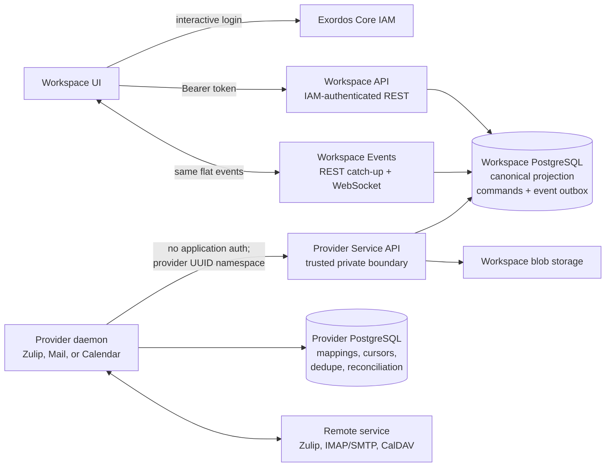
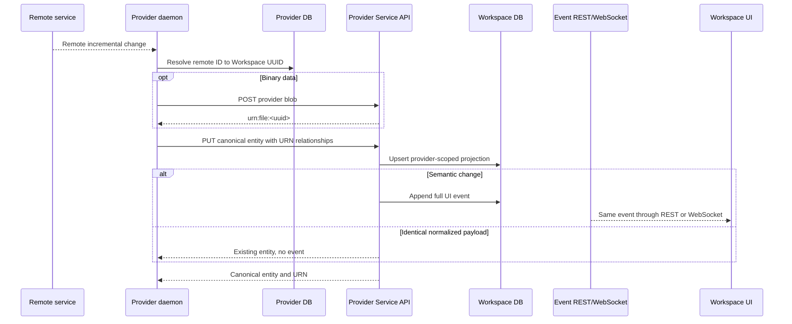
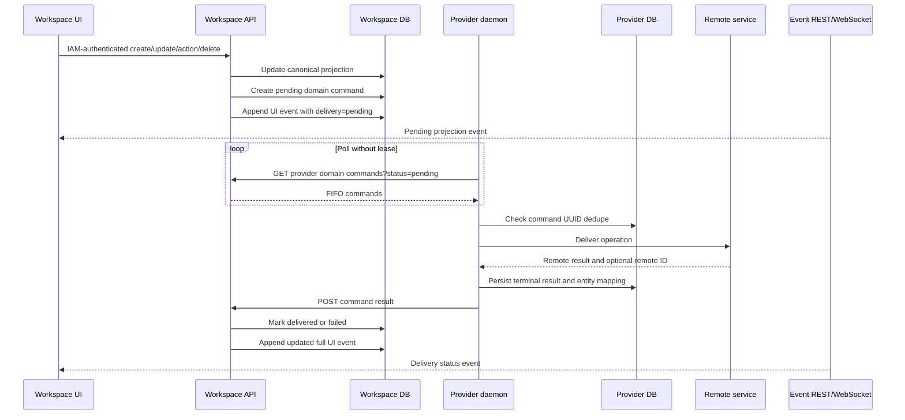

# Workspace Architecture

This document defines the greenfield Workspace architecture implemented by the
current backend and provider runtimes. It is the canonical source for service
boundaries and data ownership. API details live in
[`workspace_api.md`](workspace_api.md),
[`provider_service_api.md`](provider_service_api.md), and
[`workspace_ui_realtime_integration.md`](workspace_ui_realtime_integration.md).

## Architectural invariants

- Workspace UI communicates only with the IAM-authenticated Workspace API and
  the common Workspace event websocket.
- UI code has no knowledge of provider processes, provider databases, remote
  protocols, or the Provider Service API.
- Provider daemons are independent full-state services. They never import the
  Workspace backend as a runtime dependency and never read or write its
  database.
- Every provider runtime has its own database. That database is bound to one
  backend URL, one immutable provider UUID, and one provider kind.
- Workspace stores its canonical UI projection, durable UI event outbox, and
  pending provider commands in its own database.
- Providers initiate both directions of integration: they push remote changes
  to Workspace and poll Workspace commands that must be delivered remotely.
- Messenger, Mail, and Calendar have independent Service API entity contracts.
  Registration, External Accounts, blobs, URNs, commands, and delivery status
  are the common infrastructure.
- There is no compatibility layer for the removed bridge, UI-side mail backend,
  or historical API paths.

## Components and trust boundaries



The browser-facing and provider-facing APIs are different trust zones:

| Boundary                  | Authentication                            | Scope                                        | Intended caller         |
| ------------------------- | ----------------------------------------- | -------------------------------------------- | ----------------------- |
| Workspace REST API        | Exordos Core IAM bearer token             | IAM project and user                         | Workspace UI            |
| Workspace event websocket | IAM token in websocket subprotocol        | IAM project and user                         | Workspace UI            |
| Provider Service API      | No application-level authentication in v1 | Provider UUID and External Account namespace | Trusted provider daemon |

The provider UUID is a namespace, not a credential. Provider Service API
security depends on a trusted transport boundary. The process remains bound to
loopback on port `21083`; nginx exposes `/api/workspace-service/v1/` only on a
separate platform-internal listener on port `21085`. The browser-facing
listener on port `80` has no provider route. UI code must never use that route.

## Data ownership

| Data                  | Workspace backend owns                                                       | Provider daemon owns                                  |
| --------------------- | ---------------------------------------------------------------------------- | ----------------------------------------------------- |
| Provider registration | Display name, UUID, supported fixed kinds, version, last seen                | Stable configured UUID and runtime identity           |
| External Account      | IAM user/project binding and configured settings                             | Account cursor, health, remote connection state       |
| Canonical entities    | UI-facing users, streams, topics, messages, folders, mail, calendars, events | Remote identifiers, protocol metadata, entity mapping |
| Files                 | Canonical blob and access record                                             | Temporary remote transfer state only                  |
| Outbound work         | Durable pending command and delivery projection                              | Command dedupe and terminal remote result             |
| Realtime UI updates   | Durable monotonic event outbox                                               | None; providers do not consume UI events              |
| Reconciliation        | Canonical state visible through Service API                                  | Partitions, depth, schedule, cost, mismatch history   |

Provider-owned protocol fields such as IMAP UIDVALIDITY, CalDAV ETags and sync
tokens, Zulip queue IDs, raw ICS, and transport source payloads do not belong in
the canonical Workspace entity or UI event contract.

### Canonical identity and relationship ownership

Workspace UUIDs are the only entity identifiers consumed by the UI. A provider
keeps the mapping from its remote identifier to that UUID in its own database.
Mail and Calendar identities are scoped to one External Account:

```text
provider_uuid + external_account_uuid + provider_external_id
```

Messenger identities are scoped to the remote source instead. For Zulip the
source scope is the normalized realm URL:

```text
provider_uuid + source_scope + provider_external_id
```

This lets several Workspace users connect separate External Accounts to the
same Zulip realm while sharing one canonical user, stream, topic, message, or
reaction. Per-user bindings and message flags remain scoped to the calling
External Account. A different realm cannot reuse those relationships.

Relationships crossing canonical entities are typed URNs rather than remote
protocol IDs:

| Relationship | Canonical form |
| --- | --- |
| Mail message to folder | `urn:mail-folder:<uuid>` |
| Mail message to attachment blob | `urn:file:<uuid>` |
| Calendar event to calendar | `urn:calendar:<uuid>` |
| Messenger stream to owner | `urn:messenger-user:<uuid>` |
| Messenger topic to stream | `urn:messenger-stream:<uuid>` |
| Messenger message to stream/topic/author | typed Messenger URNs |
| Messenger reaction to message/author | typed Messenger URNs |

The Service API resolves each URN inside the provider and External Account
namespace. A relationship cannot point into another provider's projection.

### Transaction boundaries

The following Workspace-side effects are atomic for one request:

| Request | Atomic Workspace effects |
| --- | --- |
| UI local mutation | canonical projection update, pending provider command when applicable, UI event append |
| Provider entity PUT | provider-scoped upsert and UI event append when the normalized entity changed |
| Provider entity DELETE | provider-scoped delete/tombstone and UI event append |
| Provider command result | terminal command state, entity delivery projection, UI event append |
| Provider account status | External Account access state and corresponding UI event |

Provider remote delivery cannot share that database transaction. The command
UUID and provider-side dedupe record bridge this boundary. Therefore the
delivery protocol is at-least-once polling with idempotent terminal reporting,
not a distributed transaction.

## External Account lifecycle

1. A provider starts with a configured stable UUID and idempotently registers
   itself with `PUT /v1/providers/{provider_uuid}`.
2. Workspace UI reads the IAM-authenticated provider catalog and creates an
   External Account for one registered provider and one fixed v1 kind.
3. The provider lists only External Accounts whose `provider_uuid` matches its
   path namespace.
4. The provider validates the remote credentials and reports `confirmed`,
   `invalid_credentials`, or `unavailable` with a safe, redacted error.
5. A confirmed account becomes active and its entities can be synchronized.

V1 uses backend-defined External Account settings for `zulip`, `mail`, and
`calendar`. Provider-defined dynamic account schemas or capabilities are not
implemented yet and must not be assumed by clients.

The status fields have distinct meanings:

| Field | Owner | Meaning |
| --- | --- | --- |
| `status` | Workspace lifecycle | Binding is `new` or has become `active`. |
| `access_status` | Provider report | `pending`, `missing_credentials`, `confirmed`, `invalid_credentials`, or `unavailable`. |
| `access_checked_at` | Provider report timestamp | Last completed access check. |
| `access_confirmed_at` | Provider report timestamp | Last successful access check. |
| `access_last_error` | Provider-safe projection | Redacted user-displayable failure text. |

Credentials are deliberately visible only through the trusted Provider
Service API. They are masked in UI REST responses and events. Encryption at
rest is deferred in v1, so deployments must treat the Workspace database,
provider listener, process environment, traces, and logs as secret-bearing.

## Remote-to-Workspace flow



The provider prepares canonical entities before upload. Relationships are URNs,
including file, user, stream, topic, message, mail folder, and calendar
references. The backend validates that related entities belong to the same
provider and External Account.

Inbound provider PUT and DELETE operations never create an outbound command.
Repeated semantically identical PUTs are no-ops: they do not change timestamps,
delivery state, or the UI event cursor.

## Workspace-to-remote flow



Command polling intentionally has no lease. A provider can receive the same
pending command more than once and must persist command UUID results before
reporting them. A replay must return the stored terminal outcome instead of
executing the remote operation again.

For a previously unknown remote object, the bundled provider client derives a
deterministic UUIDv5 from the provider UUID, account UUID, domain, resource, and
remote ID. For an object created in Workspace, the provider must instead map the
command `entity_urn` to the new remote ID and keep using the Workspace UUID.

## Realtime event model

Workspace UI receives Messenger, Mail, Calendar, user, and External Account
changes through one durable stream:

```text
GET /api/workspace/v1/events/?epoch_version%3E=<last>&page_limit=500
WS  /api/workspace/v1/events/ws?last_epoch_version=<last>
```

REST and websocket transports carry the same flat `schema_version: 1` event.
The UI applies both through one idempotent dispatcher and deduplicates by the
monotonic `epoch_version`. Providers do not consume this feed and do not use a
provider websocket; Workspace-to-provider delivery uses domain command polling.

## Synchronization and reconciliation

Providers push incremental changes as soon as their remote protocol exposes
them. They also run bounded reconciliation to repair missed changes:

- partitions are selected by overdue time, mismatch risk, and estimated cost;
- drift halves the interval and increases inspected depth;
- clean runs increase the interval and eventually reduce depth;
- the default scheduler is bounded between 30 seconds and 7 days with maximum
  depth 64.

This model avoids scanning complete mailboxes, calendars, or messenger history
on every daemon cycle while still converging after lost remote events.

Each provider account loop should separate four responsibilities:

1. refresh the assigned External Account and validate access when due;
2. consume the remote protocol's incremental cursor or event queue;
3. poll and deliver Workspace commands with command-UUID deduplication;
4. reconcile one bounded, dynamically selected remote partition.

The cursor and reconciliation schedule are committed in the provider database
only after the corresponding canonical writes have succeeded. A crash may
repeat work, but deterministic UUIDs, semantic no-op PUTs, and command dedupe
make the replay safe.

### Domain-specific incremental inputs

| Domain | Preferred incremental source | Provider-owned recovery state |
| --- | --- | --- |
| Zulip | Event queue plus bounded history fetch | queue ID, last event ID, subscription version, remote ID map |
| Mail | IMAP IDLE/change tracking and UID ranges | UIDVALIDITY, UID cursor, mailbox state, sent-folder discovery |
| Calendar | CalDAV sync token or changed collection scan | collection URL, sync token, CTag/ETag, recurrence source |

POP3 is not a substitute for the Mail model because it does not provide the
folder hierarchy, flags, stable mailbox synchronization, moves, or draft/sent
semantics required by the canonical API.

## Failure model

- Provider account failures are isolated: safe errors are redacted, stored in
  the provider database, reported to Workspace, and do not stop other accounts.
- HTTP retry is limited to transient transport/status failures. Validation,
  ownership, and malformed URN errors are terminal until the payload is fixed.
- A failed command remains a durable terminal result and updates UI delivery
  state. A new UI mutation creates a new command.
- Full provider state survives process restart because identity maps, cursors,
  command dedupe, and reconciliation state are stored in the provider database.

Failure isolation is per provider account. One unavailable mail account must
not prevent command polling or incremental synchronization for other accounts.
Providers use bounded connection and request timeouts; for example, SMTP
connect operations must not block the daemon loop indefinitely.

Safe errors are UI projections, not diagnostic dumps. They must never contain
passwords, API keys, bearer tokens, complete account settings, raw mail bodies,
ICS documents, or remote response headers. Detailed diagnostics remain in
provider-local protected logs with their own retention policy.

## Deployment topology

A provider runtime belongs to one Workspace backend. Connecting the same remote
service to multiple Workspace backends requires one provider runtime and one
provider-owned database per backend/provider UUID pair.

The Workspace backend element runs only backend services:

```text
workspace-messenger-api       127.0.0.1:21081
workspace-messenger-events    127.0.0.1:21082
workspace-provider-api        127.0.0.1:21083
workspace-api                 127.0.0.1:21084
workspace-messenger-worker
```

Providers are three independent Exordos elements, not services in the
Workspace backend element:

```text
workspace-zulip-provider       own compute image and PostgreSQL instance
workspace-mail-provider        own compute image and PostgreSQL instance
workspace-calendar-provider    own compute image and PostgreSQL instance
```

Each element has its own manifest, node, image, database user, database, and
daemon service. Mail, Calendar, and Zulip instances must not share a provider
database or the Workspace database.

### Process and port matrix

| Process | Default listener | Public exposure | State |
| --- | --- | --- | --- |
| `workspace-messenger-api` | `127.0.0.1:21081` | Nginx `/api/workspace/v1/messenger/` | Workspace PostgreSQL |
| `workspace-messenger-events` | `127.0.0.1:21082` | Exact Nginx `/api/workspace/v1/events/ws` | Workspace event outbox |
| `workspace-provider-api` | `127.0.0.1:21083` | Platform-internal nginx `:21085/api/workspace-service/v1/` | Workspace PostgreSQL and blob storage |
| `workspace-api` | `127.0.0.1:21084` | Nginx `/api/workspace/` except Messenger and WebSocket | Workspace PostgreSQL |
| `workspace-messenger-worker` | none | none | Workspace presence maintenance |
| one provider daemon per provider element | none | none | Its element's dedicated PostgreSQL |

The provider listener is routed through a dedicated platform-internal nginx
port and prefix. It is a distinct API trust boundary and does not share the
browser-facing listener. The UI REST and websocket remain IAM-authenticated.

### Startup order and readiness

1. Workspace database migrations complete.
2. `workspace-api`, events, and Provider Service listeners become ready.
3. Provider daemons open their own databases and validate the configured
   backend URL/provider UUID binding.
4. Providers register idempotently.
5. Providers discover assigned accounts, validate them, then start incremental,
   command, and reconciliation loops.

A provider must refuse to reuse a database whose stored backend identity,
provider UUID, or kind differs from runtime configuration. Silent reassignment
would break remote-to-canonical mappings and command deduplication.

## Removed architecture

The following components and contracts are intentionally absent:

- Workspace bridge workers that share or synchronize backend tables;
- the backend previously located in `workspace_ui/packages/mail-proxy`;
- browser access to IMAP, SMTP, CalDAV, or provider endpoints;
- `/api/workspace/v1/messenger/events/ws` and messenger-specific event feeds;
- legacy `/api/messenger/**`, `/api/v1/**`, and `/workspace/**` routes.

No compatibility redirects, aliases, dual writes, or legacy data adapters
should be added for these removed paths.
