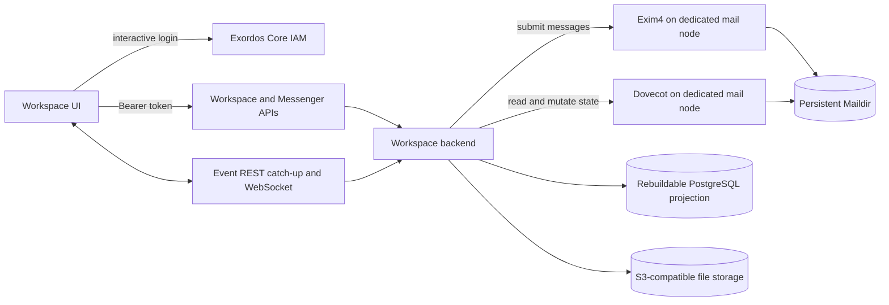

# Workspace Messenger Architecture

This document defines the Workspace backend service boundaries and data
ownership. The detailed public contract remains in
[`workspace_api.md`](workspace_api.md); realtime client behavior is documented
in [`workspace_ui_realtime_integration.md`](workspace_ui_realtime_integration.md).
The local mail transport and persistence design is specified in
[`mail_backed_messenger_architecture.md`](mail_backed_messenger_architecture.md).

## Architectural invariants

- Workspace UI communicates only with the IAM-authenticated Workspace and
  Messenger REST APIs and the common Workspace event websocket.
- The public Messenger API contract remains unchanged when message persistence
  moves to the local mail stack.
- Exim4, Dovecot, and Maildir run on a dedicated mail node in the Workspace
  element. SMTP and IMAP are authenticated platform-internal services and are
  never browser-facing API surfaces.
- Maildir is the source of truth for message content and state. Its tree lives
  on persistent node storage. PostgreSQL contains only rebuildable projections,
  indexes, counters, events, and client settings.
- IAM is the source of Workspace users, projects, and authentication.
- Files, file metadata, and access-control records use S3-compatible storage.
- Workspace has no external-provider runtime, Provider Service API, provider
  catalog, external account integration, Calendar API, or standalone Mail API.

## Components and trust boundaries

The browser-facing HTTP and websocket interfaces are the only application
network boundary. SMTP and IMAP are implementation details on the dedicated
mail node. Core local DNS provides service discovery, while the element does
not expose either protocol through its browser-facing nginx listener.

## Public API boundary

The deployment exposes these stable paths:

- `/api/workspace/v1/messenger/...` for the complete Messenger REST contract;
- `/api/workspace/v1/events/` for durable event catch-up;
- `/api/workspace/v1/events/ws` for live events;
- `/api/workspace/v1/{users,services,me,epoch}/...` for common
  IAM-scoped Workspace resources;
- `/api/workspace/specifications/3.0.3` for the Workspace OpenAPI document.

Provider, calendar, and standalone mail routes are deliberately absent.
Clients must not depend on internal SMTP, IMAP, Maildir paths, or message wire
format details.

## Identity and authorization

REST requests use an IAM bearer token. `user_uuid` comes from IAM token
information and `project_id` comes from IAM introspection information. The
backend maps those identities to local mailbox identities without making the
mail server an independent identity authority.

All Messenger operations apply the same project and user visibility rules as
the existing API. The internal mail transport cannot bypass IAM authorization:
the backend validates access before reading messages, changing flags, posting
reactions, or returning attachment references.

## Data ownership

| Data | Source of truth |
| --- | --- |
| Users, projects, authentication | Exordos Core IAM |
| Message content, folders, flags, and delivery state | Persistent Maildir through Dovecot |
| Message submission | Exim4 over authenticated internal SMTP |
| Fast lists, search, counters, events, and client settings | Rebuildable PostgreSQL projection |
| Files, metadata, and access-control records | S3-compatible storage |
| Durable UI event cursor and non-message service state | Workspace backend persistence |

Workspace UUIDs and typed URNs remain the identifiers visible through the
public contract. Mapping to mail headers, folders, and Maildir state is an
internal concern described by the mail-backed Messenger architecture.

## Message flow

For a write request, the backend authenticates the caller with IAM, validates
Messenger permissions, converts the public request to the internal mail
representation, and submits it to Exim4 through authenticated internal SMTP. Exim4 delivers
to persistent Maildir. The backend reads the resulting message through Dovecot
IMAP and emits the same public Messenger event shape used by existing clients.

For reads and state mutations, the backend authenticates and authorizes the
request first, then uses authenticated internal IMAP to query folders or change
message state.
It converts mail data back to the unchanged Messenger response model. File
payloads stay in S3-compatible storage; messages contain only the references
needed to resolve those files through authorized backend endpoints.

## Realtime model

REST catch-up and websocket delivery carry the same flat `schema_version: 1`
event object. Clients deduplicate by monotonic `epoch_version` and apply both
transports through one dispatcher. The storage implementation does not change
this contract.

## Persistence and recovery

The Maildir tree and S3-compatible object storage must survive service and node
restarts. Exim4 and Dovecot configuration can be rebuilt from deployment
configuration; message state cannot. Recovery therefore restores persistent
Maildir and object storage before starting the backend and mail services.

Dovecot index and transaction-log files are rebuildable caches and live under
`/run/workspace/dovecot-indexes`, outside the persistent Maildir volume. Maildir
messages and control files remain persistent, preserving message state,
UIDVALIDITY, and UIDs while preventing an interrupted node replacement from
reusing a partially written index log. Mail bootstrap explicitly creates the
root-owned `/run/workspace` parent with mode `0755` before creating the
`workspace:workspace` index directory with mode `0750`; this remains traversable
when the universal agent itself runs with a restrictive `UMask=0077`.

Because IMAP is the message source of truth, recovery may discard and rebuild
the PostgreSQL projection by replaying the IMAP journal. No message or shared
Messenger state may exist only in PostgreSQL.
