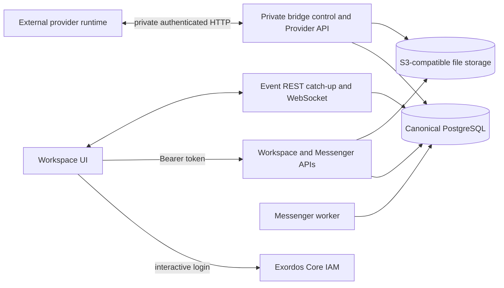

# Workspace Messenger Architecture

This document defines the current Workspace backend service boundaries and
data ownership. The browser contract remains in
[`workspace_api.md`](workspace_api.md), the private provider data plane is
defined by
[`workspace_provider_api_v1.yaml`](workspace_provider_api_v1.yaml), and
realtime client behavior is documented in
[`workspace_ui_realtime_integration.md`](workspace_ui_realtime_integration.md).

The previous mail-backed architecture is retained only as design history and
as context for the controlled import described by
[`postgresql_canonical_messenger_migration.md`](postgresql_canonical_messenger_migration.md).
The exact production deployment sequence and rollback boundary are defined in
[`postgresql_canonical_production_cutover.md`](postgresql_canonical_production_cutover.md).
It is not the current runtime architecture.

## Architectural invariants

- Workspace UI communicates only with IAM-authenticated Workspace and
  Messenger REST APIs and the common Workspace event websocket.
- PostgreSQL is canonical for Messenger resources, membership, user state,
  events, provider mappings, external-account state, commands, and client
  settings.
- The PostgreSQL-canonical runtime does not read or write SMTP, IMAP, Maildir,
  Exim, or Dovecot. Retained mail resources are inactive migration and rollback
  material until the canonical cutover is accepted and those resources are
  removed separately.
- IAM is the source of Workspace users, projects, bearer-token authentication,
  and authorization scope.
- File metadata and ACL state are represented in PostgreSQL. File bytes and
  JSON sidecars use the configured S3-compatible storage backend.
- External provider runtimes are independently deployable services. They use a
  private, bridge-authenticated Provider HTTP API and project ordinary
  Messenger resources into PostgreSQL; browsers never call that API.
- The public Messenger REST and websocket shapes are independent of the
  persistence and provider implementations.

## Components and trust boundaries

The browser-facing HTTP and websocket interfaces form the public application
boundary. The bridge control, Provider, and file-transfer APIs use a separate
private listener and bridge identity. Provider credentials, raw provider
payloads, internal cursors, database rows, and file-allocation details do not
cross the browser boundary.

## Public and private API boundaries

The deployment exposes these stable browser paths:

- `/api/workspace/v1/messenger/...` for the Messenger REST contract;
- `/api/workspace/v1/events/` for durable event catch-up;
- `/api/workspace/v1/events/ws` for live events;
- `/api/workspace/v1/{users,services,me,epoch}/...` for common
  IAM-scoped Workspace resources;
- `/api/workspace/specifications/3.0.3` for the public Workspace OpenAPI
  document.

There is no browser-facing Provider, calendar, or standalone mail API.
Independently deployed provider runtimes use the private
`/api/workspace-provider/v1` data plane. The private control and file contracts
are likewise not routed through the browser-facing nginx locations.

## Identity and authorization

Public REST requests use an IAM bearer token. `user_uuid` comes from IAM token
information and `project_id` comes from IAM introspection. Messenger operations
apply the resulting project, user, membership, ownership, and action checks
before canonical state is read or changed.

The private provider boundary authenticates an enrolled bridge instance and
binds it to one provider kind and realm. Provider event batches and operation
results are checked against that identity and the corresponding account,
project, chat assignment, capability, and lease state before they change
canonical Messenger resources.

## Data ownership

| Data | Source of truth |
| --- | --- |
| Users, projects, authentication, and IAM permissions | Exordos Core IAM |
| Messages, streams, topics, bindings, folders, drafts, reactions, read state, and events | PostgreSQL |
| Provider accounts, policies, bridge state, mappings, commands, results, and deduplication | PostgreSQL |
| File metadata and access-control state | PostgreSQL and the canonical JSON sidecar |
| File bytes and JSON sidecars | S3-compatible storage |

Workspace UUIDs and typed URNs remain the identifiers visible through the
public contract. Stable provider identifiers and conversion metadata are
stored behind the provider projection and are exposed only through sanitized
public `provider` and `delivery` fields where the contract allows them.

## Native Messenger flow

For a native write, the backend authenticates the caller with IAM, validates
the current PostgreSQL membership and permissions, and commits the canonical
resource changes and their realtime side effects in the request transaction.
Reads use the same canonical tables and user/project visibility rules.

File payloads stay in S3-compatible storage. Messages contain only authorized
file or media URNs; the Messenger API never places binary attachments in a
secondary message transport.

## Provider flow

Workspace-to-provider actions create durable provider operations in
PostgreSQL. An enrolled provider runtime leases compatible operations over the
private Provider HTTP API and reports terminal outcomes with idempotent,
per-item results. Provider-to-Workspace changes arrive as authenticated event
batches. A batch is validated and applied atomically to ordinary canonical
Messenger resources; an invalid item rolls back the complete batch so the
provider can retry it unchanged.

Provider projections are returned through the same public Messenger endpoints
as native resources. Their sanitized `provider` metadata identifies the
external source and effective capabilities, while `delivery` describes the
corresponding external operation state. Provider-specific control data remains
private.

## Realtime model

REST catch-up and websocket delivery carry the same flat `schema_version: 1`
event object. PostgreSQL maintains the generation and monotonic epoch cursor.
Clients persist `(epoch_generation, epoch_version)`, deduplicate by that cursor,
and apply both transports through one dispatcher.

Only event rows are subject to the seven-day retention policy. Messages and
other canonical resources are not removed when old events are pruned. A cursor
outside the retained suffix receives the typed `epoch_pruned` response and the
client reloads authoritative snapshots before resuming realtime updates.

## Persistence, migration, and recovery

PostgreSQL and S3-compatible storage must survive service and node replacement.
Recovery restores the database and object storage, applies database migrations,
and then starts the API, event, worker, and private provider services. Derived
indexes and caches may be rebuilt from canonical PostgreSQL rows without
changing public resource identities.

The deployment requires both `messenger_storage.mode=postgresql_canonical` and
explicit canonical-cutover confirmation before selecting this runtime. During
the controlled migration, the old Maildir may remain mounted read-only as an
import and rollback source. Canonical services do not construct mail runtime
dependencies, and removal of the old mail node, disk, routes, and secrets is a
separate post-acceptance operation.
