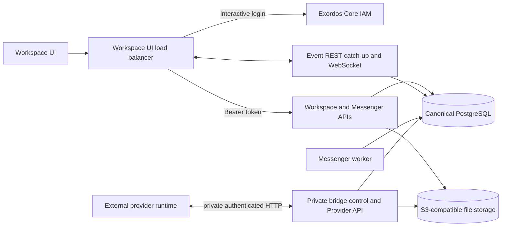

# Workspace Messenger Architektur

Dieses Dokument definiert die Grenzen des aktuellen Workspace Backend-Dienstes und
Der Browservertrag bleibt in Kraft.
[`workspace_api.md`](workspace_api.md), ist die Datenebene des privaten Anbieters
definiert durch
[`workspace_provider_api_v1.yaml`](../workspace_provider_api_v1.yaml), und
Echtzeit-Clientverhalten wird in
[`workspace_ui_realtime_integration.md`](workspace_ui_realtime_integration.md).

## Architektonische Invarianten

- Workspace Benutzeroberfläche kommuniziert nur mit IAM-authentifizierten Workspace und
  Messenger REST APIs und das gemeinsame Workspace Event Websocket.
- PostgreSQL ist für Messenger-Ressourcen, Mitgliedschaft, Benutzerzustand,
  Ereignisse, Provider-Mapping, Status externer Konten, Befehle und Client
  Einstellungen.
- Messenger kann weder SMTP, IMAP, Maildir, Exim oder Dovecot lesen noch schreiben.
- IAM ist die Quelle von Workspace-Benutzern, Projekten, Inhaber-Token-Authentifizierung,
  und der Anwendungsbereich der Genehmigung.
- Die Dateimetadaten und der ACL Zustand werden in PostgreSQL dargestellt.
  JSON Sidecars verwenden das konfigurierte S3-kompatible Speicherbackend.
- Die externen Anbieter-Runtimes sind unabhängig einsetzbare Dienste.
  private, brüchenauthentifizierte Anbieter HTTP API und Projekt-Ordentliche
  Messenger Ressourcen in PostgreSQL; Browser rufen das nie an API.
- Die öffentlichen Messenger REST und Websocket-Formen sind unabhängig von der
  Persistenz und Providerimplementierungen.
- Das Backend-Image enthält keine UI-Quelle oder Bündel.
  Versions `workspace_ui` -Element besitzt den öffentlichen Lastbalancer, dient der
  immutable Web-Artefact und Proxies `/api/` zum exportierten Backend-Knoten.

## Komponenten und Grenzen des Vertrauens

Die browsergerichteten HTTP und Websocket-Schnittstellen bilden die öffentliche Anwendung
Die Bridge-Kontrolle, Provider und File-Transfer-APIs verwenden eine separate
private Zuhörer und Brücken-Identität.
Die Datenbank kann nicht mit Daten aus der Datenbank verknüpft werden.
Überschreiten Sie die Grenze des Browsers.

## Öffentliche und private Grenzen API

Die Bereitstellung zeigt diese stabilen Browserpfade:

- `/api/workspace/v1/messenger/...` für den Messenger REST-Vertrag;
- `/api/workspace/v1/events/` für dauerhafte Ereignisnachholung;
- `/api/workspace/v1/events/ws` für Live-Veranstaltungen;
- `/api/workspace/v1/{users,services,me,epoch}/...` für die allgemeine
  IAM-Reichweite Workspace-Ressourcen;
- `/api/workspace/specifications/3.0.3` für die Öffentlichkeit Workspace OpenAPI
  Dokument.

Es gibt keinen browserorientierten Anbieter, Kalender oder eigenständige Mail API.
Unabhängig bereitgestellte Provider-Runtimes verwenden die private
`/api/workspace-provider/v1` Daten-Ebene. Die privaten Steuerung und Datei-Verträge
werden ebenfalls nicht durch die browsergerichteten nginx-Standorte geleitet.

## Identität und Genehmigung

Öffentliche REST Anfragen verwenden ein IAM Träger-Token. `user_uuid` stammt von IAM Token
Informationen und`project_id`kommt vonIAMIch habe mich selbst angeschaut.MessengerOperationen
Anwendung der daraus resultierenden Projekte, Benutzer, Mitgliedschaft, Eigentumsrechte und Aktionskontrollen
bevor der kanonische Zustand gelesen oder geändert wird.

Die private Providergrenze authentifiziert eine registrierte Bridge-Instanz und
Die Datenbank wird von einem Provider-Event-Batterie und einem Provider-Reich verbunden.
die Ergebnisse werden anhand dieser Identität und des entsprechenden Kontos überprüft,
Projekt, Chat-Zuteilung, Fähigkeit und Leasing-Zustand, bevor sie sich ändern
die kanonischen Messenger Ressourcen.

## Eigentum an Daten

| Daten | Quelle der Wahrheit |
| --- | --- |
| Benutzer, Projekte, Authentifizierung und IAM Berechtigungen | Exordos Core IAM |
| Nachrichten, Streams, Themen, Verknüpfungen, Ordner, Entwürfe, Reaktionen, Lesestatus und Ereignisse | PostgreSQL |
| Anbieterkonten, Richtlinien, Brückenzustand, Abbilder, Befehle, Ergebnisse und Deduplikation | PostgreSQL |
| Dateimetadaten und Zutrittskontrollzustand | PostgreSQL und der kanonische JSON Seitenwagen |
| Dateibytes und JSON Seitenwagen | S3-kompatible Speicherung |

Workspace UUIDs und getypte URNs bleiben die Identifikatoren, die durch die
Stabile Anbieter-Identifikatoren und Konversionsmetadaten sind
Die Daten werden hinter der Anbieterprojektion gespeichert und nur durch desinfizierte
öffentliche Felder `provider` und `delivery`, sofern der Vertrag dies zulässt.

## Native Messenger-Fluss

Für ein natives Schreiben authentifiziert das Backend den Anrufer mit IAM, validiert
Die aktuelle PostgreSQL Mitgliedschaft und Berechtigungen, und verpflichtet sich die kanonischen
Änderungen der Ressourcen und ihre Nebenwirkungen in Echtzeit bei der Anforderungstransaktion.
Die Lesungen verwenden die gleichen kanonischen Tabellen und die gleichen Sichtbarkeitsregeln für Benutzer/project.

Datei-Nutzlasten bleiben in S3-kompatiblem Speicher.
Datei- oder Medien-URNs; die Messenger API legt niemals binäre Anhänge in eine
Sekundärnachrichtentransport.

## Lieferantenfluss

Workspace-anbieter-Aktionen schaffen dauerhafte Anbieter-Aktionen in
PostgreSQL. Ein eingetragener Anbieter leiht kompatible Operationen über die
private Provider HTTP API und berichtet über die Endresultate mit idempotent,
Ergebnisse pro Element. Änderungen von Provider zu Workspace werden als authentifiziertes Ereignis angezeigt
Eine Charge wird validiert und atomar auf gewöhnliche kanonische
Messenger Ressourcen; ein ungültiger Artikel rollt die gesamte Charge zurück, so dass die
Der Anbieter kann es unverändert erneut versuchen.

Die Anbieterprognosen werden über die gleichen öffentlichen Messenger Endpunkte zurückgegeben
Sie sind als natürliche Ressourcen.`provider`Metadaten identifizieren die
Die Kommission hat die Kommission gebeten, die`delivery`beschreibt die
entsprechender externer Betriebszustand.
Ich bin ein Privatmann.

## Modell in Echtzeit

REST Aufhol- und Websocket-Zustellung tragen die gleiche Fläche `schema_version: 1`
PostgreSQL behält den Generations- und Monotonen-Epochen-Cursor.
Klienten bleiben `(epoch_generation, epoch_version)`, dedupliziert durch diesen Cursor,
und beide Transporte über einen Disponenten durchführen.

Der Websocket-Worker vereint PostgreSQL Benachrichtigungs-Brunst und Fallback
Die Datenverarbeitung erfolgt durch die
Die meisten haben eine aktive Aufgabe, so dass ein langsamer Kunde die Lieferung an gesunde Kunden nicht verzögern kann.
Ein vorübergehender Speicherleseschaden hält die etablierten Sockets bereit und versucht es erneut
Mit begrenztem jittered Backoff; senden oder Protokoll Fehler schließen nur die betroffenen
- Die Steckdose.
Eine Benachrichtigung ist nur ein Weckhinweis; der dauerhafte Cursor pro Benutzer bleibt der
Die Verknüpfung ändert also keine Ereignislast, Ordnung oder
Wiederherstellungssemantik.

Nur Ereigniszeilen unterliegen der konfigurierbaren Speicherrichtlinie, die
Nachrichten und andere kanonische Ressourcen werden nicht gelöscht
Wenn ein Cursor außerhalb des zurückgehaltenen Suffikses die
eingegeben `epoch_pruned` Antwort und der Client lädt autorisierte Snapshots neu
bevor die Echtzeit-Updates fortgesetzt werden.

## Persistenz und Erholung

PostgreSQL und S3-kompatible Speicher müssen Service- und Knotenersatz überstehen.
Wiederherstellung stellt die Datenbank und Objektspeicher wieder her, wendet Datenbankmigrationen an,
und dann startet die API, Event, Arbeiter und private Anbieter Dienste.
Index und Cache können aus kanonischen Zeilen PostgreSQL ohne
Änderung der Identität öffentlicher Ressourcen.

Die Bereitstellung startet immer die PostgreSQL unterstützte Messenger Runtime.
keine Persistenzmodus-Schalter oder sekundäres Messenger-Journal.
