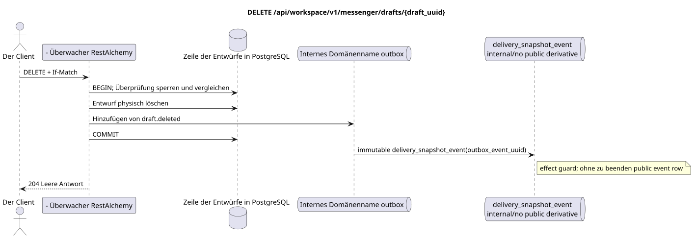

# `DELETE /api/workspace/v1/messenger/drafts/{draft_uuid}`


Allgemeine Ziel-Invariante der Zuverlässigkeit: Jedes immutable outbox-Ereignis führt genau eine immutable typed task mit einem einzigartigen `outbox_event_uuid`; coalescing fehlt. Task speichert den tatsächlichen exact scope key, verwendet lease/fencing, retry/backoff, max attempts/DLQ, reaper und idepotent effect guard. Topic scope wird nur für placement/message-binding work angewendet; shared rows erhalten keinen impliziten Fallback auf topic.

[← Hauptindex der Dokumentation](../../../../index.md) · [Index der Abfolge-Diagramme](../../README.md) · [Inhalt und Benutzer Workspace](../README.md)

Status: Ziel-Spezifikation der Operation, die zuerst in der Dokumentation erarbeitet wurde.
unverändert bleibt und ist das Normativrecht in [`workspace_api.md`](../../../../workspace_api.md).
Diese Datei beschreibt die Zielgrenzen von Transaktionen und Projektionen; sie ist nicht
Produktionscode, Migration SQL oder neuer Endpunkt.



[Ausgangsgestalt , die bearbeitet werden kann PlantUML](diagrams/delete_draft.puml)

## Zuordnung und öffentlicher Vertrag

Entfernen Sie den Eigentümerentwurf mit Optimistischem Wettbewerb.

Authentifizierung: Token Bearer IAM; `project_id` und aktuell `user_uuid` werden aus dem Kontext genommen IAM.

## Anfrageweg und -parameter

| Lage | Name | Typ / Regel |
| --- | --- | --- |
| Weg | `draft_uuid` | UUID |
| Titel: | `If-Match` | Zwangsvollständige genaue strenge Revision |

Die Sammlungspagination, wo sie vorgesehen ist, behält den aktuellen Vertrag `page_limit` und UUID
`page_marker` und erhält `X-Pagination-Limit`, und
`X-Pagination-Marker` Nur wenn die nächste Seite vorhanden ist.

## Abfrage-Body

Der Abfrage-Body fehlt.

## Eine erfolgreiche Antwort

`204` mit leeren Antwortkörpern.


## Fehler und Autorierung

Fehlende `If-Match` gibt `428` zurück. Ungültige/veraltete Revision gibt `412` mit aktuellem Bild und ETag. Nicht verfügbare Fassung gibt nicht gefunden zurück..

Allgemeine Antwortform bei Validierungsfehlern:

```json
{
  "type": "ValidationErrorException",
  "code": 400,
  "message": "Validation error occurred."
}
```

## Zielgrenze RestAlchemy

```python
from restalchemy.api import controllers as ra_controllers
from restalchemy.api import resources as ra_resources
from restalchemy.dm import models
from restalchemy.dm import properties
from restalchemy.dm import types
from restalchemy.storage.sql import orm


class WorkspaceDraft(models.ModelWithUUID, models.ModelWithProject,
                     models.ModelWithTimestamp, orm.SQLStorableMixin):
    # Contract boundary only; target physical naming/decomposition is not selected.
    __tablename__ = "m_workspace_drafts"
    user_uuid = properties.property(types.UUID(), required=True, read_only=True)
    stream_uuid = properties.property(types.UUID(), required=True, read_only=True)
    topic_uuid = properties.property(types.UUID(), required=True, read_only=True)
    payload = properties.property(types.Dict(), required=True)
    revision = properties.property(types.Integer(min_value=1), read_only=True)


class WorkspaceDraftController(ra_controllers.BaseResourceControllerPaginated):
    __resource__ = ra_resources.ResourceByRAModel(
        model_class=WorkspaceDraft,
        convert_underscore=False,
        process_filters=True,
    )
    # Narrow overrides preserve owner scope, keyset marker, ETag and If-Match.
```

Jeder öffentliche Verweis auf die Entität wird als skalar UUID-Eigenschaft RestAlchemy erklärt, nicht `relationship` (die sich als URI serialieren würde). Der entsprechende physische Spalte `*_uuid`  ein indexierter externer Schlüssel mit einer eindeutig gewählten Verweisungsaktion. Daher hält der öffentliche JSON UUID unverändert.

Die Anzeige fixiert eine unveränderliche skalare Grenze UUID/ETag. Die physischen UUID-Spalten des Benutzers/Flows/Themes bleiben FK-indexiert mit Kaskadenverhalten aus dem aktuellen Vertrag; die Beziehung RestAlchemy darf die öffentliche Verknüpfung nicht verändern UUID JSON.

## Synchronisierter Weg API

1. Auflösen `If-Match`.
2. Verriegeln Sie den Eigentümerentwurf und vergleichen Sie die Revisionen.
3. Entfernen Sie es physisch und fügen Sie den entfernten Entwurf der unmodifizierten Domänenadresse ohne öffentliche Ableitung in die Outbox.
4. Transaktion festhalten und zurückgeben `204`.

## Outbox, typische Aufgaben, Worker und Echtzeitarbeit

Der aktuelle Vertrag erstellt kein Löschmarker oder öffentliches Ereignis.

Das interne immutable Outbox-Ereignis führt zu einem `delivery_snapshot_event`,
Die keine öffentliche Ableitung festhält und endet;
Die bereitgestellte Workspace Event Row und WebSocket-Lieferung werden nicht erstellt.

## Idempotenz, Schlüssel und Rennen

Die genaue Voraussetzung der Revision verhindert, dass ein parallel aktualisierter Entwurf gelöscht wird..

## Sichtbarkeit für den Client

Der Initiator-Client sieht den festgelegten Entwurf sofort. Andere Kunden sehen ihn erst nach dem Neustart oder einer eindeutigen erneuten Anfrage der Entwürfe; das versandte Update mit der Konsistenz ist letztlich nicht verfügbar.

[← Hauptindex der Dokumentation](../../../../index.md) · [Index der Abfolge-Diagramme](../../README.md) · [Inhalt und Benutzer Workspace](../README.md)
