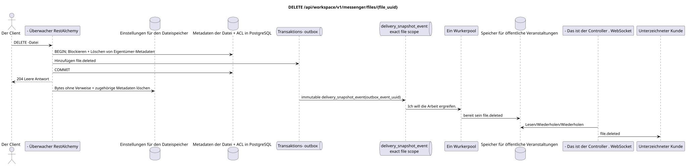

# `DELETE /api/workspace/v1/messenger/files/{file_uuid}`


Allgemeine Ziel-Invariante der Zuverlässigkeit: Jedes immutable outbox-Ereignis führt genau eine immutable typed task mit einem einzigartigen `outbox_event_uuid`; coalescing fehlt. Task speichert den tatsächlichen exact scope key, verwendet lease/fencing, retry/backoff, max attempts/DLQ, reaper und idepotent effect guard. Topic scope wird nur für placement/message-binding work angewendet; shared rows erhalten keinen impliziten Fallback auf topic.

[← Hauptindex der Dokumentation](../../../../index.md) · [Index der Abfolge-Diagramme](../../README.md) · [Inhalt und Benutzer Workspace](../README.md)

Status: Ziel-Spezifikation der Operation, die zuerst in der Dokumentation erarbeitet wurde.
unverändert bleibt und ist das Normativrecht in [`workspace_api.md`](../../../../workspace_api.md).
Diese Datei beschreibt die Zielgrenzen von Transaktionen und Projektionen; sie ist nicht
Produktionscode, Migration SQL oder neuer Endpunkt.



[Ausgangsgestalt , die bearbeitet werden kann PlantUML](diagrams/delete_file.puml)

## Zuordnung und öffentlicher Vertrag

Die Eigentümerdatei löschen und den Zugriff auf ihre Byte widerrufen.

Authentifizierung: Token Bearer IAM; `project_id` und aktuell `user_uuid` werden aus dem Kontext genommen IAM.

## Anfrageweg und -parameter

| Lage | Name | Typ / Regel |
| --- | --- | --- |
| Weg | `file_uuid` | UUID |

Die Sammlungspagination, wo sie vorgesehen ist, behält den aktuellen Vertrag `page_limit` und UUID
`page_marker` und erhält `X-Pagination-Limit`, und
`X-Pagination-Marker` Nur wenn die nächste Seite vorhanden ist.

## Abfrage-Body

Der Abfrage-Body fehlt.

## Eine erfolgreiche Antwort

`204` mit leeren Antwortkörpern.


## Fehler und Autorierung

Nur der Besitzer kann löschen. Nicht zugängliche UUID oder UUID des anderen Besitzers werden nicht offenbart. Speicherreinigungsfehler treten nach der kanonischen Löschung auf und stellen den öffentlichen Zugriff nicht wieder her.

Allgemeine Antwortform bei Validierungsfehlern:

```json
{
  "type": "ValidationErrorException",
  "code": 400,
  "message": "Validation error occurred."
}
```

## Zielgrenze RestAlchemy

```python
from restalchemy.api import controllers as ra_controllers
from restalchemy.api import resources as ra_resources
from restalchemy.dm import models
from restalchemy.dm import properties
from restalchemy.dm import types
from restalchemy.storage.sql import orm


class WorkspaceFile(models.ModelWithUUID, models.ModelWithProject,
                    models.ModelWithTimestamp, orm.SQLStorableMixin):
    # Contract boundary only; target storage decomposition is not selected.
    __tablename__ = "m_workspace_files"
    user_uuid = properties.property(types.UUID(), required=True, read_only=True)
    stream_uuid = properties.property(types.AllowNone(types.UUID()))
    name = properties.property(types.String(max_length=255), required=True)
    description = properties.property(types.String(max_length=255), default="")
    content_type = properties.property(types.String(max_length=255), required=True)
    size_bytes = properties.property(types.Integer(min_value=0), required=True)
    hash = properties.property(types.String(max_length=255), required=True)


class WorkspaceFileController(ra_controllers.BaseResourceControllerPaginated):
    __resource__ = ra_resources.ResourceByRAModel(
        model_class=WorkspaceFile,
        hidden_fields=["project_id"],
        convert_underscore=False,
        process_filters=True,
    )
    # Narrow multipart/storage/download overrides preserve the current contract.
```

Jeder öffentliche Verweis auf die Entität wird als skalar UUID-Eigenschaft RestAlchemy erklärt, nicht `relationship` (die sich als URI serialieren würde). Der entsprechende physische Spalte `*_uuid`  ein indexierter externer Schlüssel mit einer eindeutig gewählten Verweisungsaktion. Daher hält der öffentliche JSON UUID unverändert.

Der aktuelle Metadaten/Speicher/ACL-Vertrag wird beibehalten; die Zielfähigkeit ist nicht gewählt. `project_id` bleibt versteckt. Skalar `user_uuid` und zulässig `null` `stream_uuid` bleiben öffentliche UUID-Werte, die von FKs unterstützt werden..

## Synchronisierter Weg API

1. Die Metadaten der Eigentümerdatei finden und sperren.
2. Löschen Sie die kanonische Zeile der Datei/ACL und fügen Sie den unveränderlichen Eintrag `file.deleted` hinzu outbox.
3. Transaktion festhalten und zurückgeben `204`.
4. Nach der Festsetzung der Transaktion löschen Sie die binären Daten und die zugehörigen Metadaten, auf die keine Verweise mehr verwiesen werden.

## Outbox, Typisierte Aufgaben, Worker und Echtzeitarbeit

Die freie Löschung wird asynchron erstellt, der öffentliche Zugriff verschwindet, wenn die Metadaten gelöscht werden, bis die möglichst schone Ausarbeitung abgeschlossen ist..

Der festgelegte Domänen- Eintrag in der Outbox erstellt eine separate immutable
`delivery_snapshot_event` mit der exakt scope Datei und dem eindeutigen
`outbox_event_uuid`. Der Arbeiter schreibt die Fertigstellung `file.deleted` und
Der Leiter sendet, wiederholt oder spielt es.

## Idempotenz, Schlüssel und Rennen

UUID definiert einen kanonischen Metadaten-Eintrag. Löschen und Aktualisieren wird auf dieser Zeile serialisiert; eine spätere Operation sieht Löschen..

## Sichtbarkeit für den Client

Der Initiator-Client erhält sofort die festgelegten Metadaten. Andere Clients erhalten die bereitgestellten Ereignisse der Datei nach Verzögerung der Projektion. Die Repository-Reinigung nach der festgelegten Löschung kann später abgeschlossen werden, ohne Zugriff auf die Metadaten wiederherzustellen.

[← Hauptindex der Dokumentation](../../../../index.md) · [Index der Abfolge-Diagramme](../../README.md) · [Inhalt und Benutzer Workspace](../README.md)
