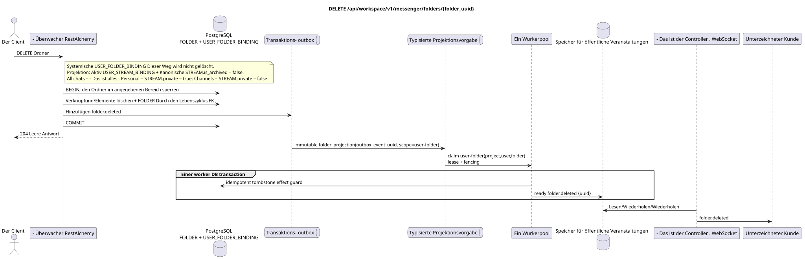

# `DELETE /api/workspace/v1/messenger/folders/{folder_uuid}`

[← Hauptindex der Dokumentation](../../../../index.md) · [Index der Abfolge-Diagramme](../../README.md) · [Inhalt und Benutzer Workspace](../README.md)

Status: Ziel-Spezifikation der Operation, die zuerst in der Dokumentation erarbeitet wurde.
unverändert bleibt und ist das Normativrecht in [`workspace_api.md`](../../../../workspace_api.md).
Diese Datei beschreibt die Zielgrenzen von Transaktionen und Projektionen; sie ist nicht
Produktionscode, Migration SQL oder neuer Endpunkt.



[Ausgangsgestalt , die bearbeitet werden kann PlantUML](diagrams/delete_folder.puml)

## Zuordnung und öffentlicher Vertrag

Verwenden Sie den aktuellen Benutzerordner.

Authentifizierung: Token Bearer IAM; `project_id` und aktuell `user_uuid` werden aus dem Kontext genommen IAM.

## Anfrageweg und -parameter

| Lage | Name | Typ / Regel |
| --- | --- | --- |
| Weg | `folder_uuid` | UUID |

Die Sammlungspagination, wo sie vorgesehen ist, behält den aktuellen Vertrag `page_limit` und UUID
`page_marker` und erhält `X-Pagination-Limit`, und
`X-Pagination-Marker` Nur wenn die nächste Seite vorhanden ist.

## Abfrage-Body

Der Abfrage-Body fehlt.

## Eine erfolgreiche Antwort

`204` mit leeren Antwortkörpern.


## Fehler und Autorierung

Falsche oder nicht autorisierte Eingabedaten werden durch die Fehlergrenze von RESTAlchemy/IAM verarbeitet; Ressourcen in einem bestimmten Bereich werden nicht außerhalb des Benutzers/Projekts offengelegt.

Allgemeine Antwortform bei Validierungsfehlern:

```json
{
  "type": "ValidationErrorException",
  "code": 400,
  "message": "Validation error occurred."
}
```

## Zielgrenze RestAlchemy

```python
from restalchemy.api import controllers as ra_controllers
from restalchemy.api import resources as ra_resources
from restalchemy.dm import models
from restalchemy.dm import properties
from restalchemy.dm import types
from restalchemy.storage.sql import orm


class WorkspaceFolder(models.ModelWithUUID, models.ModelWithProject,
                      models.ModelWithTimestamp, orm.SQLStorableMixin):
    __tablename__ = "messenger_folders"
    title = properties.property(types.String(min_length=1, max_length=64), required=True)
    background_color_value = properties.property(types.AllowNone(types.Integer()))


class WorkspaceUserFolderBinding(models.ModelWithUUID, models.ModelWithProject,
                                 models.ModelWithTimestamp, orm.SQLStorableMixin):
    __tablename__ = "messenger_user_folder_bindings"
    # Public UUID links are scalar UUID properties, never URI relationships.
    user_uuid = properties.property(types.UUID(), required=True, read_only=True)
    folder_uuid = properties.property(types.UUID(), required=True, read_only=True)
    unread_count = properties.property(types.Integer(min_value=0), default=0, read_only=True)
    mention_count = properties.property(types.Integer(min_value=0), default=0, read_only=True)
    folder_items_snapshot = properties.property(types.List(), default=list, read_only=True)
    folder_items_snapshot_version = properties.property(types.Integer(min_value=0), default=0, read_only=True)
    folder_items_snapshot_updated_at = properties.property(types.AllowNone(types.UTCDateTimeZ()), read_only=True)
    BUSINESS_KEY = ("project_id", "user_uuid", "folder_uuid")


class WorkspaceUserFolder(models.ModelWithTimestamp, orm.SQLStorableMixin):
    __tablename__ = "messenger_api_user_folders_v1"
    binding_uuid = properties.property(types.UUID(), id_property=True, read_only=True)
    uuid = properties.property(types.UUID(), read_only=True)
    title = properties.property(types.String(min_length=1, max_length=64))
    background_color_value = properties.property(types.AllowNone(types.Integer()))
    unread_count = properties.property(types.Integer(min_value=0), read_only=True)
    system_type = properties.property(types.AllowNone(types.Enum(["all", "created"])), read_only=True)
    folder_items = properties.property(types.List(), read_only=True)


class FolderController(ra_controllers.BaseResourceControllerPaginated):
    __resource__ = ra_resources.ResourceByRAModel(
        model_class=WorkspaceUserFolder,
        hidden_fields=["binding_uuid", "project_id", "user_uuid"],
        convert_underscore=False,
        process_filters=True,
    )
```

Jeder öffentliche Verweis auf die Entität wird als skalar UUID-Eigenschaft RestAlchemy erklärt, nicht `relationship` (die sich als URI serialieren würde). Der entsprechende physische Spalte `*_uuid`  ein indexierter externer Schlüssel mit einer eindeutig gewählten Verweisungsaktion. Daher hält der öffentliche JSON UUID unverändert.

Bei der Lektüre wird das öffentliche `folder_items` direkt aus dem read-only JSONB `folder_items_snapshot` genommen; die normalisierten `FOLDER_ITEM` bleiben source of truth. Das Löschen eines Ordners sammelt kein Array in den Request Path; der FK lifecycle entfernt die Wurzel/Bindung und dependent items. Das Lesen verwendet nicht N+1, `json_agg`, `COUNT` und custom SQL.

Nur der benutzerdefinierte Ordner mit der Regel/Typ `created` wird gelöscht.
`USER_FOLDER_BINDING` hat eine feste Regel und wird nicht damit entfernt
Sie ist automatisch `FOLDER_ITEM`  von einem Vorarbeiter unterstützt
die wiederherstellbare Projektion aus aktiven `USER_STREAM_BINDING` und kanonischen
`STREAM` c `is_archived = false`: `All chats` enthält alle verfügbaren
Flüsse, `Personal`  nur Flüsse mit `STREAM.private = true`, `Channels` —
Nur mit .`STREAM.private = false`- Der Lebenszyklus der Projektion wird von der Hintergrund-
Aufgabe, nicht manuelle Löschung des Systemordners.

## Synchronisierter Weg API

1. Finden Sie den Ordner und die Benutzerbindung in dem angegebenen Bereich.
2. Löschen Sie Elemente und Bindungen des Ordners über den FK-Property, und löschen Sie dann den kanonischen Ordner nach seinem Lebenszyklus.
3. Fügen Sie den unveränderlichen Eintrag `folder.deleted` zu einem öffentlichen Ordner UUID in die Outbox.
4. Transaktion festhalten und zurückgeben `204`.

## Outbox, Typisierte Aufgaben, Worker und Echtzeitarbeit

Die Löschfrage zählt nicht das Ungelesenen. Die Lösch- und Lösch-Marker-Ereignisse werden nach festgelegten Schlüsseln erstellt.

Das festgelegte Ereignis liefert immutable `folder_projection` ohne coalescing,
mit exact scope `user-folder:(project_id,user_uuid,folder_uuid)` und einzigartigem
`outbox_event_uuid`. Da die Source-Reihen bereits gelöscht wurden, geht der Worker potenziell
Festsetzt ready `folder.deleted` tombstone nach den Outbox-Schlüsseln; in derselben worker DB
transaction Wird der Effekt Guard eingeschaltet, wird der Event Controller übermittelt.
nur nach commit. Retry/backoff, DLQ/reaper sind obligatorisch.

## Idempotenz, Schlüssel und Rennen

Eine konkurrierende Operation im selben Bereich wird entweder vor dem Löschen ausgeführt oder erhält die Antwort nicht gefunden.SQL-Vernichtung wird nicht eingegeben..

## Sichtbarkeit für den Client

Die Antwort REST spiegelt die synchrone Änderung des Ordners wider. Andere Clients werden nach einer begrenzten Projektionsverzögerung mit einer Konsistenz am Ende das entsprechende Vorbereitungsereignis sehen.

[← Hauptindex der Dokumentation](../../../../index.md) · [Index der Abfolge-Diagramme](../../README.md) · [Inhalt und Benutzer Workspace](../README.md)
