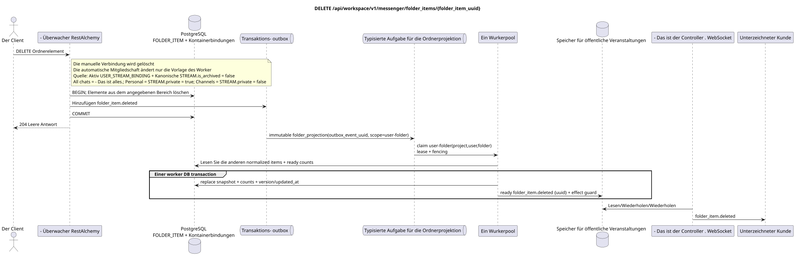

# `DELETE /api/workspace/v1/messenger/folder_items/{folder_item_uuid}`

[← Hauptindex der Dokumentation](../../../../index.md) · [Index der Abfolge-Diagramme](../../README.md) · [Inhalt und Benutzer Workspace](../README.md)

Status: Ziel-Spezifikation der Operation, die zuerst in der Dokumentation erarbeitet wurde.
unverändert bleibt und ist das Normativrecht in [`workspace_api.md`](../../../../workspace_api.md).
Diese Datei beschreibt die Zielgrenzen von Transaktionen und Projektionen; sie ist nicht
Produktionscode, Migration SQL oder neuer Endpunkt.



[Ausgangsgestalt , die bearbeitet werden kann PlantUML](diagrams/delete_folder_item.puml)

## Zuordnung und öffentlicher Vertrag

Streaming aus dem aktuellen Benutzerordner löschen.

Authentifizierung: Token Bearer IAM; `project_id` und aktuell `user_uuid` werden aus dem Kontext genommen IAM.

## Anfrageweg und -parameter

| Lage | Name | Typ / Regel |
| --- | --- | --- |
| Weg | `folder_item_uuid` | UUID |

Die Sammlungspagination, wo sie vorgesehen ist, behält den aktuellen Vertrag `page_limit` und UUID
`page_marker` und erhält `X-Pagination-Limit`, und
`X-Pagination-Marker` Nur wenn die nächste Seite vorhanden ist.

## Abfrage-Body

Der Abfrage-Body fehlt.

## Eine erfolgreiche Antwort

`204` mit leeren Antwortkörpern.


## Fehler und Autorierung

Falsche oder nicht autorisierte Eingabedaten werden durch die Fehlergrenze von RESTAlchemy/IAM verarbeitet; Ressourcen in einem bestimmten Bereich werden nicht außerhalb des Benutzers/Projekts offengelegt.

Allgemeine Antwortform bei Validierungsfehlern:

```json
{
  "type": "ValidationErrorException",
  "code": 400,
  "message": "Validation error occurred."
}
```

## Zielgrenze RestAlchemy

```python
from restalchemy.api import controllers as ra_controllers
from restalchemy.api import resources as ra_resources
from restalchemy.dm import models
from restalchemy.dm import properties
from restalchemy.dm import types
from restalchemy.storage.sql import orm


class WorkspaceFolderItem(models.ModelWithUUID, models.ModelWithProject,
                          models.ModelWithTimestamp, orm.SQLStorableMixin):
    __tablename__ = "messenger_folder_items"
    user_uuid = properties.property(types.UUID(), required=True, read_only=True)
    folder_uuid = properties.property(types.UUID(), required=True)
    stream_uuid = properties.property(types.UUID(), required=True)
    chat_type = properties.property(types.Enum(["stream", "group", "private"]), required=True)
    order_index = properties.property(types.AllowNone(types.Integer()))
    pinned_at = properties.property(types.AllowNone(types.UTCDateTimeZ()), read_only=True)


class WorkspaceUserFolderItem(models.ModelWithTimestamp, orm.SQLStorableMixin):
    __tablename__ = "messenger_api_user_folder_items_v1"
    uuid = properties.property(types.UUID(), id_property=True, read_only=True)
    project_id = properties.property(types.UUID(), read_only=True)
    user_uuid = properties.property(types.UUID(), read_only=True)
    folder_uuid = properties.property(types.UUID(), read_only=True)
    stream_uuid = properties.property(types.UUID(), read_only=True)
    chat_type = properties.property(
        types.Enum(["stream", "group", "private"]), read_only=True,
    )
    order_index = properties.property(types.AllowNone(types.Integer()))
    pinned_at = properties.property(types.AllowNone(types.UTCDateTimeZ()), read_only=True)
    # Ready fields are joined from unique USER_STREAM_BINDING. They are not
    # stored on WorkspaceFolderItem and are never calculated on API reads.
    unread_count = properties.property(types.Integer(min_value=0), read_only=True)
    active_unread_count = properties.property(types.Integer(min_value=0), read_only=True)
    passive_unread_count = properties.property(types.Integer(min_value=0), read_only=True)


class FolderItemController(ra_controllers.BaseResourceControllerPaginated):
    __resource__ = ra_resources.ResourceByRAModel(
        model_class=WorkspaceUserFolderItem,
        convert_underscore=False,
        process_filters=True,
    )
    # Writes use WorkspaceFolderItem; reads use the calculation-free view.
```

Jeder öffentliche Verweis auf die Entität wird als skalar UUID-Eigenschaft RestAlchemy erklärt, nicht `relationship` (die sich als URI serialieren würde). Der entsprechende physische Spalte `*_uuid`  ein indexierter externer Schlüssel mit einer eindeutig gewählten Verweisungsaktion. Daher hält der öffentliche JSON UUID unverändert.

Das physische Element hat FKs .`folder_uuid`, `stream_uuid`Und ...`user_uuid`- Ich weiß .`ON DELETE CASCADE`- Seine öffentlichen .UUID-die Verweise bleiben skalar.`USER_STREAM_BINDING`- Ich weiß .`(project_id,user_uuid,stream_uuid)`Sie werden nie in der Nachricht verbunden gespeichert und werden in dieser Anfrage nicht gezählt.

Der Router löscht die manuelle Verbindung in der Benutzermappe.
automatische `FOLDER_ITEM` im Systemordner wird nicht manuell gelöscht: dies
Eine wiederherstellbare materialisierte Projektion, die von Worker und Potential
unterstützt die aktive `USER_STREAM_BINDING` und die kanonische `STREAM` mit
`is_archived = false`. `All chats` beinhaltet alle verfügbaren Ströme,
`Personal` — Nur Ströme mit `STREAM.private = true`, `Channels`  nur mit
`STREAM.private = false`. Die Quelle wird über den Transaktions-
outbox und eine unabhängige immutable task mit einem einzigartigen `outbox_event_uuid`.

## Synchronisierter Weg API

1. Elemente in einem bestimmten Bereich finden und sperren.
2. Nur diese Zeile des Elements löschen.
3. Ein unveränderbares Eintrag in die Outbox hinzufügen `folder_item.deleted`.
4. Transaktion festhalten und zurückgeben `204`.

## Outbox, Typisierte Aufgaben, Worker und Echtzeitarbeit

Die Anfrage läßt die Zähler nicht wiederherstellen; das Löschmarker wird asynchron erstellt.

Outbox event führt immutable `folder_projection` ohne coalescing und mit exact scope
`user-folder:(project_id,user_uuid,folder_uuid)`. Der Besitzer der eingezäunten Miete liest
übrigen normalized items und ready stream counts und dann in einem worker DB
transaction Ersetzt deterministic `folder_items_snapshot`, Zähler,
version/updated_at und ready `folder_item.deleted`.
Nach commit; retry/backoff, DLQ/reaper und effect guard sind obligatorisch.

## Idempotenz, Schlüssel und Rennen

UUID Die Strecke mit dem Benutzer-/Projektbereich definiert eindeutig die Löschung. Konkurrierende Löschungen/Einnahmen werden in Transaktionsreihenfolge erlaubt; kein fremder Fluss oder Ordner wird gelöscht.

## Sichtbarkeit für den Client

Die Antwort REST `204` spiegelt sofort die Löschung des normalized item wider. Ein eingebetteter read-only snapshot von Ordner, Zählern und WebSocket tombstone kann bis zum Abschluss zurückbleiben `folder_projection`.

[← Hauptindex der Dokumentation](../../../../index.md) · [Index der Abfolge-Diagramme](../../README.md) · [Inhalt und Benutzer Workspace](../README.md)
