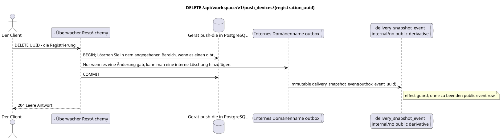

# `DELETE /api/workspace/v1/push_devices/{registration_uuid}`


Allgemeine Ziel-Invariante der Zuverlässigkeit: Jedes immutable outbox-Ereignis führt genau eine immutable typed task mit einem einzigartigen `outbox_event_uuid`; coalescing fehlt. Task speichert den tatsächlichen exact scope key, verwendet lease/fencing, retry/backoff, max attempts/DLQ, reaper und idepotent effect guard. Topic scope wird nur für placement/message-binding work angewendet; shared rows erhalten keinen impliziten Fallback auf topic.

[← Hauptindex der Dokumentation](../../../../index.md) · [Index der Abfolge-Diagramme](../../README.md) · [Inhalt und Benutzer Workspace](../README.md)

Status: Ziel-Spezifikation der Operation, die zuerst in der Dokumentation erarbeitet wurde.
unverändert bleibt und ist das Normativrecht in [`workspace_api.md`](../../../../workspace_api.md).
Diese Datei beschreibt die Zielgrenzen von Transaktionen und Projektionen; sie ist nicht
Produktionscode, Migration SQL oder neuer Endpunkt.



[Ausgangsgestalt , die bearbeitet werden kann PlantUML](diagrams/delete_push_device.puml)

## Zuordnung und öffentlicher Vertrag

Die Installationsregistrierung des aktuellen Benutzers löschen.

Authentifizierung: Token Bearer IAM; `project_id` und aktuell `user_uuid` werden aus dem Kontext genommen IAM.

## Anfrageweg und -parameter

| Lage | Name | Typ / Regel |
| --- | --- | --- |
| Weg | `registration_uuid` | UUID |

Die Sammlungspagination, wo sie vorgesehen ist, behält den aktuellen Vertrag `page_limit` und UUID
`page_marker` und erhält `X-Pagination-Limit`, und
`X-Pagination-Marker` Nur wenn die nächste Seite vorhanden ist.

## Abfrage-Body

Der Abfrage-Body fehlt.

## Eine erfolgreiche Antwort

`204` mit leeren Antwortkörpern.


## Fehler und Autorierung

Die Operation bringt sie zurück .`204`und wenn die Registrierung in dem angegebenen Bereich gelöscht wurde und wenn sie nicht mehr existiert.UUID/IAMwird durch die gemeinsame Validierungsgrenze bearbeitet.

Allgemeine Antwortform bei Validierungsfehlern:

```json
{
  "type": "ValidationErrorException",
  "code": 400,
  "message": "Validation error occurred."
}
```

## Zielgrenze RestAlchemy

```python
from restalchemy.api import controllers as ra_controllers
from restalchemy.api import resources as ra_resources
from restalchemy.dm import models
from restalchemy.dm import properties
from restalchemy.dm import types
from restalchemy.storage.sql import orm


class PushDevice(models.ModelWithUUID, models.ModelWithProject,
                 models.ModelWithTimestamp, orm.SQLStorableMixin):
    __tablename__ = "m_workspace_push_devices"
    user_uuid = properties.property(types.UUID(), required=True, read_only=True)
    transport = properties.property(types.Enum(["fcm"]), required=True)
    platform = properties.property(types.Enum(["android", "ios"]), required=True)
    registration_token = properties.property(types.String(max_length=4096), required=True)
    encryption = properties.property(types.Dict(), required=True)


class PushDeviceController(ra_controllers.BaseResourceController):
    __resource__ = ra_resources.ResourceByRAModel(model_class=PushDevice)
    # Narrow PUT upsert and idempotent DELETE overrides preserve owner scope.
```

Jeder öffentliche Verweis auf die Entität wird als skalar UUID-Eigenschaft RestAlchemy erklärt, nicht `relationship` (die sich als URI serialieren würde). Der entsprechende physische Spalte `*_uuid`  ein indexierter externer Schlüssel mit einer eindeutig gewählten Verweisungsaktion. Daher hält der öffentliche JSON UUID unverändert.

Die Verwaltung von Push-Notifications-Registrierungen liegt außerhalb der Verarbeitung von Messenger-Wesen. UUID-Einstellungen  Ressourcenschlüssel. `user_uuid` und `project_id`  Server skalarische UUID-Felder, die von Index-Feld-Spalten unterstützt werden; die Verschlüsselung verwendet das vorhandene Modell `kind` HPKE.

## Synchronisierter Weg API

1. Bereiche für den Eigentümer auswählen.
2. Löschen Sie die Zeile nur, wenn UUID, Projekt und Benutzer übereinstimmen.
3. Wenn sich die Zeile geändert hat, fügen Sie in die Outbox einen unveränderlichen internen Eintrag ohne öffentliche Ableitung hinzu.
4. Beide Fälle: `204`.

## Outbox, Typisierte Aufgaben, Worker und Echtzeitarbeit

Es werden keine öffentlichen Aufgaben/Ereignisse oder Push-Benachrichtigungen erstellt.

Der aktuelle Vertrag regelt nur die Registrierung. immutable
outbox-Das Ereignis erzeugt eine `delivery_snapshot_event`, die impotent ist.
Die Angabe der Ableitung wird nicht veröffentlicht und wird abgeschlossen; Workspace event row
Und ...WebSocketDie Verschlüsselung und die Lieferung der Push-Ladung sind eingeschlossen.
außerhalb dieses Endpunktes.

## Idempotenz, Schlüssel und Rennen

Die Löschung ist nicht potenziell und enthüllt keine Registrierung aus einem anderen Bereich des Besitzers.UUID- die Registrierung.

## Sichtbarkeit für den Client

Die Änderung der Registrierung ist bis zur Rückgabe der HTTP-Antwort sichtbar. Es gibt kein öffentliches WebSocket-Event für sie.

[← Hauptindex der Dokumentation](../../../../index.md) · [Index der Abfolge-Diagramme](../../README.md) · [Inhalt und Benutzer Workspace](../README.md)
