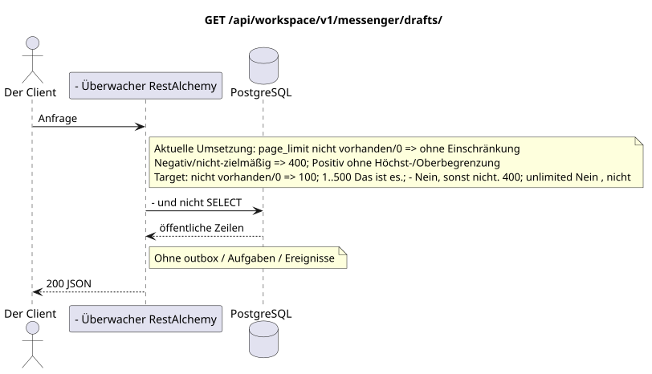

# `GET /api/workspace/v1/messenger/drafts/`

[← Hauptindex der Dokumentation](../../../../index.md) · [Index der Abfolge-Diagramme](../../README.md) · [Inhalt und Benutzer Workspace](../README.md)

Status: Ziel-Spezifikation der Operation, die zuerst in der Dokumentation erarbeitet wurde.
unverändert bleibt und ist das Normativrecht in [`workspace_api.md`](../../../../workspace_api.md).
Diese Datei beschreibt die Zielgrenzen von Transaktionen und Projektionen; sie ist nicht
Produktionscode, Migration SQL oder neuer Endpunkt.



[Ausgangsgestalt , die bearbeitet werden kann PlantUML](diagrams/get_drafts_list.puml)

## Zuordnung und öffentlicher Vertrag

Listen Sie die aktuellen Benutzerentwürfe mit stabiler Kurzerseite nach `(updated_at, uuid)`.

Authentifizierung: Token Bearer IAM; `project_id` und aktuell `user_uuid` werden aus dem Kontext genommen IAM.

## Anfrageweg und -parameter

| Lage | Name | Typ / Regel |
| --- | --- | --- |
| Anfrage | `page_limit` | current: fehlen/`0` bedeutet unlimited; target: fehlen/`0` => `100`, `1..500` genau, negativ/nichtzielhaft/`>500` => `400` ohne clamp |
| Anfrage | `page_marker` | UUID In demselben Bereich des Besitzers und Filter |
| Anfrage | `sort_key` | Nur `updated_at` |
| Anfrage | `sort_dir` | `asc` oder `desc` |
| Anfrage | `stream_uuid` | - nicht obligatorisch UUID |
| Anfrage | `topic_uuid` | - nicht obligatorisch UUID |

Die Sammlungspagination, wo sie vorgesehen ist, behält den aktuellen Vertrag `page_limit` und UUID
`page_marker` und erhält `X-Pagination-Limit`, und
`X-Pagination-Marker` Nur wenn die nächste Seite vorhanden ist.

Target default — `100`, hard maximum — `500`; `0` bedeutet auch`100`Unbounded Mode fehlt . Die Angabe ist öffentlich .JSON-die Form nicht ändern; Kunden des vollen Exports lesen bis zur Abwesenheit des nächsten marker.

## Abfrage-Body

Der Abfrage-Body fehlt.

## Eine erfolgreiche Antwort

`200`

```json
[
  {
    "uuid": "ca14d274-0057-4a9a-a34b-fb1174be6a17",
    "project_id": "22222222-2222-2222-2222-222222222222",
    "user_uuid": "11111111-1111-1111-1111-111111111111",
    "stream_uuid": "75309057-419c-4b12-a7c1-3932429ec4a6",
    "topic_uuid": "4ec0b996-b778-45f8-8ef4-ef863be0c047",
    "payload": {
      "kind": "markdown",
      "content": "Draft message"
    },
    "revision": 1,
    "created_at": "2026-07-17T08:00:00Z",
    "updated_at": "2026-07-17T08:00:00Z"
  }
]
```


## Fehler und Autorierung

Falsche Sortierungs-/Filterparameter geben `400` zurück. Marker außerhalb des genauen Bereichs des Besitzers/Projekts/Filters geben `404` zurück. Fehler IAM werden durch eine gemeinsame Grenze verarbeitet.

Allgemeine Antwortform bei Validierungsfehlern:

```json
{
  "type": "ValidationErrorException",
  "code": 400,
  "message": "Validation error occurred."
}
```

## Zielgrenze RestAlchemy

```python
from restalchemy.api import controllers as ra_controllers
from restalchemy.api import resources as ra_resources
from restalchemy.dm import models
from restalchemy.dm import properties
from restalchemy.dm import types
from restalchemy.storage.sql import orm


class WorkspaceDraft(models.ModelWithUUID, models.ModelWithProject,
                     models.ModelWithTimestamp, orm.SQLStorableMixin):
    # Contract boundary only; target physical naming/decomposition is not selected.
    __tablename__ = "m_workspace_drafts"
    user_uuid = properties.property(types.UUID(), required=True, read_only=True)
    stream_uuid = properties.property(types.UUID(), required=True, read_only=True)
    topic_uuid = properties.property(types.UUID(), required=True, read_only=True)
    payload = properties.property(types.Dict(), required=True)
    revision = properties.property(types.Integer(min_value=1), read_only=True)


class WorkspaceDraftController(ra_controllers.BaseResourceControllerPaginated):
    __resource__ = ra_resources.ResourceByRAModel(
        model_class=WorkspaceDraft,
        convert_underscore=False,
        process_filters=True,
    )
    # Narrow overrides preserve owner scope, keyset marker, ETag and If-Match.
```

Jeder öffentliche Verweis auf die Entität wird als skalar UUID-Eigenschaft RestAlchemy erklärt, nicht `relationship` (die sich als URI serialieren würde). Der entsprechende physische Spalte `*_uuid`  ein indexierter externer Schlüssel mit einer eindeutig gewählten Verweisungsaktion. Daher hält der öffentliche JSON UUID unverändert.

Die Anzeige fixiert eine unveränderliche skalare Grenze UUID/ETag. Die physischen UUID-Spalten des Benutzers/Flows/Themes bleiben FK-indexiert mit Kaskadenverhalten aus dem aktuellen Vertrag; die Beziehung RestAlchemy darf die öffentliche Verknüpfung nicht verändern UUID JSON.

## Synchronisierter Weg API

1. Bereiche überprüfen IAM.
2. Führen Sie eine indexierte Ressource aus.
3. Nicht geändertes öffentliches Programm serialisieren JSON.

## Outbox, Typisierte Aufgaben, Worker und Echtzeitarbeit

Dieses Lesen schreibt kein Domänenereignis oder Outbox-Eintrag, erstellt keine typische Projektionsvorgabe und veröffentlicht kein öffentliches Ereignis. Die DB-basierten Ressourcen werden ohne Berechnungen nach Indizes gelesen. Alle Zähler sind bereits materialisiert; die Anfrage führt keine `COUNT`, `GROUP BY`, korrelierten Unteranfragen aus und scannt keine Nachrichtenbindungen.

WebSocket ist nicht anwesend.

## Idempotenz, Schlüssel und Rennen

Die Identität der Ressource und der Filterbereich sind während der Transaktion stabil..

## Sichtbarkeit für den Client

Der Client erhält den festgelegten Status, der zum Zeitpunkt der Ausführung der Lesetransaction verfügbar ist; die Anfrage plant keine neue ausgesetzte Arbeit.

[← Hauptindex der Dokumentation](../../../../index.md) · [Index der Abfolge-Diagramme](../../README.md) · [Inhalt und Benutzer Workspace](../README.md)
