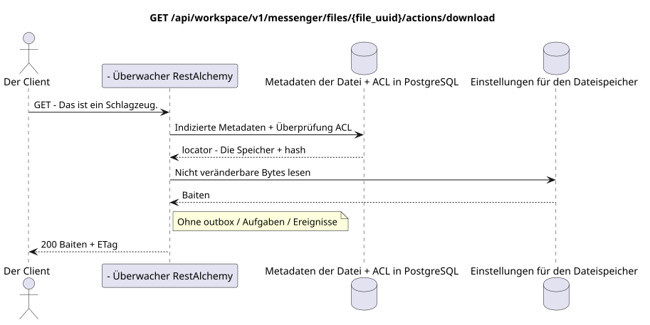

# `GET /api/workspace/v1/messenger/files/{file_uuid}/actions/download`

[← Hauptindex der Dokumentation](../../../../index.md) · [Index der Abfolge-Diagramme](../../README.md) · [Inhalt und Benutzer Workspace](../README.md)

Status: Ziel-Spezifikation der Operation, die zuerst in der Dokumentation erarbeitet wurde.
unverändert bleibt und ist das Normativrecht in [`workspace_api.md`](../../../../workspace_api.md).
Diese Datei beschreibt die Zielgrenzen von Transaktionen und Projektionen; sie ist nicht
Produktionscode, Migration SQL oder neuer Endpunkt.



[Ausgangsgestalt , die bearbeitet werden kann PlantUML](diagrams/get_file_download.puml)

## Zuordnung und öffentlicher Vertrag

Das nicht veränderbare Byte der sichtbaren Datei herunterladen.

Authentifizierung: Token Bearer IAM; `project_id` und aktuell `user_uuid` werden aus dem Kontext genommen IAM.

## Anfrageweg und -parameter

| Lage | Name | Typ / Regel |
| --- | --- | --- |
| Weg | `file_uuid` | UUID |

Die Sammlungspagination, wo sie vorgesehen ist, behält den aktuellen Vertrag `page_limit` und UUID
`page_marker` und erhält `X-Pagination-Limit`, und
`X-Pagination-Marker` Nur wenn die nächste Seite vorhanden ist.

## Abfrage-Body

Der Abfrage-Body fehlt.

## Eine erfolgreiche Antwort

`200`: Unverarbeiteten Bytes, nichtJSON. Überschrift: gespeichert`Content-Type`, der Anlage`Content-Disposition`- Sie sind streng .`ETag: "<hash>"`und Verhalten private/no-cache.


## Fehler und Autorierung

Ungültige Filter geben HTTP `400` zurück; eine nicht erreichbare einzelne Ressource wird nicht gefunden. Fehler IAM überschreiten die Authentifizierungsfehlergrenze Workspace.

Allgemeine Antwortform bei Validierungsfehlern:

```json
{
  "type": "ValidationErrorException",
  "code": 400,
  "message": "Validation error occurred."
}
```

## Zielgrenze RestAlchemy

```python
from restalchemy.api import controllers as ra_controllers
from restalchemy.api import resources as ra_resources
from restalchemy.dm import models
from restalchemy.dm import properties
from restalchemy.dm import types
from restalchemy.storage.sql import orm


class WorkspaceFile(models.ModelWithUUID, models.ModelWithProject,
                    models.ModelWithTimestamp, orm.SQLStorableMixin):
    # Contract boundary only; target storage decomposition is not selected.
    __tablename__ = "m_workspace_files"
    user_uuid = properties.property(types.UUID(), required=True, read_only=True)
    stream_uuid = properties.property(types.AllowNone(types.UUID()))
    name = properties.property(types.String(max_length=255), required=True)
    description = properties.property(types.String(max_length=255), default="")
    content_type = properties.property(types.String(max_length=255), required=True)
    size_bytes = properties.property(types.Integer(min_value=0), required=True)
    hash = properties.property(types.String(max_length=255), required=True)


class WorkspaceFileController(ra_controllers.BaseResourceControllerPaginated):
    __resource__ = ra_resources.ResourceByRAModel(
        model_class=WorkspaceFile,
        hidden_fields=["project_id"],
        convert_underscore=False,
        process_filters=True,
    )
    # Narrow multipart/storage/download overrides preserve the current contract.
```

Jeder öffentliche Verweis auf die Entität wird als skalar UUID-Eigenschaft RestAlchemy erklärt, nicht `relationship` (die sich als URI serialieren würde). Der entsprechende physische Spalte `*_uuid`  ein indexierter externer Schlüssel mit einer eindeutig gewählten Verweisungsaktion. Daher hält der öffentliche JSON UUID unverändert.

Der aktuelle Metadaten/Speicher/ACL-Vertrag wird beibehalten; die Zielfähigkeit ist nicht gewählt. `project_id` bleibt versteckt. Skalar `user_uuid` und zulässig `null` `stream_uuid` bleiben öffentliche UUID-Werte, die von FKs unterstützt werden..

## Synchronisierter Weg API

1. Die Anfrage authentifizieren und die Metadaten nach UUID.
2. Überprüfen Sie die öffentliche ACL oder aktuelle indexierte Mitgliedschaft im Stream.
3. Nicht veränderbare Binärdaten aus dem konfigurierten Speicher lesen.
4. Übertragen von Byte mit Vollständigkeits- und Einfügungsüberschriften.

## Outbox, Typisierte Aufgaben, Worker und Echtzeitarbeit

Dieses Lesen schreibt kein Domänenereignis oder Outbox-Eintrag, erstellt keine typische Projektionsvorgabe und veröffentlicht kein öffentliches Ereignis. Die DB-basierten Ressourcen werden ohne Berechnungen nach Indizes gelesen. Alle Zähler sind bereits materialisiert; die Anfrage führt keine `COUNT`, `GROUP BY`, korrelierten Unteranfragen aus und scannt keine Nachrichtenbindungen.

WebSocket ist nicht anwesend.

## Idempotenz, Schlüssel und Rennen

Die Identität der Ressource und der Filterbereich sind während der Transaktion stabil..

## Sichtbarkeit für den Client

Der Client erhält den festgelegten Status, der zum Zeitpunkt der Ausführung der Lesetransaction verfügbar ist; die Anfrage plant keine neue ausgesetzte Arbeit.

[← Hauptindex der Dokumentation](../../../../index.md) · [Index der Abfolge-Diagramme](../../README.md) · [Inhalt und Benutzer Workspace](../README.md)
