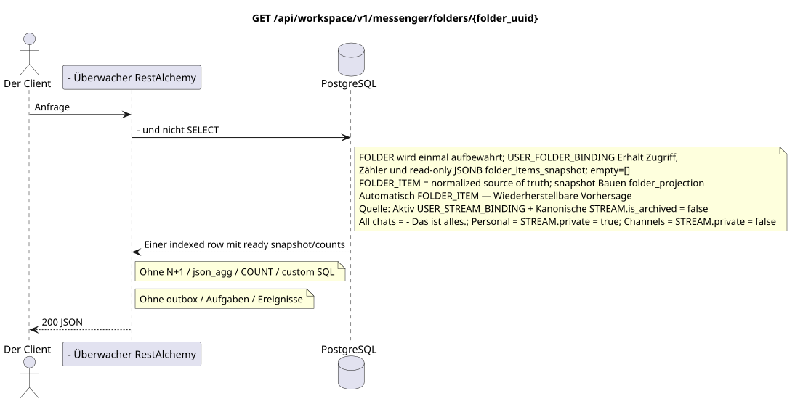

# `GET /api/workspace/v1/messenger/folders/{folder_uuid}`

[← Hauptindex der Dokumentation](../../../../index.md) · [Index der Abfolge-Diagramme](../../README.md) · [Inhalt und Benutzer Workspace](../README.md)

Status: Ziel-Spezifikation der Operation, die zuerst in der Dokumentation erarbeitet wurde.
unverändert bleibt und ist das Normativrecht in [`workspace_api.md`](../../../../workspace_api.md).
Diese Datei beschreibt die Zielgrenzen von Transaktionen und Projektionen; sie ist nicht
Produktionscode, Migration SQL oder neuer Endpunkt.



[Ausgangsgestalt , die bearbeitet werden kann PlantUML](diagrams/get_folder.puml)

## Zuordnung und öffentlicher Vertrag

Einen aktuellen Benutzerordner erhalten.

Authentifizierung: Token Bearer IAM; `project_id` und aktuell `user_uuid` werden aus dem Kontext genommen IAM.

## Anfrageweg und -parameter

| Lage | Name | Typ / Regel |
| --- | --- | --- |
| Weg | `folder_uuid` | UUID |

Die Sammlungspagination, wo sie vorgesehen ist, behält den aktuellen Vertrag `page_limit` und UUID
`page_marker` und erhält `X-Pagination-Limit`, und
`X-Pagination-Marker` Nur wenn die nächste Seite vorhanden ist.

## Abfrage-Body

Der Abfrage-Body fehlt.

## Eine erfolgreiche Antwort

`200`

```json
{
  "uuid": "50ecadd0-9823-4d97-b54c-806cc672c210",
  "title": "Inbox",
  "background_color_value": 4280391411,
  "unread_count": 3,
  "system_type": "created",
  "folder_items": [
    {
      "uuid": "9f41b1a7-77f9-4c12-bdc6-d3cebc5dbf50",
      "project_id": "22222222-2222-2222-2222-222222222222",
      "folder_uuid": "50ecadd0-9823-4d97-b54c-806cc672c210",
      "user_uuid": "11111111-1111-1111-1111-111111111111",
      "stream_uuid": "75309057-419c-4b12-a7c1-3932429ec4a6",
      "chat_type": "stream",
      "order_index": 10,
      "pinned_at": null,
      "unread_count": 3,
      "active_unread_count": 3,
      "passive_unread_count": 0,
      "created_at": "2026-06-22T09:30:00Z",
      "updated_at": "2026-06-22T09:30:00Z"
    }
  ],
  "created_at": "2026-06-22T09:30:00Z",
  "updated_at": "2026-06-22T09:30:00Z"
}
```


## Fehler und Autorierung

Ungültige Filter geben HTTP `400` zurück; eine nicht erreichbare einzelne Ressource wird nicht gefunden. Fehler IAM überschreiten die Authentifizierungsfehlergrenze Workspace.

Allgemeine Antwortform bei Validierungsfehlern:

```json
{
  "type": "ValidationErrorException",
  "code": 400,
  "message": "Validation error occurred."
}
```

## Zielgrenze RestAlchemy

```python
from restalchemy.api import controllers as ra_controllers
from restalchemy.api import resources as ra_resources
from restalchemy.dm import models
from restalchemy.dm import properties
from restalchemy.dm import types
from restalchemy.storage.sql import orm


class WorkspaceFolder(models.ModelWithUUID, models.ModelWithProject,
                      models.ModelWithTimestamp, orm.SQLStorableMixin):
    __tablename__ = "messenger_folders"
    title = properties.property(types.String(min_length=1, max_length=64), required=True)
    background_color_value = properties.property(types.AllowNone(types.Integer()))


class WorkspaceUserFolderBinding(models.ModelWithUUID, models.ModelWithProject,
                                 models.ModelWithTimestamp, orm.SQLStorableMixin):
    __tablename__ = "messenger_user_folder_bindings"
    # Public UUID links are scalar UUID properties, never URI relationships.
    user_uuid = properties.property(types.UUID(), required=True, read_only=True)
    folder_uuid = properties.property(types.UUID(), required=True, read_only=True)
    unread_count = properties.property(types.Integer(min_value=0), default=0, read_only=True)
    mention_count = properties.property(types.Integer(min_value=0), default=0, read_only=True)
    folder_items_snapshot = properties.property(types.List(), default=list, read_only=True)
    folder_items_snapshot_version = properties.property(types.Integer(min_value=0), default=0, read_only=True)
    folder_items_snapshot_updated_at = properties.property(types.AllowNone(types.UTCDateTimeZ()), read_only=True)
    BUSINESS_KEY = ("project_id", "user_uuid", "folder_uuid")


class WorkspaceUserFolder(models.ModelWithTimestamp, orm.SQLStorableMixin):
    __tablename__ = "messenger_api_user_folders_v1"
    binding_uuid = properties.property(types.UUID(), id_property=True, read_only=True)
    uuid = properties.property(types.UUID(), read_only=True)
    title = properties.property(types.String(min_length=1, max_length=64))
    background_color_value = properties.property(types.AllowNone(types.Integer()))
    unread_count = properties.property(types.Integer(min_value=0), read_only=True)
    system_type = properties.property(types.AllowNone(types.Enum(["all", "created"])), read_only=True)
    folder_items = properties.property(types.List(), read_only=True)


class FolderController(ra_controllers.BaseResourceControllerPaginated):
    __resource__ = ra_resources.ResourceByRAModel(
        model_class=WorkspaceUserFolder,
        hidden_fields=["binding_uuid", "project_id", "user_uuid"],
        convert_underscore=False,
        process_filters=True,
    )
```

Jeder öffentliche Verweis auf die Entität wird als skalar UUID-Eigenschaft RestAlchemy erklärt, nicht `relationship` (die sich als URI serialieren würde). Der entsprechende physische Spalte `*_uuid`  ein indexierter externer Schlüssel mit einer eindeutig gewählten Verweisungsaktion. Daher hält der öffentliche JSON UUID unverändert.

Das Modell liefert eine Index-File zurück .`WorkspaceUserFolderBinding`Mit einer kanonischen .`WorkspaceFolder`- Das ist öffentlich .`folder_items`Sie wird direkt aus Read-only übernommen .JSONB `folder_items_snapshot` (`[]`für einen leeren Ordner).GETEr wird nicht von N+1 ausgeführt.`json_agg`, `COUNT`, Unteranfragen oder customSQL- Normalisiert .`FOLDER_ITEM`Die Bilder und die Zähler werden verarbeitet .`folder_projection`. `folder_uuid`Und ...`user_uuid`Index FK mit `ON DELETE CASCADE`.

Systemordner  ist `USER_FOLDER_BINDING` mit den festen Regeln/Typ: ihr
Sie können diese Regel nicht löschen oder manuell in eine andere Regel umstellen.
`FOLDER_ITEM` — Die wiederhergestellte materialisierte Projektion.
Idimpotent unterstützt sie aus den aktiven `USER_STREAM_BINDING` und kanonischen
`STREAM` mit `is_archived = false`: `All chats` (Alle Chats) beinhaltet alle solche
verfügbare Flüsse, `Personal` (Personal)  nur Flüsse von
`STREAM.private = true`, `Channels` («Kanäle)  nur mit
`STREAM.private = false`. API Lesen Sie sie nur mit einfachen Indexierten
Zusammenschlüsse; öffentlicher Vertrag und Handlungsumfang ändern sich nicht.

## Synchronisierter Weg API

1. Bereiche überprüfen IAM.
2. Führen Sie eine indexierte Ressource aus.
3. Nicht geändertes öffentliches Programm serialisieren JSON.

## Outbox, Typisierte Aufgaben, Worker und Echtzeitarbeit

Dieses Lesen schreibt nicht in die Outbox und erstellt keine Task. Standard RestAlchemy
resource Liest eine Indexed Binding Row; Zähler und read-only JSONB
`folder_items_snapshot` Wir sind bereit. N+1, `json_agg`, `COUNT`,
`GROUP BY`, Korrelierte Unterabfragen oder custom SQL; es wird nicht behoben snapshot.

WebSocket ist nicht anwesend.

## Idempotenz, Schlüssel und Rennen

Die Identität der Ressource und der Filterbereich sind während der Transaktion stabil..

## Sichtbarkeit für den Client

Der Client erhält den festgelegten Status, der zum Zeitpunkt der Ausführung der Lesetransaction verfügbar ist; die Anfrage plant keine neue ausgesetzte Arbeit.

[← Hauptindex der Dokumentation](../../../../index.md) · [Index der Abfolge-Diagramme](../../README.md) · [Inhalt und Benutzer Workspace](../README.md)
