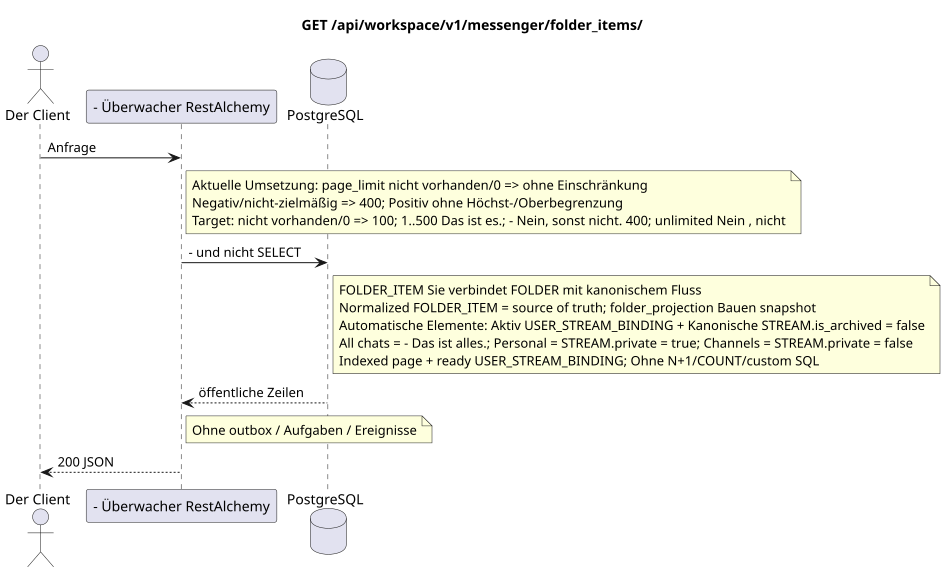

# `GET /api/workspace/v1/messenger/folder_items/`

[← Hauptindex der Dokumentation](../../../../index.md) · [Index der Abfolge-Diagramme](../../README.md) · [Inhalt und Benutzer Workspace](../README.md)

Status: Ziel-Spezifikation der Operation, die zuerst in der Dokumentation erarbeitet wurde.
unverändert bleibt und ist das Normativrecht in [`workspace_api.md`](../../../../workspace_api.md).
Diese Datei beschreibt die Zielgrenzen von Transaktionen und Projektionen; sie ist nicht
Produktionscode, Migration SQL oder neuer Endpunkt.



[Ausgangsgestalt , die bearbeitet werden kann PlantUML](diagrams/get_folder_items_list.puml)

## Zuordnung und öffentlicher Vertrag

Liste der Ordner des aktuellen Benutzers.

Authentifizierung: Token Bearer IAM; `project_id` und aktuell `user_uuid` werden aus dem Kontext genommen IAM.

## Anfrageweg und -parameter

| Lage | Name | Typ / Regel |
| --- | --- | --- |
| Anfrage | `page_limit` | current: fehlen/`0` bedeutet unlimited; target: fehlen/`0` => `100`, `1..500` genau, negativ/nichtzielhaft/`>500` => `400` ohne clamp |
| Anfrage | `page_marker` | UUID Letzte Ressource der vorherigen Seite |

Die Sammlungspagination, wo sie vorgesehen ist, behält den aktuellen Vertrag `page_limit` und UUID
`page_marker` und erhält `X-Pagination-Limit`, und
`X-Pagination-Marker` Nur wenn die nächste Seite vorhanden ist.

Target default — `100`, hard maximum — `500`; `0` bedeutet auch`100`Unbounded Mode fehlt . Die Angabe ist öffentlich .JSON-die Form nicht ändern; Kunden des vollen Exports lesen bis zur Abwesenheit des nächsten marker.

## Abfrage-Body

Der Abfrage-Body fehlt.

## Eine erfolgreiche Antwort

`200`

```json
[
  {
    "uuid": "9f41b1a7-77f9-4c12-bdc6-d3cebc5dbf50",
    "project_id": "22222222-2222-2222-2222-222222222222",
    "folder_uuid": "50ecadd0-9823-4d97-b54c-806cc672c210",
    "user_uuid": "11111111-1111-1111-1111-111111111111",
    "stream_uuid": "75309057-419c-4b12-a7c1-3932429ec4a6",
    "chat_type": "stream",
    "order_index": 10,
    "pinned_at": null,
    "unread_count": 3,
    "active_unread_count": 3,
    "passive_unread_count": 0,
    "created_at": "2026-06-22T09:30:00Z",
    "updated_at": "2026-06-22T09:30:00Z"
  }
]
```


## Fehler und Autorierung

Ungültige Filter geben HTTP `400` zurück; eine nicht erreichbare einzelne Ressource wird nicht gefunden. Fehler IAM überschreiten die Authentifizierungsfehlergrenze Workspace.

Allgemeine Antwortform bei Validierungsfehlern:

```json
{
  "type": "ValidationErrorException",
  "code": 400,
  "message": "Validation error occurred."
}
```

## Zielgrenze RestAlchemy

```python
from restalchemy.api import controllers as ra_controllers
from restalchemy.api import resources as ra_resources
from restalchemy.dm import models
from restalchemy.dm import properties
from restalchemy.dm import types
from restalchemy.storage.sql import orm


class WorkspaceFolderItem(models.ModelWithUUID, models.ModelWithProject,
                          models.ModelWithTimestamp, orm.SQLStorableMixin):
    __tablename__ = "messenger_folder_items"
    user_uuid = properties.property(types.UUID(), required=True, read_only=True)
    folder_uuid = properties.property(types.UUID(), required=True)
    stream_uuid = properties.property(types.UUID(), required=True)
    chat_type = properties.property(types.Enum(["stream", "group", "private"]), required=True)
    order_index = properties.property(types.AllowNone(types.Integer()))
    pinned_at = properties.property(types.AllowNone(types.UTCDateTimeZ()), read_only=True)


class WorkspaceUserFolderItem(models.ModelWithTimestamp, orm.SQLStorableMixin):
    __tablename__ = "messenger_api_user_folder_items_v1"
    uuid = properties.property(types.UUID(), id_property=True, read_only=True)
    project_id = properties.property(types.UUID(), read_only=True)
    user_uuid = properties.property(types.UUID(), read_only=True)
    folder_uuid = properties.property(types.UUID(), read_only=True)
    stream_uuid = properties.property(types.UUID(), read_only=True)
    chat_type = properties.property(
        types.Enum(["stream", "group", "private"]), read_only=True,
    )
    order_index = properties.property(types.AllowNone(types.Integer()))
    pinned_at = properties.property(types.AllowNone(types.UTCDateTimeZ()), read_only=True)
    # Ready fields are joined from unique USER_STREAM_BINDING. They are not
    # stored on WorkspaceFolderItem and are never calculated on API reads.
    unread_count = properties.property(types.Integer(min_value=0), read_only=True)
    active_unread_count = properties.property(types.Integer(min_value=0), read_only=True)
    passive_unread_count = properties.property(types.Integer(min_value=0), read_only=True)


class FolderItemController(ra_controllers.BaseResourceControllerPaginated):
    __resource__ = ra_resources.ResourceByRAModel(
        model_class=WorkspaceUserFolderItem,
        convert_underscore=False,
        process_filters=True,
    )
    # Writes use WorkspaceFolderItem; reads use the calculation-free view.
```

Jeder öffentliche Verweis auf die Entität wird als skalar UUID-Eigenschaft RestAlchemy erklärt, nicht `relationship` (die sich als URI serialieren würde). Der entsprechende physische Spalte `*_uuid`  ein indexierter externer Schlüssel mit einer eindeutig gewählten Verweisungsaktion. Daher hält der öffentliche JSON UUID unverändert.

Das physische Element hat FKs .`folder_uuid`, `stream_uuid`Und ...`user_uuid`- Ich weiß .`ON DELETE CASCADE`- Seine öffentlichen .UUID-die Verweise bleiben skalar.`USER_STREAM_BINDING`- Ich weiß .`(project_id,user_uuid,stream_uuid)`Sie werden nie in der Nachricht verbunden gespeichert und werden in dieser Anfrage nicht gezählt.

Kanonische `FOLDER_ITEM` verbindet `FOLDER` mit unterstützten kanonischen
Sie können die Daten des Objekts (in dem aktuellen Vertrag  Stream) ohne Kopieren verwenden.
automatische Elemente  wiederherstellbare materialisierte Projektion:
Erstellen/Aktualisieren/Löschen `USER_STREAM_BINDING` geht durch
Transaktions-Outbox und eine separate immutable task mit einem einzigartigen `outbox_event_uuid`, danach worker
Impidpotent materialisiert die aktiven `USER_STREAM_BINDING`, verbunden mit
Kanonische `STREAM` mit `is_archived = false`: `All chats` beinhaltet alle solche
verfügbare Flüsse, `Personal`  nur Flüsse mit `STREAM.private = true`,
`Channels` — Nur mit .`STREAM.private = false`Worker aktualisiert auch die
Die Aggregate `unread_count`/`mention_count` in `USER_FOLDER_BINDING`. GET
führt nur einfache indexierte Verbindungen ohne `COUNT` während
Nachfrage.

## Synchronisierter Weg API

1. Bereiche überprüfen IAM.
2. Führen Sie eine indexierte Ressource aus.
3. Nicht geändertes öffentliches Programm serialisieren JSON.

## Outbox, Typisierte Aufgaben, Worker und Echtzeitarbeit

Dieses Lesen schreibt kein Domänenereignis oder Outbox-Eintrag, erstellt keine typische Projektionsvorgabe und veröffentlicht kein öffentliches Ereignis. Die DB-basierten Ressourcen werden ohne Berechnungen nach Indizes gelesen. Alle Zähler sind bereits materialisiert; die Anfrage führt keine `COUNT`, `GROUP BY`, korrelierten Unteranfragen aus und scannt keine Nachrichtenbindungen.
Die Seite items liest normalized `FOLDER_ITEM` und eins
Die viele-zu-einen-Join-Index wird von den bereitgestellten Zählern abgerufen.
`USER_STREAM_BINDING`. Es gibt keine N+1 und keine custom SQL. normalized rows
sind die Quelle der Wahrheit für read-only `folder_items_snapshot`; diese GET ist nicht
Sie repariert es nicht, sondern baut es um. `folder_projection`.

WebSocket ist nicht anwesend.

## Idempotenz, Schlüssel und Rennen

Die Identität der Ressource und der Filterbereich sind während der Transaktion stabil..

## Sichtbarkeit für den Client

Der Client erhält den festgelegten Status, der zum Zeitpunkt der Ausführung der Lesetransaction verfügbar ist; die Anfrage plant keine neue ausgesetzte Arbeit.

[← Hauptindex der Dokumentation](../../../../index.md) · [Index der Abfolge-Diagramme](../../README.md) · [Inhalt und Benutzer Workspace](../README.md)
