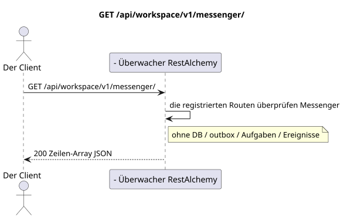

# `GET /api/workspace/v1/messenger/`

[← Hauptindex der Dokumentation](../../../../index.md) · [Index der Abfolge-Diagramme](../../README.md) · [Inhalt und Benutzer Workspace](../README.md)

Status: Ziel-Spezifikation der Operation, die zuerst in der Dokumentation erarbeitet wurde.
unverändert bleibt und ist das Normativrecht in [`workspace_api.md`](../../../../workspace_api.md).
Diese Datei beschreibt die Zielgrenzen von Transaktionen und Projektionen; sie ist nicht
Produktionscode, Migration SQL oder neuer Endpunkt.



[Ausgangsgestalt , die bearbeitet werden kann PlantUML](diagrams/get_messenger_routes_index.puml)

## Zuordnung und öffentlicher Vertrag

Legen Sie die aktuellen Routen der Sammlungen direkt unter der Wurzel auf Messenger v1.

Authentifizierung: Token Bearer IAM; `project_id` und aktuell `user_uuid` werden aus dem Kontext genommen IAM.

## Anfrageweg und -parameter

Weg und Anfrage werden nicht akzeptiert.

Die Sammlungspagination, wo sie vorgesehen ist, behält den aktuellen Vertrag `page_limit` und UUID
`page_marker` und erhält `X-Pagination-Limit`, und
`X-Pagination-Marker` Nur wenn die nächste Seite vorhanden ist.

## Abfrage-Body

Der Abfrage-Body fehlt.

## Eine erfolgreiche Antwort

`200`

```json
[
  "drafts",
  "external_accounts",
  "external_bridge_instances",
  "external_chats",
  "external_operations",
  "external_provider_health",
  "external_provider_policies",
  "files",
  "folder_items",
  "folders",
  "message_reactions",
  "messages",
  "stream_bindings",
  "stream_topics",
  "streams",
  "topic_summary_endpoints",
  "topic_summary_settings"
]
```


## Fehler und Autorierung

Authentifizierungsfehler IAM werden durch die allgemeine Fehlergrenze Workspace verarbeitet. Für diese Laufzeitliste gibt es keinen Fall von Ressource nicht gefunden und es akzeptiert keine funktionellen Filter.

Allgemeine Antwortform bei Validierungsfehlern:

```json
{
  "type": "ValidationErrorException",
  "code": 400,
  "message": "Validation error occurred."
}
```

## Zielgrenze RestAlchemy

```python
from restalchemy.api import controllers as ra_controllers


class WorkspaceApiEndpointController(ra_controllers.RoutesListController):
    __TARGET_PATH__ = "/v1/"


class MessengerApiEndpointController(ra_controllers.RoutesListController):
    __TARGET_PATH__ = "/v1/messenger/"
```

Für diese Routing-/Zwischensoftware-Antwort gibt es kein Domänenmodell oder physischen externen Schlüssel.

`RoutesListController` prüft den statischen Routenbaum; seine Liste der Ausführungszeiten  die öffentliche Grenze des Routenindex, nicht das Modell der Domänenressource.

## Synchronisierter Weg API

1. Anfrage authentifizieren.
2. Verwenden Sie den registrierten Routenbaum Messenger.
3. Wiederherstellen der geordneten Namen der Strecken der Sammlungen. Keine Datenbanktransaktion erforderlich.

## Outbox, Typisierte Aufgaben, Worker und Echtzeitarbeit

Diese Lektüre schreibt kein Domänenereignis oder Outbox-Eintrag auf, erstellt keine typische Projektionsvorgabe und veröffentlicht kein öffentliches Ereignis. Die DB-basierten Ressourcen werden ohne Berechnungen nach Indizes gelesen. Alle Zähler sind bereits materialisiert; die Anfrage führt keine `COUNT`, `GROUP BY`, korrelierten Unteranfragen aus und scannt keine Nachrichtenbindungen.

WebSocket ist nicht anwesend.

## Idempotenz, Schlüssel und Rennen

Die Identität der Ressource und der Filterbereich sind während der Transaktion stabil..

## Sichtbarkeit für den Client

Der Client erhält den festgelegten Status, der zum Zeitpunkt der Ausführung der Lesetransaction verfügbar ist; die Anfrage plant keine neue ausgesetzte Arbeit.

[← Hauptindex der Dokumentation](../../../../index.md) · [Index der Abfolge-Diagramme](../../README.md) · [Inhalt und Benutzer Workspace](../README.md)
