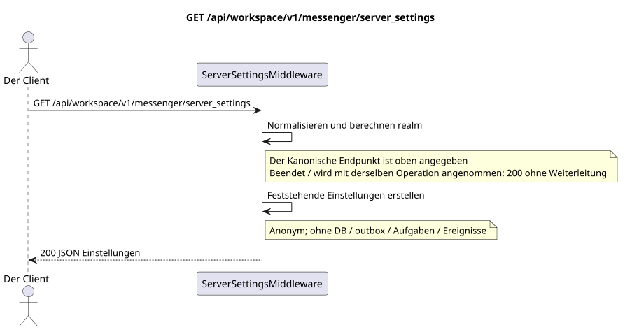

# `GET /api/workspace/v1/messenger/server_settings`

[← Hauptindex der Dokumentation](../../../../index.md) · [Index der Abfolge-Diagramme](../../README.md) · [Inhalt und Benutzer Workspace](../README.md)

Status: Ziel-Spezifikation der Operation, die zuerst in der Dokumentation erarbeitet wurde.
unverändert bleibt und ist das Normativrecht in [`workspace_api.md`](../../../../workspace_api.md).
Diese Datei beschreibt die Zielgrenzen von Transaktionen und Projektionen; sie ist nicht
Produktionscode, Migration SQL oder neuer Endpunkt.



[Ausgangsgestalt , die bearbeitet werden kann PlantUML](diagrams/get_server_settings.puml)

## Zuordnung und öffentlicher Vertrag

Zurückgeben eines anonymen Zulip -kompatiblen Server-Discovery-Objekts.
Kanonische Operation — `GET /api/workspace/v1/messenger/server_settings`.
Eine Anfrage auf den gleichen Weg mit dem Abschluss `/` nimmt die gleiche Zwischensoftware an und gibt zurück
- Das ist derselbe .`200`ohne Weiterleitung; es ist das Verhalten einer Operation, nicht der zweite Route.

Authentifizierung ist nicht erforderlich; es ist der einzige Endpunkt Workspace ohne Authentifizierung, den verwendet UI.

## Anfrageweg und -parameter

| Lage | Name | Typ / Regel |
| --- | --- | --- |
| Anfrage | `any unsupported name` | Die bewerteten Namen werden in der Liste der `ignored_parameters_unsupported` |

## Abfrage-Body

Der Abfrage-Body fehlt.

## Eine erfolgreiche Antwort

`200`

```json
{
  "result": "success",
  "msg": "Welcome to Exordos Workspace",
  "authentication_methods": {
    "password": true,
    "dev": false,
    "email": true,
    "ldap": false,
    "remoteuser": false,
    "github": false,
    "azuread": false,
    "gitlab": false,
    "google": false,
    "apple": false,
    "saml": false,
    "openid connect": false
  },
  "push_notifications_enabled": true,
  "email_auth_enabled": true,
  "require_email_format_usernames": true,
  "realm_url": "https://workspace.example.com",
  "realm_name": "Exordos Workspace",
  "realm_icon": "urn:url:https://workspace.example.com/logo-512x512.png",
  "realm_description": "<p>Exordos Workspace messenger.</p>",
  "realm_web_public_access_enabled": false,
  "meet_url": "https://meet.genesis-core.tech",
  "external_authentication_methods": [],
  "realm_uri": "https://workspace.example.com"
}
```


## Fehler und Autorierung

Die Zwischensoftware gibt zurück .`200`Sowohl für den kanonischen Weg als auch für den gleichen Weg mit dem Abschluss.`/`, ohne Umleitung: beide Varianten werden durch`rstrip("/")`Die nicht unterstützten Anfragen werden nicht als Fehler bezeichnet, sondern als Namen in der Antwort zurückgegeben.`Host`und Proxy folgen der dokumentierten Grenze des umgekehrten Proxy.

Allgemeine Antwortform bei Validierungsfehlern:

```json
{
  "type": "ValidationErrorException",
  "code": 400,
  "message": "Validation error occurred."
}
```

## Zielgrenze RestAlchemy

```python
# Middleware endpoint: it deliberately has no RestAlchemy resource/model.
class ServerSettingsMiddleware:
    PATH = "/v1/server_settings"

    def process_request(self, request):
        # Returns the fixed public discovery object for both slash forms.
        ...
```

Für diese Routing-/Zwischensoftware-Antwort gibt es kein Domänenmodell oder physischen externen Schlüssel.

URL realm werden aus `Host` und vertrauenswürdigem `X-Forwarded-Proto` gebildet; diese Zwischen-SOF sollte außerhalb des Ressourcen-Routers bleiben RestAlchemy.

## Synchronisierter Weg API

1. Normalisieren des Abschluss-Schlusses.
2. Berechnen Sie die öffentliche URL-Reihe aus den vertrauenswürdigen Anfrageüberschriften.
3. Erstellen und zurückgeben eines festgelegten Objektes. Eine Transaktion in der Datenbank wird nicht erstellt.

## Outbox, Typisierte Aufgaben, Worker und Echtzeitarbeit

Diese Lektüre schreibt kein Domänenereignis oder Outbox-Eintrag auf, erstellt keine typische Projektionsvorgabe und veröffentlicht kein öffentliches Ereignis. Die DB-basierten Ressourcen werden ohne Berechnungen nach Indizes gelesen. Alle Zähler sind bereits materialisiert; die Anfrage führt keine `COUNT`, `GROUP BY`, korrelierten Unteranfragen aus und scannt keine Nachrichtenbindungen.

WebSocket ist nicht anwesend.

## Idempotenz, Schlüssel und Rennen

Die Identität der Ressource und der Filterbereich sind während der Transaktion stabil..

## Sichtbarkeit für den Client

Der Client erhält den festgelegten Status, der zum Zeitpunkt der Ausführung der Lesetransaction verfügbar ist; die Anfrage plant keine neue ausgesetzte Arbeit.

[← Hauptindex der Dokumentation](../../../../index.md) · [Index der Abfolge-Diagramme](../../README.md) · [Inhalt und Benutzer Workspace](../README.md)
