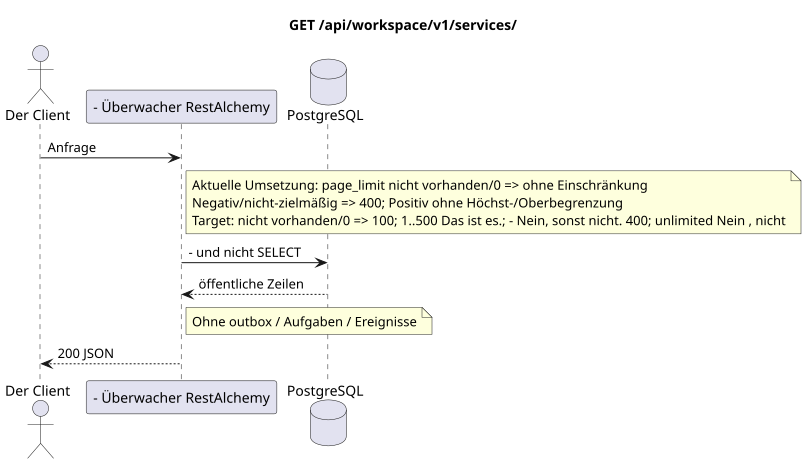

# `GET /api/workspace/v1/services/`

[← Hauptindex der Dokumentation](../../../../index.md) · [Index der Abfolge-Diagramme](../../README.md) · [Inhalt und Benutzer Workspace](../README.md)

Status: Ziel-Spezifikation der Operation, die zuerst in der Dokumentation erarbeitet wurde.
unverändert bleibt und ist das Normativrecht in [`workspace_api.md`](../../../../workspace_api.md).
Diese Datei beschreibt die Zielgrenzen von Transaktionen und Projektionen; sie ist nicht
Produktionscode, Migration SQL oder neuer Endpunkt.



[Ausgangsgestalt , die bearbeitet werden kann PlantUML](diagrams/get_services_list.puml)

## Zuordnung und öffentlicher Vertrag

Liste der verfügbaren Dienste Workspace.

Authentifizierung: Token Bearer IAM; `project_id` und aktuell `user_uuid` werden aus dem Kontext genommen IAM.

## Anfrageweg und -parameter

| Lage | Name | Typ / Regel |
| --- | --- | --- |
| Anfrage | `page_limit` | current: fehlen/`0` bedeutet unlimited; target: fehlen/`0` => `100`, `1..500` genau, negativ/nichtzielhaft/`>500` => `400` ohne clamp |
| Anfrage | `page_marker` | UUID Letzte Ressource der vorherigen Seite |

Die Sammlungspagination, wo sie vorgesehen ist, behält den aktuellen Vertrag `page_limit` und UUID
`page_marker` und erhält `X-Pagination-Limit`, und
`X-Pagination-Marker` Nur wenn die nächste Seite vorhanden ist.

Target default — `100`, hard maximum — `500`; `0` bedeutet auch`100`Unbounded Mode fehlt . Die Angabe ist öffentlich .JSON-die Form nicht ändern; Kunden des vollen Exports lesen bis zur Abwesenheit des nächsten marker.

## Abfrage-Body

Der Abfrage-Body fehlt.

## Eine erfolgreiche Antwort

`200`

```json
[
  {
    "uuid": "608919f5-ae0f-44fb-85bf-f1bf56534238",
    "name": "Messenger",
    "description": "Workspace Messenger",
    "service_url": "https://workspace.example.com/",
    "icon": "https://workspace.example.com/icon.svg",
    "created_at": "2026-07-17T08:00:00Z",
    "updated_at": "2026-07-17T08:00:00Z"
  }
]
```


## Fehler und Autorierung

Ungültige Filter geben HTTP `400` zurück; eine nicht erreichbare einzelne Ressource wird nicht gefunden. Fehler IAM überschreiten die Authentifizierungsfehlergrenze Workspace.

Allgemeine Antwortform bei Validierungsfehlern:

```json
{
  "type": "ValidationErrorException",
  "code": 400,
  "message": "Validation error occurred."
}
```

## Zielgrenze RestAlchemy

```python
from restalchemy.api import controllers as ra_controllers
from restalchemy.api import resources as ra_resources
from restalchemy.dm import models
from restalchemy.dm import properties
from restalchemy.dm import types


class Service(models.ModelWithUUID, models.ModelWithTimestamp):
    name = properties.property(types.String(max_length=255), required=True)
    description = properties.property(types.String(max_length=255), default="")
    service_url = properties.property(types.Url(), required=True)
    icon = properties.property(types.AllowNone(types.Url()))


class ServiceController(ra_controllers.BaseResourceControllerPaginated):
    __resource__ = ra_resources.ResourceByRAModel(model_class=Service)
```

Jeder öffentliche Verweis auf die Entität wird als skalar UUID-Eigenschaft RestAlchemy erklärt, nicht `relationship` (die sich als URI serialieren würde). Der entsprechende physische Spalte `*_uuid`  ein indexierter externer Schlüssel mit einer eindeutig gewählten Verweisungsaktion. Daher hält der öffentliche JSON UUID unverändert.

Der Katalog der Dienste bleibt nur für Lesen und außerhalb der Messenger Domänenverarbeitung verfügbar. UUID  skalarer öffentlicher Ressourcen-ID; öffentliche URI Beziehung wird nicht eingeführt.

## Synchronisierter Weg API

1. Bereiche überprüfen IAM.
2. Führen Sie eine indexierte Ressource aus.
3. Nicht geändertes öffentliches Programm serialisieren JSON.

## Outbox, Typisierte Aufgaben, Worker und Echtzeitarbeit

Diese Lektüre schreibt kein Domänenereignis oder Outbox-Eintrag auf, erstellt keine typische Projektionsvorgabe und veröffentlicht kein öffentliches Ereignis. Die DB-basierten Ressourcen werden ohne Berechnungen nach Indizes gelesen. Alle Zähler sind bereits materialisiert; die Anfrage führt keine `COUNT`, `GROUP BY`, korrelierten Unteranfragen aus und scannt keine Nachrichtenbindungen.

WebSocket ist nicht anwesend.

## Idempotenz, Schlüssel und Rennen

Die Identität der Ressource und der Filterbereich sind während der Transaktion stabil..

## Sichtbarkeit für den Client

Der Client erhält den festgelegten Status, der zum Zeitpunkt der Ausführung der Lesetransaction verfügbar ist; die Anfrage plant keine neue ausgesetzte Arbeit.

[← Hauptindex der Dokumentation](../../../../index.md) · [Index der Abfolge-Diagramme](../../README.md) · [Inhalt und Benutzer Workspace](../README.md)
