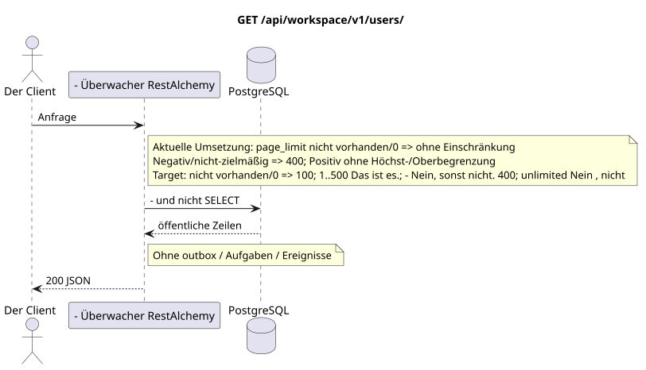

# `GET /api/workspace/v1/users/`

[← Hauptindex der Dokumentation](../../../../index.md) · [Index der Abfolge-Diagramme](../../README.md) · [Inhalt und Benutzer Workspace](../README.md)

Status: Ziel-Spezifikation der Operation, die zuerst in der Dokumentation erarbeitet wurde.
unverändert bleibt und ist das Normativrecht in [`workspace_api.md`](../../../../workspace_api.md).
Diese Datei beschreibt die Zielgrenzen von Transaktionen und Projektionen; sie ist nicht
Produktionscode, Migration SQL oder neuer Endpunkt.



[Ausgangsgestalt , die bearbeitet werden kann PlantUML](diagrams/get_users_list.puml)

## Zuordnung und öffentlicher Vertrag

Liste bereits verwirklichte Benutzer Workspace; der globale Router kann Identitätsvoranschreiter nicht importieren IAM.

Authentifizierung: Token Bearer IAM; `project_id` und aktuell `user_uuid` werden aus dem Kontext genommen IAM.

## Anfrageweg und -parameter

| Lage | Name | Typ / Regel |
| --- | --- | --- |
| Anfrage | `page_limit` | current: fehlen/`0` bedeutet unlimited; target: fehlen/`0` => `100`, `1..500` genau, negativ/nichtzielhaft/`>500` => `400` ohne clamp |
| Anfrage | `page_marker` | UUID Letzte Ressource der vorherigen Seite |

Die Sammlungspagination, wo sie vorgesehen ist, behält den aktuellen Vertrag `page_limit` und UUID
`page_marker` und erhält `X-Pagination-Limit`, und
`X-Pagination-Marker` Nur wenn die nächste Seite vorhanden ist.

Target default — `100`, hard maximum — `500`; `0` bedeutet auch`100`Unbounded Mode fehlt . Die Angabe ist öffentlich .JSON-die Form nicht ändern; Kunden des vollen Exports lesen bis zur Abwesenheit des nächsten marker.

## Abfrage-Body

Der Abfrage-Body fehlt.

## Eine erfolgreiche Antwort

`200`

```json
[
  {
    "uuid": "11111111-1111-1111-1111-111111111111",
    "username": "admin",
    "source": "iam",
    "status": "active",
    "status_emoji": "coffee",
    "status_text": "Focusing",
    "first_name": "Workspace",
    "last_name": "Administrator",
    "email": "admin@example.com",
    "avatar": "urn:gravatar:0123456789abcdef0123456789abcdef",
    "last_ping_at": "2026-07-17T08:00:00Z",
    "created_at": "2026-07-01T08:00:00Z",
    "updated_at": "2026-07-17T08:00:00Z"
  }
]
```


## Fehler und Autorierung

Ungültige Filter geben HTTP `400` zurück; eine nicht erreichbare einzelne Ressource wird nicht gefunden. Fehler IAM überschreiten die Authentifizierungsfehlergrenze Workspace.

Allgemeine Antwortform bei Validierungsfehlern:

```json
{
  "type": "ValidationErrorException",
  "code": 400,
  "message": "Validation error occurred."
}
```

## Zielgrenze RestAlchemy

```python
from restalchemy.api import controllers as ra_controllers
from restalchemy.api import resources as ra_resources
from restalchemy.dm import models
from restalchemy.dm import properties
from restalchemy.dm import types
from restalchemy.storage.sql import orm


class WorkspaceUser(models.ModelWithUUID, models.ModelWithTimestamp,
                    orm.SQLStorableMixin):
    __tablename__ = "messenger_users"
    username = properties.property(types.String(min_length=1, max_length=128), required=True)
    source = properties.property(types.Enum(["iam", "zulip"]), default="iam")
    status = properties.property(types.Enum(["active", "idle", "offline", "do_not_disturb"]))
    status_emoji = properties.property(types.AllowNone(types.String(max_length=64)))
    status_text = properties.property(types.AllowNone(types.String(max_length=256)))
    avatar = properties.property(types.String(max_length=2048), required=True)


class WorkspaceUserController(ra_controllers.BaseResourceControllerPaginated):
    __resource__ = ra_resources.ResourceByRAModel(
        model_class=WorkspaceUser,
        convert_underscore=False,
        process_filters=True,
    )
    # Narrow own-user IAM refresh and presence/avatar actions preserve the API.
```

Jeder öffentliche Verweis auf die Entität wird als skalar UUID-Eigenschaft RestAlchemy erklärt, nicht `relationship` (die sich als URI serialieren würde). Der entsprechende physische Spalte `*_uuid`  ein indexierter externer Schlüssel mit einer eindeutig gewählten Verweisungsaktion. Daher hält der öffentliche JSON UUID unverändert.

`WorkspaceUser` — öffentliche UUID-ähnliche Links des Providers bleiben Skalierfelder im sanitierten Behälter des Providers; physische Links  sind FK-indexiert. Identitätsfelder, die zu IAM gehören, sind Browseranfragen nur für Lesen zugänglich.

## Synchronisierter Weg API

1. Authentifizieren.
2. Lesen von materialisierten Benutzern über indizierte Filter/Pagination.
3. Metadaten des externen Providers säubern.
4. Liste ohne Benutzer importieren zurückgeben IAM.

## Outbox, Typisierte Aufgaben, Worker und Echtzeitarbeit

Diese Lektüre schreibt kein Domänenereignis oder Outbox-Eintrag auf, erstellt keine typische Projektionsvorgabe und veröffentlicht kein öffentliches Ereignis. Die DB-basierten Ressourcen werden ohne Berechnungen nach Indizes gelesen. Alle Zähler sind bereits materialisiert; die Anfrage führt keine `COUNT`, `GROUP BY`, korrelierten Unteranfragen aus und scannt keine Nachrichtenbindungen.

WebSocket ist nicht anwesend.

## Idempotenz, Schlüssel und Rennen

Die Identität der Ressource und der Filterbereich sind während der Transaktion stabil..

## Sichtbarkeit für den Client

Der Client erhält den festgelegten Status, der zum Zeitpunkt der Ausführung der Lesetransaction verfügbar ist; die Anfrage plant keine neue ausgesetzte Arbeit.

[← Hauptindex der Dokumentation](../../../../index.md) · [Index der Abfolge-Diagramme](../../README.md) · [Inhalt und Benutzer Workspace](../README.md)
