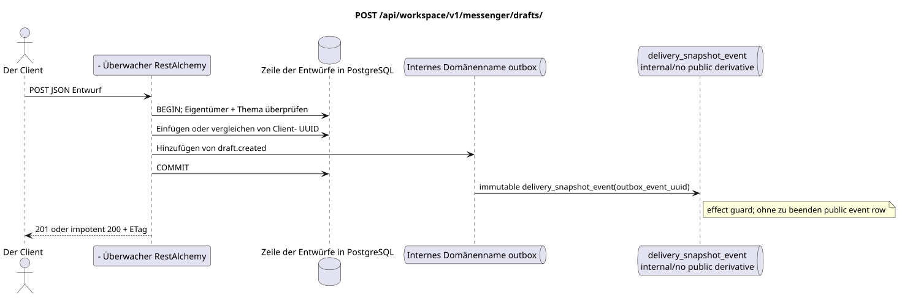

# `POST /api/workspace/v1/messenger/drafts/`


Allgemeine Ziel-Invariante der Zuverlässigkeit: Jedes immutable outbox-Ereignis führt genau eine immutable typed task mit einem einzigartigen `outbox_event_uuid`; coalescing fehlt. Task speichert den tatsächlichen exact scope key, verwendet lease/fencing, retry/backoff, max attempts/DLQ, reaper und idepotent effect guard. Topic scope wird nur für placement/message-binding work angewendet; shared rows erhalten keinen impliziten Fallback auf topic.

[← Hauptindex der Dokumentation](../../../../index.md) · [Index der Abfolge-Diagramme](../../README.md) · [Inhalt und Benutzer Workspace](../README.md)

Status: Ziel-Spezifikation der Operation, die zuerst in der Dokumentation erarbeitet wurde.
unverändert bleibt und ist das Normativrecht in [`workspace_api.md`](../../../../workspace_api.md).
Diese Datei beschreibt die Zielgrenzen von Transaktionen und Projektionen; sie ist nicht
Produktionscode, Migration SQL oder neuer Endpunkt.



[Ausgangsgestalt , die bearbeitet werden kann PlantUML](diagrams/post_drafts_create.puml)

## Zuordnung und öffentlicher Vertrag

Erstellen Sie einen Eigentümerentwurf, der den vom Kunden erstellten UUID als Idempotenzschlüssel verwendet.

Authentifizierung: Token Bearer IAM; `project_id` und aktuell `user_uuid` werden aus dem Kontext genommen IAM.

## Anfrageweg und -parameter

Weg und Anfrage werden nicht akzeptiert.

Die Sammlungspagination, wo sie vorgesehen ist, behält den aktuellen Vertrag `page_limit` und UUID
`page_marker` und erhält `X-Pagination-Limit`, und
`X-Pagination-Marker` Nur wenn die nächste Seite vorhanden ist.

## Abfrage-Body

```json
{
  "uuid": "ca14d274-0057-4a9a-a34b-fb1174be6a17",
  "stream_uuid": "75309057-419c-4b12-a7c1-3932429ec4a6",
  "topic_uuid": "4ec0b996-b778-45f8-8ef4-ef863be0c047",
  "payload": {
    "kind": "markdown",
    "content": "Draft message"
  }
}
```

## Eine erfolgreiche Antwort

`201` für eine neue Zeile oder `200`

```json
{
  "uuid": "ca14d274-0057-4a9a-a34b-fb1174be6a17",
  "project_id": "22222222-2222-2222-2222-222222222222",
  "user_uuid": "11111111-1111-1111-1111-111111111111",
  "stream_uuid": "75309057-419c-4b12-a7c1-3932429ec4a6",
  "topic_uuid": "4ec0b996-b778-45f8-8ef4-ef863be0c047",
  "payload": {
    "kind": "markdown",
    "content": "Draft message"
  },
  "revision": 1,
  "created_at": "2026-07-17T08:00:00Z",
  "updated_at": "2026-07-17T08:00:00Z"
}
```

Antwortüberschrift: `ETag: "1"`.

## Fehler und Autorierung

Fehlende/überflüssige Felder oder falscher Markdown gibt `400` zurück. Wiederverwendung von UUID mit anderen erstellungskanonischen Feldern gibt `409` zurück; der genaue Fehlerkörper enthält die Zeile `message`..

Allgemeine Antwortform bei Validierungsfehlern:

```json
{
  "type": "ValidationErrorException",
  "code": 400,
  "message": "Validation error occurred."
}
```

## Zielgrenze RestAlchemy

```python
from restalchemy.api import controllers as ra_controllers
from restalchemy.api import resources as ra_resources
from restalchemy.dm import models
from restalchemy.dm import properties
from restalchemy.dm import types
from restalchemy.storage.sql import orm


class WorkspaceDraft(models.ModelWithUUID, models.ModelWithProject,
                     models.ModelWithTimestamp, orm.SQLStorableMixin):
    # Contract boundary only; target physical naming/decomposition is not selected.
    __tablename__ = "m_workspace_drafts"
    user_uuid = properties.property(types.UUID(), required=True, read_only=True)
    stream_uuid = properties.property(types.UUID(), required=True, read_only=True)
    topic_uuid = properties.property(types.UUID(), required=True, read_only=True)
    payload = properties.property(types.Dict(), required=True)
    revision = properties.property(types.Integer(min_value=1), read_only=True)


class WorkspaceDraftController(ra_controllers.BaseResourceControllerPaginated):
    __resource__ = ra_resources.ResourceByRAModel(
        model_class=WorkspaceDraft,
        convert_underscore=False,
        process_filters=True,
    )
    # Narrow overrides preserve owner scope, keyset marker, ETag and If-Match.
```

Jeder öffentliche Verweis auf die Entität wird als skalar UUID-Eigenschaft RestAlchemy erklärt, nicht `relationship` (die sich als URI serialieren würde). Der entsprechende physische Spalte `*_uuid`  ein indexierter externer Schlüssel mit einer eindeutig gewählten Verweisungsaktion. Daher hält der öffentliche JSON UUID unverändert.

Die Anzeige fixiert eine unveränderliche skalare Grenze UUID/ETag. Die physischen UUID-Spalten des Benutzers/Flows/Themes bleiben FK-indexiert mit Kaskadenverhalten aus dem aktuellen Vertrag; die Beziehung RestAlchemy darf die öffentliche Verknüpfung nicht verändern UUID JSON.

## Synchronisierter Weg API

1. Überprüfen Sie die richtige Anzahl der Felder und Markdowns mit bis zu 40.000 Zeichen.
2. Überprüfen Sie , ob der Besitzer Mitglied ist und ob das Thema vom Stream gehört.
3. Einfügen nach dem Client UUID oder vergleichen Sie die bestehende Eigentümerzeile für eine genaue idempotentielle Wiederholung.
4. Fügen Sie einen nicht veränderbaren Entwurf ohne öffentliche Ableitung in die Outbox.
5. Transaktion festhalten und die Zeile mit der strikten ETag.

## Outbox, Typisierte Aufgaben, Worker und Echtzeitarbeit

Das Erstellen eines Entwurfs betrifft keine Nachrichten, Reaktionen, Unread-Zähler oder Dateiverweise.

Das interne immutable Outbox-Ereignis führt zu einem `delivery_snapshot_event`,
Die keine öffentliche Ableitung festhält und endet;
Die bereitgestellte Workspace Event Row und WebSocket-Lieferung werden nicht erstellt.

## Idempotenz, Schlüssel und Rennen

- Das ist der Kunde .UUIDIdempotenz-Schlüssel: eine identische Wiederholung gibt den vorhandenen Entwurf zurück (`200`), die sich aus unterschiedlicher Wiederverwendung ergeben`409`Einzigartig .UUIDzusammen mit dem Eigentümer-/Projektbereich verhindert, dass die Zeilen doppelt geschrieben werden.

## Sichtbarkeit für den Client

Der Initiator-Client sieht den festgelegten Entwurf sofort. Andere Kunden sehen ihn erst nach dem Neustart oder einer eindeutigen erneuten Anfrage der Entwürfe; das versandte Update mit der Konsistenz ist letztlich nicht verfügbar.

[← Hauptindex der Dokumentation](../../../../index.md) · [Index der Abfolge-Diagramme](../../README.md) · [Inhalt und Benutzer Workspace](../README.md)
