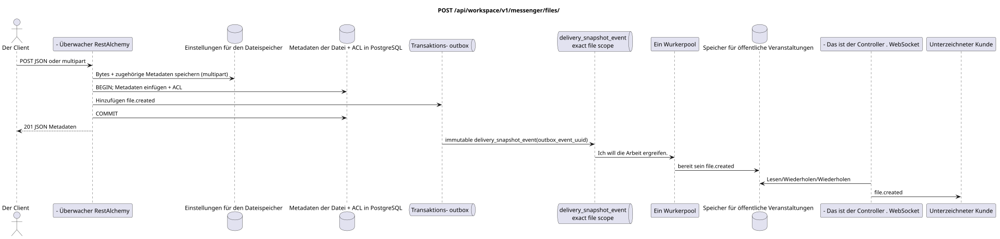

# `POST /api/workspace/v1/messenger/files/`


Allgemeine Ziel-Invariante der Zuverlässigkeit: Jedes immutable outbox-Ereignis führt genau eine immutable typed task mit einem einzigartigen `outbox_event_uuid`; coalescing fehlt. Task speichert den tatsächlichen exact scope key, verwendet lease/fencing, retry/backoff, max attempts/DLQ, reaper und idepotent effect guard. Topic scope wird nur für placement/message-binding work angewendet; shared rows erhalten keinen impliziten Fallback auf topic.

[← Hauptindex der Dokumentation](../../../../index.md) · [Index der Abfolge-Diagramme](../../README.md) · [Inhalt und Benutzer Workspace](../README.md)

Status: Ziel-Spezifikation der Operation, die zuerst in der Dokumentation erarbeitet wurde.
unverändert bleibt und ist das Normativrecht in [`workspace_api.md`](../../../../workspace_api.md).
Diese Datei beschreibt die Zielgrenzen von Transaktionen und Projektionen; sie ist nicht
Produktionscode, Migration SQL oder neuer Endpunkt.



[Ausgangsgestalt , die bearbeitet werden kann PlantUML](diagrams/post_files_create.puml)

## Zuordnung und öffentlicher Vertrag

Erstellen Sie Metadaten aus JSON oder laden Sie Bytes über multipart form data.

Authentifizierung: Token Bearer IAM; `project_id` und aktuell `user_uuid` werden aus dem Kontext genommen IAM.

## Anfrageweg und -parameter

Weg und Anfrage werden nicht akzeptiert.

Die Sammlungspagination, wo sie vorgesehen ist, behält den aktuellen Vertrag `page_limit` und UUID
`page_marker` und erhält `X-Pagination-Limit`, und
`X-Pagination-Marker` Nur wenn die nächste Seite vorhanden ist.

## Abfrage-Body

Diese Operation benutzt `multipart/form-data`, nicht den Körper. JSON.

Es gibt genau zwei Anfragearten.JSON- Metadaten.:

```json
{
  "stream_uuid": "75309057-419c-4b12-a7c1-3932429ec4a6",
  "name": "example.txt",
  "description": "Example",
  "content_type": "text/plain",
  "size_bytes": 12,
  "hash": "abc"
}
```

Der Multipart-Modus erfordert`file`und genau ein Gebiet:`stream_uuid`Oder auch nicht .`acl={"mode":"public"}`Ohne Strom.`name`ist standardmäßig gleich dem Namen der hochgeladenen Datei;`description`Leerzeichen.

## Eine erfolgreiche Antwort

`201`

```json
{
  "uuid": "f11353e0-712d-4b99-a716-5cdba848cc05",
  "user_uuid": "11111111-1111-1111-1111-111111111111",
  "stream_uuid": "75309057-419c-4b12-a7c1-3932429ec4a6",
  "name": "example.txt",
  "description": "Example",
  "content_type": "text/plain",
  "size_bytes": 12,
  "hash": "abc",
  "created_at": "2026-07-17T08:00:00Z",
  "updated_at": "2026-07-17T08:00:00Z"
}
```


## Fehler und Autorierung

Die Erstellung über JSON erfordert `stream_uuid`, `name`, `content_type`, `size_bytes` und `hash`. Multipart lehnt das Fehlen von `file`, gleichzeitig beide oder keines der Bereiche, öffentlich ACL zusammen mit dem Fluss und Anfragen über der nginx-Grenze von 50 MiB. Zugriffsfehler und IAM werden von der gemeinsamen Grenze behandelt.

Allgemeine Antwortform bei Validierungsfehlern:

```json
{
  "type": "ValidationErrorException",
  "code": 400,
  "message": "Validation error occurred."
}
```

## Zielgrenze RestAlchemy

```python
from restalchemy.api import controllers as ra_controllers
from restalchemy.api import resources as ra_resources
from restalchemy.dm import models
from restalchemy.dm import properties
from restalchemy.dm import types
from restalchemy.storage.sql import orm


class WorkspaceFile(models.ModelWithUUID, models.ModelWithProject,
                    models.ModelWithTimestamp, orm.SQLStorableMixin):
    # Contract boundary only; target storage decomposition is not selected.
    __tablename__ = "m_workspace_files"
    user_uuid = properties.property(types.UUID(), required=True, read_only=True)
    stream_uuid = properties.property(types.AllowNone(types.UUID()))
    name = properties.property(types.String(max_length=255), required=True)
    description = properties.property(types.String(max_length=255), default="")
    content_type = properties.property(types.String(max_length=255), required=True)
    size_bytes = properties.property(types.Integer(min_value=0), required=True)
    hash = properties.property(types.String(max_length=255), required=True)


class WorkspaceFileController(ra_controllers.BaseResourceControllerPaginated):
    __resource__ = ra_resources.ResourceByRAModel(
        model_class=WorkspaceFile,
        hidden_fields=["project_id"],
        convert_underscore=False,
        process_filters=True,
    )
    # Narrow multipart/storage/download overrides preserve the current contract.
```

Jeder öffentliche Verweis auf die Entität wird als skalar UUID-Eigenschaft RestAlchemy erklärt, nicht `relationship` (die sich als URI serialieren würde). Der entsprechende physische Spalte `*_uuid`  ein indexierter externer Schlüssel mit einer eindeutig gewählten Verweisungsaktion. Daher hält der öffentliche JSON UUID unverändert.

Der aktuelle Metadaten/Speicher/ACL-Vertrag wird beibehalten; die Zielfähigkeit ist nicht gewählt. `project_id` bleibt versteckt. Skalar `user_uuid` und zulässig `null` `stream_uuid` bleiben öffentliche UUID-Werte, die von FKs unterstützt werden..

## Synchronisierter Weg API

1. Überprüfen Sie den Anfragebereich und -modus.
2. Für Multipart schreiben Sie binäre Daten und die zugehörigen Metadaten, dann berechnen SHA-256.
3. Eingeben von Kanonischen Metadaten in die Datenbank/ACLund einen unveränderlichen Eintrag in die Outbox hinzufügen `file.created`.
4. Eine Transaktion festhalten; die Speicherstelle kompensieren, wenn die Arbeit vor der Feststellung der Transaktion mit einem Fehler abgeschlossen wurde.
5. Die gesäuberten Metadaten zurückgeben.

## Outbox, Typisierte Aufgaben, Worker und Echtzeitarbeit

Bytes und Metadaten der Datei sind keine Projektion der Nachricht..

Der festgelegte Domänen- Eintrag in der Outbox erstellt eine separate immutable
`delivery_snapshot_event` mit der exakt scope Datei und dem eindeutigen
`outbox_event_uuid`. Der Arbeiter schreibt die Fertigstellung `file.created` und
Der Leiter sendet, wiederholt oder spielt es.

## Idempotenz, Schlüssel und Rennen

Die generierte UUID Datei definiert unveränderliche Bytes. Genau ein Bereich ACL wird gespeichert. Fehlerbearbeitung der begleitenden Datei und der Datenbank sollte die öffentliche Metadatenzeile ausschließen, die auf fehlende Bytes hinweist; die genaue Zielmechanik der Speichertransaktionen bleibt außerhalb dieser Verarbeitung..

## Sichtbarkeit für den Client

Der Initiator-Client erhält sofort die festgelegten Metadaten. Andere Clients erhalten die bereitgestellten Ereignisse der Datei nach Verzögerung der Projektion. Die Repository-Reinigung nach der festgelegten Löschung kann später abgeschlossen werden, ohne Zugriff auf die Metadaten wiederherzustellen.

[← Hauptindex der Dokumentation](../../../../index.md) · [Index der Abfolge-Diagramme](../../README.md) · [Inhalt und Benutzer Workspace](../README.md)
