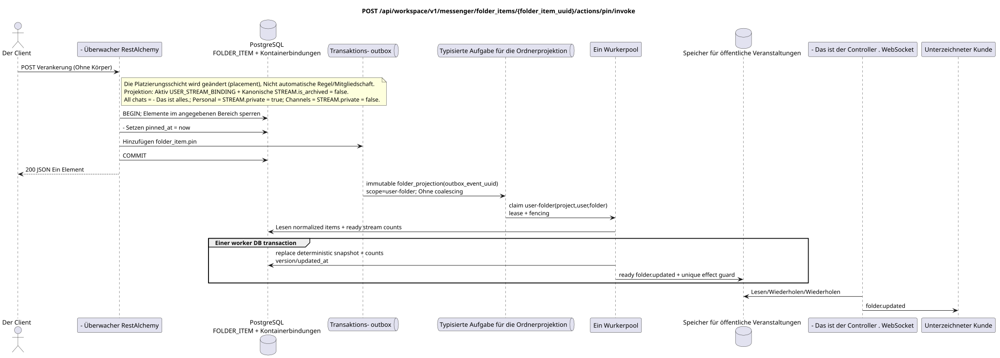

# `POST /api/workspace/v1/messenger/folder_items/{folder_item_uuid}/actions/pin/invoke`

[← Hauptindex der Dokumentation](../../../../index.md) · [Index der Abfolge-Diagramme](../../README.md) · [Inhalt und Benutzer Workspace](../README.md)

Status: Ziel-Spezifikation der Operation, die zuerst in der Dokumentation erarbeitet wurde.
unverändert bleibt und ist das Normativrecht in [`workspace_api.md`](../../../../workspace_api.md).
Diese Datei beschreibt die Zielgrenzen von Transaktionen und Projektionen; sie ist nicht
Produktionscode, Migration SQL oder neuer Endpunkt.



[Ausgangsgestalt , die bearbeitet werden kann PlantUML](diagrams/post_folder_item_pin.puml)

## Zuordnung und öffentlicher Vertrag

Das Ordnerelement des aktuellen Benutzers befestigen.

Authentifizierung: Token Bearer IAM; `project_id` und aktuell `user_uuid` werden aus dem Kontext genommen IAM.

## Anfrageweg und -parameter

| Lage | Name | Typ / Regel |
| --- | --- | --- |
| Weg | `folder_item_uuid` | UUID |

Die Sammlungspagination, wo sie vorgesehen ist, behält den aktuellen Vertrag `page_limit` und UUID
`page_marker` und erhält `X-Pagination-Limit`, und
`X-Pagination-Marker` Nur wenn die nächste Seite vorhanden ist.

## Abfrage-Body

Der Abfrage-Body fehlt.

## Eine erfolgreiche Antwort

`200`

```json
{
  "uuid": "9f41b1a7-77f9-4c12-bdc6-d3cebc5dbf50",
  "project_id": "22222222-2222-2222-2222-222222222222",
  "folder_uuid": "50ecadd0-9823-4d97-b54c-806cc672c210",
  "user_uuid": "11111111-1111-1111-1111-111111111111",
  "stream_uuid": "75309057-419c-4b12-a7c1-3932429ec4a6",
  "chat_type": "stream",
  "order_index": 10,
  "pinned_at": "2026-06-22T09:31:00Z",
  "unread_count": 3,
  "active_unread_count": 3,
  "passive_unread_count": 0,
  "created_at": "2026-06-22T09:30:00Z",
  "updated_at": "2026-06-22T09:31:00Z"
}
```


## Fehler und Autorierung

Falsche oder nicht autorisierte Eingabedaten werden durch die Fehlergrenze von RESTAlchemy/IAM verarbeitet; Ressourcen in einem bestimmten Bereich werden nicht außerhalb des Benutzers/Projekts offengelegt.

Allgemeine Antwortform bei Validierungsfehlern:

```json
{
  "type": "ValidationErrorException",
  "code": 400,
  "message": "Validation error occurred."
}
```

## Zielgrenze RestAlchemy

```python
from restalchemy.api import controllers as ra_controllers
from restalchemy.api import resources as ra_resources
from restalchemy.dm import models
from restalchemy.dm import properties
from restalchemy.dm import types
from restalchemy.storage.sql import orm


class WorkspaceFolderItem(models.ModelWithUUID, models.ModelWithProject,
                          models.ModelWithTimestamp, orm.SQLStorableMixin):
    __tablename__ = "messenger_folder_items"
    user_uuid = properties.property(types.UUID(), required=True, read_only=True)
    folder_uuid = properties.property(types.UUID(), required=True)
    stream_uuid = properties.property(types.UUID(), required=True)
    chat_type = properties.property(types.Enum(["stream", "group", "private"]), required=True)
    order_index = properties.property(types.AllowNone(types.Integer()))
    pinned_at = properties.property(types.AllowNone(types.UTCDateTimeZ()), read_only=True)


class WorkspaceUserFolderItem(models.ModelWithTimestamp, orm.SQLStorableMixin):
    __tablename__ = "messenger_api_user_folder_items_v1"
    uuid = properties.property(types.UUID(), id_property=True, read_only=True)
    project_id = properties.property(types.UUID(), read_only=True)
    user_uuid = properties.property(types.UUID(), read_only=True)
    folder_uuid = properties.property(types.UUID(), read_only=True)
    stream_uuid = properties.property(types.UUID(), read_only=True)
    chat_type = properties.property(
        types.Enum(["stream", "group", "private"]), read_only=True,
    )
    order_index = properties.property(types.AllowNone(types.Integer()))
    pinned_at = properties.property(types.AllowNone(types.UTCDateTimeZ()), read_only=True)
    # Ready fields are joined from unique USER_STREAM_BINDING. They are not
    # stored on WorkspaceFolderItem and are never calculated on API reads.
    unread_count = properties.property(types.Integer(min_value=0), read_only=True)
    active_unread_count = properties.property(types.Integer(min_value=0), read_only=True)
    passive_unread_count = properties.property(types.Integer(min_value=0), read_only=True)


class FolderItemController(ra_controllers.BaseResourceControllerPaginated):
    __resource__ = ra_resources.ResourceByRAModel(
        model_class=WorkspaceUserFolderItem,
        convert_underscore=False,
        process_filters=True,
    )
    # Writes use WorkspaceFolderItem; reads use the calculation-free view.
```

Jeder öffentliche Verweis auf die Entität wird als skalar UUID-Eigenschaft RestAlchemy erklärt, nicht `relationship` (die sich als URI serialieren würde). Der entsprechende physische Spalte `*_uuid`  ein indexierter externer Schlüssel mit einer eindeutig gewählten Verweisungsaktion. Daher hält der öffentliche JSON UUID unverändert.

Das physische Element hat FKs .`folder_uuid`, `stream_uuid`Und ...`user_uuid`- Ich weiß .`ON DELETE CASCADE`- Seine öffentlichen .UUID-die Verweise bleiben skalar.`USER_STREAM_BINDING`- Ich weiß .`(project_id,user_uuid,stream_uuid)`Sie werden nie in der Nachricht verbunden gespeichert und werden in dieser Anfrage nicht gezählt.

Die Befestigung ändert nur die persönliche Platzierungsschicht des Elements und ändert keine Regel
Sie können sich automatisch in den Systemordner einmelden oder automatisch Mitglied werden. `FOLDER_ITEM`
bleibt von der aktiven projizierenden wiederherstellbaren Vorrichtung unterstützt
`USER_STREAM_BINDING` und kanonische `STREAM` mit `is_archived = false`:
`All chats` beinhaltet alle verfügbaren Ströme, `Personal`  nur Ströme mit
`STREAM.private = true`, `Channels` — Nur mit `STREAM.private = false`.
Die Lesevorstellung verwendet einfache indexierte Verbindungen ohne `COUNT`
während der Anfrage.

## Synchronisierter Weg API

1. Das Ordnerelement im angegebenen Bereich finden und sperren.
2. Setzen Sie `pinned_at` zur aktuellen Zeit UTC.
3. Ein unveränderbares Eintrag in die Outbox hinzufügen `folder_item.pin`.
4. Transaktion speichern und aktualisiertes Element zurückgeben.

## Outbox, Typisierte Aufgaben, Worker und Echtzeitarbeit

Die Aktion ändert nur den Zustand des Elements synchron. Die Ereignisprojektion des Elternordners verwendet die vorhandenen Containerbindungszähler.

Outbox event führt immutable `folder_projection` ohne coalescing und mit exact scope
`user-folder:(project_id,user_uuid,folder_uuid)`. Der Besitzer der eingezäunten Miete liest
normalized item und ready stream counts, und dann in einer worker DB transaction
ersetzt deterministic `folder_items_snapshot`, Zähler, version/updated_at und
ready `folder.updated`. Der Lieferant liefert erst nach commit;
retry/backoff, DLQ/reaper und effect guard sind obligatorisch.

## Idempotenz, Schlüssel und Rennen

Wiederholung der Aktion kommt zum gleichen festgelegten/abgegrenzten Zustand; Wiederholung der Festlegung kann `pinned_at` gemäß der aktuellen Aktionssemantik aktualisieren..

## Sichtbarkeit für den Client

Die Antwort REST enthält sofort eine neue `pinned_at`; eingebettete read-only Snapshot-Ordner, Zähler und WebSocket-Events können bis zum Abschluss zurückbleiben `folder_projection`.

[← Hauptindex der Dokumentation](../../../../index.md) · [Index der Abfolge-Diagramme](../../README.md) · [Inhalt und Benutzer Workspace](../README.md)
