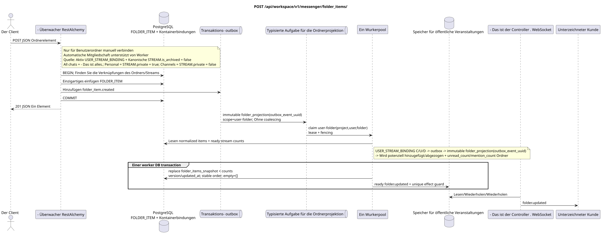

# `POST /api/workspace/v1/messenger/folder_items/`

[← Hauptindex der Dokumentation](../../../../index.md) · [Index der Abfolge-Diagramme](../../README.md) · [Inhalt und Benutzer Workspace](../README.md)

Status: Ziel-Spezifikation der Operation, die zuerst in der Dokumentation erarbeitet wurde.
unverändert bleibt und ist das Normativrecht in [`workspace_api.md`](../../../../workspace_api.md).
Diese Datei beschreibt die Zielgrenzen von Transaktionen und Projektionen; sie ist nicht
Produktionscode, Migration SQL oder neuer Endpunkt.



[Ausgangsgestalt , die bearbeitet werden kann PlantUML](diagrams/post_folder_items_create.puml)

## Zuordnung und öffentlicher Vertrag

Der aktuelle Benutzer-Ordner wird mit einem Fluss versehen.

Authentifizierung: Token Bearer IAM; `project_id` und aktuell `user_uuid` werden aus dem Kontext genommen IAM.

## Anfrageweg und -parameter

Weg und Anfrage werden nicht akzeptiert.

Die Sammlungspagination, wo sie vorgesehen ist, behält den aktuellen Vertrag `page_limit` und UUID
`page_marker` und erhält `X-Pagination-Limit`, und
`X-Pagination-Marker` Nur wenn die nächste Seite vorhanden ist.

## Abfrage-Body

```json
{
  "folder_uuid": "50ecadd0-9823-4d97-b54c-806cc672c210",
  "stream_uuid": "75309057-419c-4b12-a7c1-3932429ec4a6",
  "chat_type": "stream",
  "order_index": 10
}
```

## Eine erfolgreiche Antwort

`201`

```json
{
  "uuid": "9f41b1a7-77f9-4c12-bdc6-d3cebc5dbf50",
  "project_id": "22222222-2222-2222-2222-222222222222",
  "folder_uuid": "50ecadd0-9823-4d97-b54c-806cc672c210",
  "user_uuid": "11111111-1111-1111-1111-111111111111",
  "stream_uuid": "75309057-419c-4b12-a7c1-3932429ec4a6",
  "chat_type": "stream",
  "order_index": 10,
  "pinned_at": null,
  "unread_count": 0,
  "active_unread_count": 0,
  "passive_unread_count": 0,
  "created_at": "2026-06-22T09:30:00Z",
  "updated_at": "2026-06-22T09:30:00Z"
}
```


## Fehler und Autorierung

Falsche oder nicht autorisierte Eingabedaten werden durch die Fehlergrenze von RESTAlchemy/IAM verarbeitet; Ressourcen in einem bestimmten Bereich werden nicht außerhalb des Benutzers/Projekts offengelegt.

Allgemeine Antwortform bei Validierungsfehlern:

```json
{
  "type": "ValidationErrorException",
  "code": 400,
  "message": "Validation error occurred."
}
```

## Zielgrenze RestAlchemy

```python
from restalchemy.api import controllers as ra_controllers
from restalchemy.api import resources as ra_resources
from restalchemy.dm import models
from restalchemy.dm import properties
from restalchemy.dm import types
from restalchemy.storage.sql import orm


class WorkspaceFolderItem(models.ModelWithUUID, models.ModelWithProject,
                          models.ModelWithTimestamp, orm.SQLStorableMixin):
    __tablename__ = "messenger_folder_items"
    user_uuid = properties.property(types.UUID(), required=True, read_only=True)
    folder_uuid = properties.property(types.UUID(), required=True)
    stream_uuid = properties.property(types.UUID(), required=True)
    chat_type = properties.property(types.Enum(["stream", "group", "private"]), required=True)
    order_index = properties.property(types.AllowNone(types.Integer()))
    pinned_at = properties.property(types.AllowNone(types.UTCDateTimeZ()), read_only=True)


class WorkspaceUserFolderItem(models.ModelWithTimestamp, orm.SQLStorableMixin):
    __tablename__ = "messenger_api_user_folder_items_v1"
    uuid = properties.property(types.UUID(), id_property=True, read_only=True)
    project_id = properties.property(types.UUID(), read_only=True)
    user_uuid = properties.property(types.UUID(), read_only=True)
    folder_uuid = properties.property(types.UUID(), read_only=True)
    stream_uuid = properties.property(types.UUID(), read_only=True)
    chat_type = properties.property(
        types.Enum(["stream", "group", "private"]), read_only=True,
    )
    order_index = properties.property(types.AllowNone(types.Integer()))
    pinned_at = properties.property(types.AllowNone(types.UTCDateTimeZ()), read_only=True)
    # Ready fields are joined from unique USER_STREAM_BINDING. They are not
    # stored on WorkspaceFolderItem and are never calculated on API reads.
    unread_count = properties.property(types.Integer(min_value=0), read_only=True)
    active_unread_count = properties.property(types.Integer(min_value=0), read_only=True)
    passive_unread_count = properties.property(types.Integer(min_value=0), read_only=True)


class FolderItemController(ra_controllers.BaseResourceControllerPaginated):
    __resource__ = ra_resources.ResourceByRAModel(
        model_class=WorkspaceUserFolderItem,
        convert_underscore=False,
        process_filters=True,
    )
    # Writes use WorkspaceFolderItem; reads use the calculation-free view.
```

Jeder öffentliche Verweis auf die Entität wird als skalar UUID-Eigenschaft RestAlchemy erklärt, nicht `relationship` (die sich als URI serialieren würde). Der entsprechende physische Spalte `*_uuid`  ein indexierter externer Schlüssel mit einer eindeutig gewählten Verweisungsaktion. Daher hält der öffentliche JSON UUID unverändert.

Das physische Element hat FKs .`folder_uuid`, `stream_uuid`Und ...`user_uuid`- Ich weiß .`ON DELETE CASCADE`- Seine öffentlichen .UUID-die Verweise bleiben skalar.`USER_STREAM_BINDING`- Ich weiß .`(project_id,user_uuid,stream_uuid)`Sie werden nie in der Nachricht verbunden gespeichert und werden in dieser Anfrage nicht gezählt.

Diese Operation erstellt manuell eine Verbindung zwischen dem benutzerdefinierten Ordner und dem unterstützten
Kanonische Objekt (nach laufendem Vertrag  Fluss).
in Systemordner nicht manuell erstellt: Änderungen `USER_STREAM_BINDING`
schreiben eine Transaktions-Outbox, eine separate immutable Task mit einem einzigartigen `outbox_event_uuid` startet
Wir haben eine Funktion, die wir als Vorker verwenden, und er fügt potenziell automatische `FOLDER_ITEM` hinzu und entfernt
Erneuert die bereitgestellten Aggregate `unread_count`/`mention_count` in
`USER_FOLDER_BINDING`. Die Projektionsquelle  aktiv `USER_STREAM_BINDING` und
Kanonische `STREAM` mit `is_archived = false`: `All chats` beinhaltet alle solche
verfügbare Flüsse, `Personal`  nur Flüsse mit `STREAM.private = true`,
`Channels` — Nur mit `STREAM.private = false`.

## Synchronisierter Weg API

1. Finden Sie die Verknüpfungen des aktuellen Benutzers.
2. Überprüfen `chat_type` und Optionsanordnung.
3. Einzigartige Zeile eines Ordnerelements einfügen.
4. Ein unveränderbares Eintrag in die Outbox hinzufügen `folder_item.created`.
5. Transaktion festhalten und das Element zurückgeben, das mit den bereitgestellten Stromzählern verbunden ist.

## Outbox, Typisierte Aufgaben, Worker und Echtzeitarbeit

Die Anfrage berechnet keine Ordner- oder Stromaggregate. `USER_STREAM_BINDING`.

Outbox event führt immutable `folder_projection` ohne coalescing, mit exact
scope `user-folder:(project_id,user_uuid,folder_uuid)` und einzigartig
`outbox_event_uuid`. Der Besitzer der eingezäunten Miete liest normalized `FOLDER_ITEM` source of
truth und die fertiggestellten Zähler `USER_STREAM_BINDING`, wird deterministisch serialisiert
genaue öffentliche Array und in einem worker DB transaction ersetzt
`folder_items_snapshot`, Die Zähler, version/updated_at und ready `folder.updated`.
Der Event-Diplome reads nur nach dem commit; retry/backoff, DLQ/reaper und
Wirdpotentieller Effekt Guard ist obligatorisch.

## Idempotenz, Schlüssel und Rennen

Der Geschäftsschlüssel `(project_id,user_uuid,folder_uuid,stream_uuid)` verhindert die Duplizierung der Mitgliedschaft. Konkurrierende Erstellungen werden durch eine Einschränkung erlaubt; der Verlierer erhält die Standardgrenze für Konflikt/Fehler.

## Sichtbarkeit für den Client

Die Antwort REST zeigt sofort den normalized item. Ein eingebetteter read-only `folder_items_snapshot` der Elternordner, seine bereitgestellten Zähler und WebSocket event können bis zum Abschluss `folder_projection` zurückbleiben; dies ist die geplante eventual consistency.

[← Hauptindex der Dokumentation](../../../../index.md) · [Index der Abfolge-Diagramme](../../README.md) · [Inhalt und Benutzer Workspace](../README.md)
