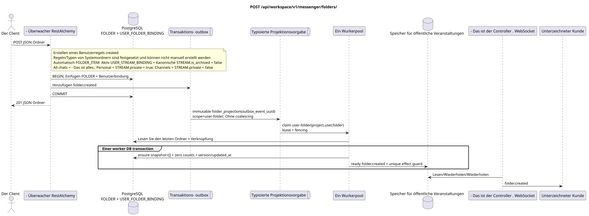

# `POST /api/workspace/v1/messenger/folders/`

[← Hauptindex der Dokumentation](../../../../index.md) · [Index der Abfolge-Diagramme](../../README.md) · [Inhalt und Benutzer Workspace](../README.md)

Status: Ziel-Spezifikation der Operation, die zuerst in der Dokumentation erarbeitet wurde.
unverändert bleibt und ist das Normativrecht in [`workspace_api.md`](../../../../workspace_api.md).
Diese Datei beschreibt die Zielgrenzen von Transaktionen und Projektionen; sie ist nicht
Produktionscode, Migration SQL oder neuer Endpunkt.



[Ausgangsgestalt , die bearbeitet werden kann PlantUML](diagrams/post_folders_create.puml)

## Zuordnung und öffentlicher Vertrag

Erstellen eines Ordners für den aktuellen Benutzer.

Authentifizierung: Token Bearer IAM; `project_id` und aktuell `user_uuid` werden aus dem Kontext genommen IAM.

## Anfrageweg und -parameter

Weg und Anfrage werden nicht akzeptiert.

Die Sammlungspagination, wo sie vorgesehen ist, behält den aktuellen Vertrag `page_limit` und UUID
`page_marker` und erhält `X-Pagination-Limit`, und
`X-Pagination-Marker` Nur wenn die nächste Seite vorhanden ist.

## Abfrage-Body

```json
{
  "title": "Inbox",
  "background_color_value": 4280391411
}
```

## Eine erfolgreiche Antwort

`201`

```json
{
  "uuid": "50ecadd0-9823-4d97-b54c-806cc672c210",
  "title": "Inbox",
  "background_color_value": 4280391411,
  "unread_count": 0,
  "system_type": "created",
  "folder_items": [],
  "created_at": "2026-06-22T09:30:00Z",
  "updated_at": "2026-06-22T09:30:00Z"
}
```


## Fehler und Autorierung

Falsche oder nicht autorisierte Eingabedaten werden durch die Fehlergrenze von RESTAlchemy/IAM verarbeitet; Ressourcen in einem bestimmten Bereich werden nicht außerhalb des Benutzers/Projekts offengelegt.

Allgemeine Antwortform bei Validierungsfehlern:

```json
{
  "type": "ValidationErrorException",
  "code": 400,
  "message": "Validation error occurred."
}
```

## Zielgrenze RestAlchemy

```python
from restalchemy.api import controllers as ra_controllers
from restalchemy.api import resources as ra_resources
from restalchemy.dm import models
from restalchemy.dm import properties
from restalchemy.dm import types
from restalchemy.storage.sql import orm


class WorkspaceFolder(models.ModelWithUUID, models.ModelWithProject,
                      models.ModelWithTimestamp, orm.SQLStorableMixin):
    __tablename__ = "messenger_folders"
    title = properties.property(types.String(min_length=1, max_length=64), required=True)
    background_color_value = properties.property(types.AllowNone(types.Integer()))


class WorkspaceUserFolderBinding(models.ModelWithUUID, models.ModelWithProject,
                                 models.ModelWithTimestamp, orm.SQLStorableMixin):
    __tablename__ = "messenger_user_folder_bindings"
    # Public UUID links are scalar UUID properties, never URI relationships.
    user_uuid = properties.property(types.UUID(), required=True, read_only=True)
    folder_uuid = properties.property(types.UUID(), required=True, read_only=True)
    unread_count = properties.property(types.Integer(min_value=0), default=0, read_only=True)
    mention_count = properties.property(types.Integer(min_value=0), default=0, read_only=True)
    folder_items_snapshot = properties.property(types.List(), default=list, read_only=True)
    folder_items_snapshot_version = properties.property(types.Integer(min_value=0), default=0, read_only=True)
    folder_items_snapshot_updated_at = properties.property(types.AllowNone(types.UTCDateTimeZ()), read_only=True)
    BUSINESS_KEY = ("project_id", "user_uuid", "folder_uuid")


class WorkspaceUserFolder(models.ModelWithTimestamp, orm.SQLStorableMixin):
    __tablename__ = "messenger_api_user_folders_v1"
    binding_uuid = properties.property(types.UUID(), id_property=True, read_only=True)
    uuid = properties.property(types.UUID(), read_only=True)
    title = properties.property(types.String(min_length=1, max_length=64))
    background_color_value = properties.property(types.AllowNone(types.Integer()))
    unread_count = properties.property(types.Integer(min_value=0), read_only=True)
    system_type = properties.property(types.AllowNone(types.Enum(["all", "created"])), read_only=True)
    folder_items = properties.property(types.List(), read_only=True)


class FolderController(ra_controllers.BaseResourceControllerPaginated):
    __resource__ = ra_resources.ResourceByRAModel(
        model_class=WorkspaceUserFolder,
        hidden_fields=["binding_uuid", "project_id", "user_uuid"],
        convert_underscore=False,
        process_filters=True,
    )
```

Jeder öffentliche Verweis auf die Entität wird als skalar UUID-Eigenschaft RestAlchemy erklärt, nicht `relationship` (die sich als URI serialieren würde). Der entsprechende physische Spalte `*_uuid`  ein indexierter externer Schlüssel mit einer eindeutig gewählten Verweisungsaktion. Daher hält der öffentliche JSON UUID unverändert.

Es entsteht eine .`WorkspaceUserFolderBinding`Mit den Zellzählern und`folder_items_snapshot=[]`- öffentlich`folder_items`zeigt diese nur-lesen-nur-Liste direkt an .JSONBEiner Zeile zu lesen, nicht N+1,`json_agg`, `COUNT`oder customSQL- Die künftigen Änderungen der normalisierten`FOLDER_ITEM`Das Bild wird nur über `folder_projection`.

Diese Operation erstellt einen benutzerdefinierten Ordner mit der Regel/Typ `created`; er ist nicht
Sie ist die Regeln des Systems.`USER_FOLDER_BINDING`haben festgelegte
Regel/Typ, und ihre automatische `FOLDER_ITEM` Idempotent unterstützt Worker
von aktiven `USER_STREAM_BINDING` und kanonischen `STREAM` mit
`is_archived = false`. `All chats` («Alle Chats) beinhaltet alle verfügbaren
Flüsse, `Personal` (Persönliche)  nur Flüsse mit
`STREAM.private = true`, `Channels` («Kanäle)  nur mit
`STREAM.private = false`. Neue öffentliche Aktionen werden nicht eingeführt.

## Synchronisierter Weg API

1. Überprüfen Sie `title` (1..64) und den wahlweise ARGB.
2. Einen Kanonischen einfügen `FOLDER`.
3. Einfügen Sie einen einzigartigen `USER_FOLDER_BINDING` aktuellen Benutzer mit bereitgestellten Aggregaten `unread_count` und Erwähnungen.
4. In derselben Transaktion fügen Sie den unveränderlichen Domain-Eintrag `folder.created` in outbox.
5. Transaktionen festhalten und die Flachdarstellung des Benutzerordners lesen.

## Outbox, Typisierte Aufgaben, Worker und Echtzeitarbeit

API kann nicht nachrichten scannen und nicht Ordnerzählungen berechnen..

Das festgelegte Ereignis liefert immutable `folder_projection` ohne coalescing,
mit exact scope `user-folder:(project_id,user_uuid,folder_uuid)` und einzigartigem
`outbox_event_uuid`. Besitzer der eingezäunten Miete liest die letzte Quelle der Wahrheit und in
Einer der DB-Werker-Transaktionen fixiert `folder_items_snapshot=[]`, Null
Die Zähler version/updated_at und ready `folder.created`.
Ereignis nur nach commit; retry/backoff, DLQ/reaper sind obligatorisch.

## Idempotenz, Schlüssel und Rennen

Einzigartig `(project_id,user_uuid,folder_uuid)` verhindert Duplikate der Sichtzeilen. Wiederholung des Clients ohne Client-ID  Neue Erstellungsanfrage; Rücklauf der Transaktion hinterlässt weder Ordner noch Aufzeichnungen outbox.

## Sichtbarkeit für den Client

Die Antwort REST spiegelt die synchrone Änderung des Ordners wider. Andere Clients werden nach einer begrenzten Projektionsverzögerung mit einer Konsistenz am Ende das entsprechende Vorbereitungsereignis sehen.

[← Hauptindex der Dokumentation](../../../../index.md) · [Index der Abfolge-Diagramme](../../README.md) · [Inhalt und Benutzer Workspace](../README.md)
