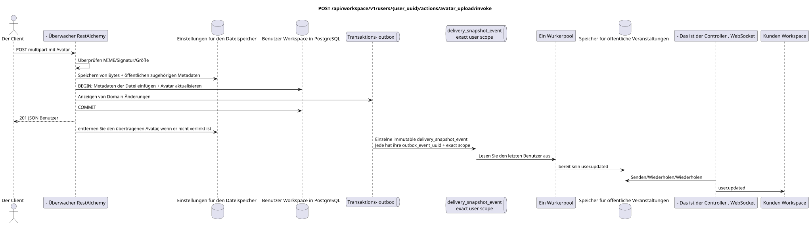

# `POST /api/workspace/v1/users/{user_uuid}/actions/avatar_upload/invoke`


Allgemeine Ziel-Invariante der Zuverlässigkeit: Jedes immutable outbox-Ereignis führt genau eine immutable typed task mit einem einzigartigen `outbox_event_uuid`; coalescing fehlt. Task speichert den tatsächlichen exact scope key, verwendet lease/fencing, retry/backoff, max attempts/DLQ, reaper und idepotent effect guard. Topic scope wird nur für placement/message-binding work angewendet; shared rows erhalten keinen impliziten Fallback auf topic.

[← Hauptindex der Dokumentation](../../../../index.md) · [Index der Abfolge-Diagramme](../../README.md) · [Inhalt und Benutzer Workspace](../README.md)

Status: Ziel-Spezifikation der Operation, die zuerst in der Dokumentation erarbeitet wurde.
unverändert bleibt und ist das Normativrecht in [`workspace_api.md`](../../../../workspace_api.md).
Diese Datei beschreibt die Zielgrenzen von Transaktionen und Projektionen; sie ist nicht
Produktionscode, Migration SQL oder neuer Endpunkt.



[Ausgangsgestalt , die bearbeitet werden kann PlantUML](diagrams/post_user_avatar_upload.puml)

## Zuordnung und öffentlicher Vertrag

Automatisierte Nutzer-Avatar-Aufnahme und Auswahl.

Authentifizierung: Token Bearer IAM; `project_id` und aktuell `user_uuid` werden aus dem Kontext genommen IAM.

## Anfrageweg und -parameter

| Lage | Name | Typ / Regel |
| --- | --- | --- |
| Weg | `user_uuid` | muss mit dem UUID authentifizierten Benutzer übereinstimmen |

Die Sammlungspagination, wo sie vorgesehen ist, behält den aktuellen Vertrag `page_limit` und UUID
`page_marker` und erhält `X-Pagination-Limit`, und
`X-Pagination-Marker` Nur wenn die nächste Seite vorhanden ist.

## Abfrage-Body

Diese Operation benutzt `multipart/form-data`, nicht den Körper. JSON.

Pflichtfeld der Form `file`: binäre Daten PNG, JPEG, GIF oder WebP, maximal 25 MiB.

## Eine erfolgreiche Antwort

`201`

```json
{
  "uuid": "11111111-1111-1111-1111-111111111111",
  "username": "admin",
  "source": "iam",
  "status": "active",
  "status_emoji": "coffee",
  "status_text": "Focusing",
  "first_name": "Workspace",
  "last_name": "Administrator",
  "email": "admin@example.com",
  "avatar": "urn:image:f11353e0-712d-4b99-a716-5cdba848cc05",
  "last_ping_at": "2026-07-17T08:00:00Z",
  "created_at": "2026-07-01T08:00:00Z",
  "updated_at": "2026-07-17T08:01:00Z"
}
```


## Fehler und Autorierung

Nur eigene UUID akzeptiert. Fehlende Datei, nicht unterstützte MIME/Signatur, leere Inhalte oder Größe größer als 25 MiB geben einen Validierungsfehler zurück.

Allgemeine Antwortform bei Validierungsfehlern:

```json
{
  "type": "ValidationErrorException",
  "code": 400,
  "message": "Validation error occurred."
}
```

## Zielgrenze RestAlchemy

```python
from restalchemy.api import controllers as ra_controllers
from restalchemy.api import resources as ra_resources
from restalchemy.dm import models
from restalchemy.dm import properties
from restalchemy.dm import types
from restalchemy.storage.sql import orm


class WorkspaceUser(models.ModelWithUUID, models.ModelWithTimestamp,
                    orm.SQLStorableMixin):
    __tablename__ = "messenger_users"
    username = properties.property(types.String(min_length=1, max_length=128), required=True)
    source = properties.property(types.Enum(["iam", "zulip"]), default="iam")
    status = properties.property(types.Enum(["active", "idle", "offline", "do_not_disturb"]))
    status_emoji = properties.property(types.AllowNone(types.String(max_length=64)))
    status_text = properties.property(types.AllowNone(types.String(max_length=256)))
    avatar = properties.property(types.String(max_length=2048), required=True)


class WorkspaceUserController(ra_controllers.BaseResourceControllerPaginated):
    __resource__ = ra_resources.ResourceByRAModel(
        model_class=WorkspaceUser,
        convert_underscore=False,
        process_filters=True,
    )
    # Narrow own-user IAM refresh and presence/avatar actions preserve the API.
```

Jeder öffentliche Verweis auf die Entität wird als skalar UUID-Eigenschaft RestAlchemy erklärt, nicht `relationship` (die sich als URI serialieren würde). Der entsprechende physische Spalte `*_uuid`  ein indexierter externer Schlüssel mit einer eindeutig gewählten Verweisungsaktion. Daher hält der öffentliche JSON UUID unverändert.

`WorkspaceUser` — öffentliche UUID-ähnliche Links des Providers bleiben Skalierfelder im sanitierten Behälter des Providers; physische Links  sind FK-indexiert. Identitätsfelder, die zu IAM gehören, sind Browseranfragen nur für Lesen zugänglich.

## Synchronisierter Weg API

1. Überprüfen Sie die eigene UUID, MIME, Signatur und Größe.
2. Speichern von Bytes und zugehörigen Metadaten des öffentlichen ACL ohne UUID-Stream.
3. In einer Transaktion der DB die Metadaten der Datei einfügen, nur `user.avatar` aktualisieren und unveränderliche Domain-Einträge des Avatars/Datei in outbox.
4. Transaktion festhalten und Benutzer zurückgeben.
5. Nach dem Verlinkungsprozess den ersetzten Benutzeravatar zurückrufen/löschen.

## Outbox, Typisierte Aufgaben, Worker und Echtzeitarbeit

Die öffentliche Aufzeichnung `user.updated` wird nach Festlegung des Avatar-Verweises und der Metadaten der Datei materialisiert..

Ein separates immutable `delivery_snapshot_event` mit exact user scope liest
Der letzte Canon-Benutzer wird automatisch erstellt.
`user.updated` mit effect guard auf `outbox_event_uuid`.
der Dispepter sendet, wiederholt oder wiederholt; Worker WebSocket-
keine Verbindungen besitzt.

## Idempotenz, Schlüssel und Rennen

Die Canonische Zeile des Benutzers verhindert eine zerrissene Auswahl des Avatars. Ein Fehler vor der Festsetzung der Transaktion der DB kompensiert die neu gespeicherten Bytes. Das Löschen der ersetzten Daten berücksichtigt die Verweise und erlaubt Wiederholungen.

## Sichtbarkeit für den Client

Der aktuelle Client erhält sofort den aktualisierten Canonischen Benutzer. Andere Kunden erhalten eine vollständige Aufnahme `user.updated` nach dem angenommenen Projektionsverzögerung/Dispatcherisierung.

[← Hauptindex der Dokumentation](../../../../index.md) · [Index der Abfolge-Diagramme](../../README.md) · [Inhalt und Benutzer Workspace](../README.md)
