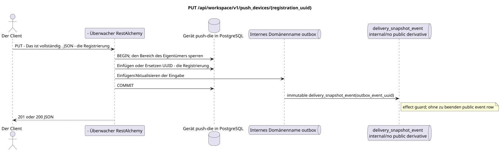

# `PUT /api/workspace/v1/push_devices/{registration_uuid}`


Allgemeine Ziel-Invariante der Zuverlässigkeit: Jedes immutable outbox-Ereignis führt genau eine immutable typed task mit einem einzigartigen `outbox_event_uuid`; coalescing fehlt. Task speichert den tatsächlichen exact scope key, verwendet lease/fencing, retry/backoff, max attempts/DLQ, reaper und idepotent effect guard. Topic scope wird nur für placement/message-binding work angewendet; shared rows erhalten keinen impliziten Fallback auf topic.

[← Hauptindex der Dokumentation](../../../../index.md) · [Index der Abfolge-Diagramme](../../README.md) · [Inhalt und Benutzer Workspace](../README.md)

Status: Ziel-Spezifikation der Operation, die zuerst in der Dokumentation erarbeitet wurde.
unverändert bleibt und ist das Normativrecht in [`workspace_api.md`](../../../../workspace_api.md).
Diese Datei beschreibt die Zielgrenzen von Transaktionen und Projektionen; sie ist nicht
Produktionscode, Migration SQL oder neuer Endpunkt.



[Ausgangsgestalt , die bearbeitet werden kann PlantUML](diagrams/put_push_device.puml)

## Zuordnung und öffentlicher Vertrag

Egal ob Sie eine neue Anlage registrieren oder ersetzen möchten token/encryption key.

Authentifizierung: Token Bearer IAM; `project_id` und aktuell `user_uuid` werden aus dem Kontext genommen IAM.

## Anfrageweg und -parameter

| Lage | Name | Typ / Regel |
| --- | --- | --- |
| Weg | `registration_uuid` | eine stabile UUID Installation, die vom Client erstellt wurde |

Die Sammlungspagination, wo sie vorgesehen ist, behält den aktuellen Vertrag `page_limit` und UUID
`page_marker` und erhält `X-Pagination-Limit`, und
`X-Pagination-Marker` Nur wenn die nächste Seite vorhanden ist.

## Abfrage-Body

```json
{
  "transport": "fcm",
  "platform": "ios",
  "registration_token": "<FCM registration token>",
  "encryption": {
    "kind": "HPKE",
    "algorithm": "HPKE-v1-BASE-X25519-HKDF-SHA256-AES-256-GCM",
    "key_uuid": "248305f4-ecdf-4206-8e93-95f830ea8ad6",
    "public_key": "<unpadded base64url X25519 public key>"
  }
}
```

## Eine erfolgreiche Antwort

`201` bei der ersten Registrierung, `200` bei der Ersetzung`

```json
{
  "uuid": "7c1af344-95e1-487e-8b51-d1af0370cdb5",
  "transport": "fcm",
  "platform": "ios",
  "encryption": {
    "kind": "HPKE",
    "algorithm": "HPKE-v1-BASE-X25519-HKDF-SHA256-AES-256-GCM",
    "key_uuid": "248305f4-ecdf-4206-8e93-95f830ea8ad6",
    "public_key": "<unpadded base64url X25519 public key>"
  },
  "user_uuid": "11111111-1111-1111-1111-111111111111",
  "project_id": "22222222-2222-2222-2222-222222222222",
  "registration_token": "<FCM registration token>",
  "created_at": "2026-07-26T05:30:00Z",
  "updated_at": "2026-07-26T05:40:00Z"
}
```


## Fehler und Autorierung

Nur `fcm`, Plattform `android|ios`, Fixed Algorithm HPKE und kanonische 43-Symbol-Offenstecker X25519 werden in base64url ohne Ergänzung akzeptiert. UUID des anderen Benutzers/Projekts wird als nicht gefunden zurückgegeben.

Allgemeine Antwortform bei Validierungsfehlern:

```json
{
  "type": "ValidationErrorException",
  "code": 400,
  "message": "Validation error occurred."
}
```

## Zielgrenze RestAlchemy

```python
from restalchemy.api import controllers as ra_controllers
from restalchemy.api import resources as ra_resources
from restalchemy.dm import models
from restalchemy.dm import properties
from restalchemy.dm import types
from restalchemy.storage.sql import orm


class PushDevice(models.ModelWithUUID, models.ModelWithProject,
                 models.ModelWithTimestamp, orm.SQLStorableMixin):
    __tablename__ = "m_workspace_push_devices"
    user_uuid = properties.property(types.UUID(), required=True, read_only=True)
    transport = properties.property(types.Enum(["fcm"]), required=True)
    platform = properties.property(types.Enum(["android", "ios"]), required=True)
    registration_token = properties.property(types.String(max_length=4096), required=True)
    encryption = properties.property(types.Dict(), required=True)


class PushDeviceController(ra_controllers.BaseResourceController):
    __resource__ = ra_resources.ResourceByRAModel(model_class=PushDevice)
    # Narrow PUT upsert and idempotent DELETE overrides preserve owner scope.
```

Jeder öffentliche Verweis auf die Entität wird als skalar UUID-Eigenschaft RestAlchemy erklärt, nicht `relationship` (die sich als URI serialieren würde). Der entsprechende physische Spalte `*_uuid`  ein indexierter externer Schlüssel mit einer eindeutig gewählten Verweisungsaktion. Daher hält der öffentliche JSON UUID unverändert.

Die Verwaltung von Push-Notifications-Registrierungen liegt außerhalb der Verarbeitung von Messenger-Wesen. UUID-Einstellungen  Ressourcenschlüssel. `user_uuid` und `project_id`  Server skalarische UUID-Felder, die von Index-Feld-Spalten unterstützt werden; die Verschlüsselung verwendet das vorhandene Modell `kind` HPKE.

## Synchronisierter Weg API

1. Benutzer und Projekt auf IAM festlegen und den Benutzerbereich sperren.
2. Überprüfen Sie den vollständigen Ersatzteil.
3. UUID einfügen, wenn es nicht vorhanden ist; ansonsten die Übereinstimmung des Eigentümerbereichs verlangen und ersetzen `token`/`platform`/`encryption`.
4. Eine interne nicht veränderbare Registrierungsdomain ohne öffentliche Ableitung in die Outbox hinzufügen.
5. Die Transaktion festhalten und zurückgeben `201` oder `200`.

## Outbox, Typisierte Aufgaben, Worker und Echtzeitarbeit

Die Projektion Messenger und das Ereignis WebSocket werden nicht erstellt.

Der aktuelle Vertrag regelt nur die Registrierung. immutable
outbox-Das Ereignis erzeugt eine `delivery_snapshot_event`, die impotent ist.
Die Angabe der Ableitung wird nicht veröffentlicht und wird abgeschlossen; Workspace event row
Und ...WebSocketDie Verschlüsselung und die Lieferung der Push-Ladung sind eingeschlossen.
außerhalb dieses Endpunktes.

## Idempotenz, Schlüssel und Rennen

`registration_uuid` — Wiederholung des gleichen Körpers führt zu derselben gespeicherten Registrierung; Atomrollen können nicht ersetzt werden, Ressourcen können nicht von einem anderen Besitzer abgehört werden..

## Sichtbarkeit für den Client

Die Änderung der Registrierung ist bis zur Rückgabe der HTTP-Antwort sichtbar. Es gibt kein öffentliches WebSocket-Event für sie.

[← Hauptindex der Dokumentation](../../../../index.md) · [Index der Abfolge-Diagramme](../../README.md) · [Inhalt und Benutzer Workspace](../README.md)
