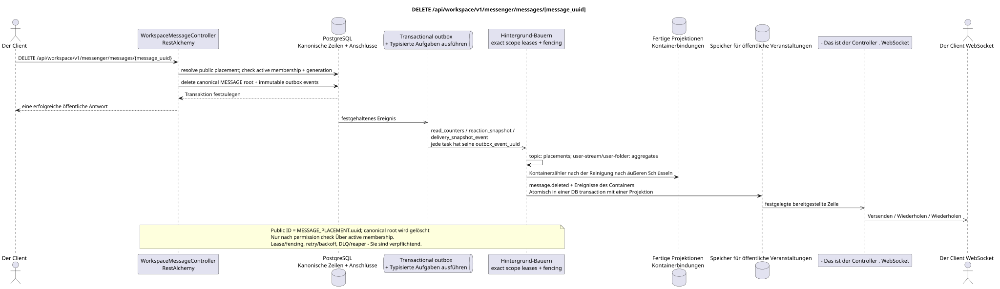

# DELETE /api/workspace/v1/messenger/messages/{message_uuid}

[← Hauptindex der Dokumentation](../../../../index.md) · [Index der Abfolge](../../README.md) · [Abschnitt Core Messenger](../README.md)

## Status und Grenze des laufenden Vertrags

Die Methode, der Weg, die öffentliche JSON und die Autorisierung folgen dem aktuellen Vertrag von [`workspace_api.md`](../../../../workspace_api.md); bounded pagination und asynchrone visibility folgen dem separat angenommenen target compatibility ADR.



Ausgangsgestalt , die bearbeitet werden kann: [`delete_message.puml`](diagrams/delete_message.puml).

## Die Operation

**Methode und Weg:** `DELETE /api/workspace/v1/messenger/messages/{message_uuid}`

**Zweck:** Die kanonische Nachricht und die dazugehörigen Zeilen unwiderruflich löschen.

## Öffentliche Anfrage

Ohne Körper JSON.

## Eine erfolgreiche öffentliche Antwort

HTTP `204`; Leerkörper.

## Öffentliche Fehler

Bewerber-Token IAM und Projektbereich erforderlich. Falsch UUID oder Anfrage-Body wird HTTP `400` gegeben; fehlende oder nicht verfügbare Ressource in diesem Bereich  `404`. Standarddokumenterter Validierungsfehler-Body:

```json
{
  "type": "ValidationErrorException",
  "code": 400,
  "message": "Validation error occurred."
}
```

## Zielgrenze RestAlchemy

```python
from restalchemy.api import controllers
from restalchemy.api import resources
from restalchemy.dm import models
from restalchemy.dm import properties
from restalchemy.dm import types
from restalchemy.storage.sql import orm


class WorkspaceUserMessage(models.ModelWithProject, orm.SQLStorableMixin):
    __tablename__ = "messenger_api_user_messages_v1"

    binding_uuid = properties.property(types.UUID(), id_property=True)
    uuid = properties.property(types.UUID(), read_only=True)
    stream_uuid = properties.property(types.UUID(), read_only=True)
    topic_uuid = properties.property(types.UUID(), read_only=True)
    author_uuid = properties.property(types.UUID(), read_only=True)
    user_uuid = properties.property(types.UUID(), read_only=True)


class WorkspaceMessageController(controllers.BaseResourceControllerPaginated):
    __resource__ = resources.ResourceByRAModel(
        WorkspaceUserMessage, convert_underscore=False, process_filters=True,
    )
```

Öffentlich .`uuid`und Routen-ID sind gleich`MESSAGE_PLACEMENT.uuid = UUIDv5(namespace=TOPIC.uuid, name=MESSAGE.uuid)`; name — lowercase hyphenated canonical UUID- Kanonisch .`MESSAGE.uuid`- die interne;`binding_uuid`Der Controller erlaubt die Platzierung und überprüft synchron die active membership plus generation bis canonical delete.

## Synchrone Transaktion

1. Zugriff erlauben und Autorenrechte überprüfen.
2. Wurzel MESSAGE löschen; Abhängigkeitsfreigabe durch externe Schlüssel.
3. Fügen Sie einen unveränderlichen Grabstein in einen Transaktions-Outbox mit öffentlichem ID hinzu.

Betroffener Zustand: MESSAGE, Platzierungen, Benutzerbindungen/Zustände, Reaktions- und transactional outbox.

## Typisierte Aufgaben und Hintergrund-Ausfüllung

Aufgaben: `read_counters`, `reaction_snapshot` und `delivery_snapshot_event`.

Topic-scoped workers Verarbeiten Placements Löschung, und einzelne fenced owners
`user-stream`/`user-topic`/`user-folder` Sie aktualisieren die Shared Counters.
outbox event hat eine unabhängige immutable task; topic worker tut das nicht unsafe
read-modify-write shared rows. Lease/retry/DLQ/reaper und die idempotentielle Wirkung auf
`outbox_event_uuid` - Sie sind verpflichtend.

## Öffentliche Veranstaltungen und WebSocket

`message.deleted` und betroffene Themen-/Flowzeilen, die der Manager liefern.

## Idempotenz, Rennen und zeitliche Merkmale, die dem Kunden sichtbar sind

Die Auslösung nach den äußeren Schlüsseln ist atomar, die Wiederholung der Grabinschrift ist idempotent..

[← Hauptindex der Dokumentation](../../../../index.md) · [Index der Abfolge](../../README.md) · [Abschnitt Core Messenger](../README.md)
