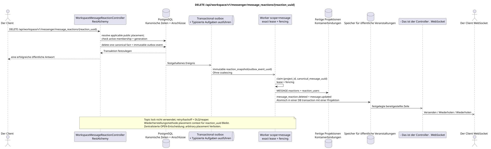

# DELETE /api/workspace/v1/messenger/message_reactions/{reaction_uuid}

[← Hauptindex der Dokumentation](../../../../index.md) · [Index der Abfolge](../../README.md) · [Abschnitt Core Messenger](../README.md)

## Status und Grenze des laufenden Vertrags

Die Methode, der Weg, die öffentliche JSON und die Autorisierung folgen dem aktuellen Vertrag von [`workspace_api.md`](../../../../workspace_api.md); bounded pagination und asynchrone visibility folgen dem separat angenommenen target compatibility ADR.



Ausgangsgestalt , die bearbeitet werden kann: [`delete_message_reaction.puml`](diagrams/delete_message_reaction.puml).

## Die Operation

**Methode und Weg:** `DELETE /api/workspace/v1/messenger/message_reactions/{reaction_uuid}`

**Zweck:** Die ursprüngliche Reaktion des aktuellen Benutzers zu entfernen.

## Öffentliche Anfrage

Ohne Körper JSON.

## Eine erfolgreiche öffentliche Antwort

HTTP `204`; Leerkörper.

## Öffentliche Fehler

Bewerber-Token IAM und Projektbereich erforderlich. Falsch UUID oder Anfrage-Body wird HTTP `400` gegeben; fehlende oder nicht verfügbare Ressource in diesem Bereich  `404`. Standarddokumenterter Validierungsfehler-Body:

```json
{
  "type": "ValidationErrorException",
  "code": 400,
  "message": "Validation error occurred."
}
```

## Zielgrenze RestAlchemy

```python
from restalchemy.api import controllers
from restalchemy.api import resources
from restalchemy.dm import models
from restalchemy.dm import properties
from restalchemy.dm import types
from restalchemy.storage.sql import orm


class WorkspaceMessageReactionView(
    models.ModelWithUUID,
    models.ModelWithProject,
    orm.SQLStorableMixin,
):
    __tablename__ = "messenger_api_message_reactions_v1"

    message_uuid = properties.property(types.UUID(), read_only=True)
    canonical_message_uuid = properties.property(types.UUID(), read_only=True)
    user_uuid = properties.property(types.UUID(), read_only=True)


class WorkspaceMessageReactionController(controllers.BaseResourceControllerPaginated):
    __resource__ = resources.ResourceByRAModel(
        WorkspaceMessageReactionView, convert_underscore=False, process_filters=True,
    )
```

Öffentliche `message_uuid`  skalare UUID Placement; innere
`canonical_message_uuid` Feldberechtigungen sind versteckt.UUIDder ursprünglichen Tatsache
Die physischen Verweise bleiben FK-indexiert, und
Die ursprünglichen Metadaten des Providers/Lieferanten sind geschlossen.

## Synchrone Transaktion

1. Wiederherstellen Sie die Benutzer-eigene Tatsache, die anwendbare öffentliche placement
   und überprüfen active stream membership + matching generation.
2. Nur eine Tatsache löschen.
3. Hinzufügen eines löschbaren Ereignisses in transactional outbox; derived task
   Einzigartig in `outbox_event_uuid`.

Betroffener Zustand: Reaktions- und transactional outbox.

## Typisierte Aufgaben und Hintergrund-Ausfüllung

Aufgaben: Einzelne unveränderliche `reaction_snapshot`; kein coalescing.

Fenced owner scope `message` Er baut die Bilder aus den verbleibenden Fakten um.; topic
lock Lease expiry, retry/backoff, DLQ und reaper stellen sicher, dass
Wiederherstellung nach Ausfall.

## Öffentliche Veranstaltungen und WebSocket

Für den Initiator  `message_reaction.deleted`, für den Beobachter  `message.updated`; der Dispepter liefert die festgelegten Zeilen.

## Idempotenz, Rennen und zeitliche Merkmale, die dem Kunden sichtbar sind

Die Löschung ist atomar, erfordert aktive Mitgliedschaft, und die Umstrukturierung ist idempotent.
- Das ist ein Source Event .UUID. Aggregierte Karten können kurz zurückbleiben.
Der Weg enthält nur `reaction_uuid`: die Möglichkeit, ihn öffentlich wiederherzustellen
placement context Bei mehreren sichtbaren Platzierungen bleibt zentralisiert
OPEN-Nach der Auswahl der access check
Tatsache und Bild sind absichtlich canonical-message-global und für alle sichtbar placements,
Dieser Datenschutz-Trade-off wird als Critic risk #8.

[← Hauptindex der Dokumentation](../../../../index.md) · [Index der Abfolge](../../README.md) · [Abschnitt Core Messenger](../README.md)
