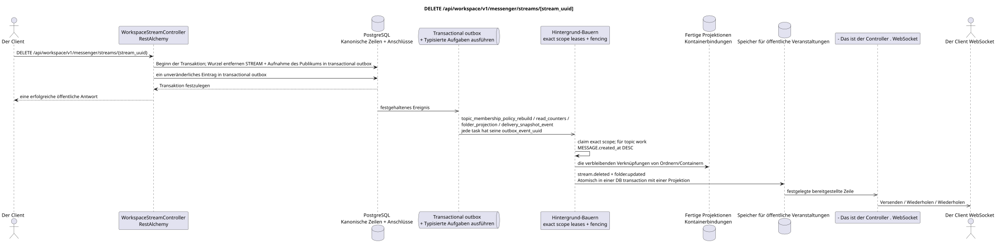

# DELETE /api/workspace/v1/messenger/streams/{stream_uuid}


Allgemeine Ziel-Invariante der Zuverlässigkeit: Jedes immutable outbox-Ereignis führt genau eine immutable typed task mit einem einzigartigen `outbox_event_uuid`; coalescing fehlt. Task speichert den tatsächlichen exact scope key, verwendet lease/fencing, retry/backoff, max attempts/DLQ, reaper und idepotent effect guard. Topic scope wird nur für placement/message-binding work angewendet; shared rows erhalten keinen impliziten Fallback auf topic.

[← Hauptindex der Dokumentation](../../../../index.md) · [Index der Abfolge](../../README.md) · [Abschnitt Core Messenger](../README.md)

## Status und Grenze des laufenden Vertrags

Die Methode, der Weg, die öffentliche JSON und die Autorisierung folgen dem aktuellen Vertrag von [`workspace_api.md`](../../../../workspace_api.md); bounded pagination und asynchrone visibility folgen dem separat angenommenen target compatibility ADR.



Ausgangsgestalt , die bearbeitet werden kann: [`delete_stream.puml`](diagrams/delete_stream.puml).

## Die Operation

**Methode und Weg:** `DELETE /api/workspace/v1/messenger/streams/{stream_uuid}`

**Zweck:** Kanonischen Fluss für alle Benutzer zu entfernen.

## Öffentliche Anfrage

Ohne Körper JSON.

## Eine erfolgreiche öffentliche Antwort

HTTP `204`; Leerkörper.

## Öffentliche Fehler

Bewerber-Token IAM und Projektbereich erforderlich. Falsch UUID oder Anfrage-Body wird HTTP `400` gegeben; fehlende oder nicht verfügbare Ressource in diesem Bereich  `404`. Standarddokumenterter Validierungsfehler-Body:

```json
{
  "type": "ValidationErrorException",
  "code": 400,
  "message": "Validation error occurred."
}
```

Der Streaming selbst wird gelöscht. `400`.

## Zielgrenze RestAlchemy

```python
from restalchemy.api import controllers
from restalchemy.api import resources
from restalchemy.dm import models
from restalchemy.dm import properties
from restalchemy.dm import types
from restalchemy.storage.sql import orm


class WorkspaceUserStream(
    models.ModelWithUUID,
    models.ModelWithProject,
    orm.SQLStorableMixin,
):
    __tablename__ = "messenger_api_user_streams_v1"

    owner = properties.property(types.UUID(), read_only=True)
    user_uuid = properties.property(types.UUID(), read_only=True)
    direct_user_uuid = properties.property(
        types.AllowNone(types.UUID()), default=None, read_only=True,
    )
    last_message_uuid = properties.property(types.UUID(), read_only=True)
    default_topic_uuid = properties.property(types.UUID(), read_only=True)


class WorkspaceStreamController(controllers.BaseResourceControllerPaginated):
    __resource__ = resources.ResourceByRAModel(
        WorkspaceUserStream, convert_underscore=False, process_filters=True,
    )
```

Die öffentlichen Entitätsverweise sind mit den skalaren Eigenschaften `types.UUID()` und nicht mit den Beziehungen RestAlchemy, die in URI serialisiert werden. Die physischen Spalten `*_uuid` bleiben indexierte Außenschlüssel mit eindeutig ausgewählten Verweisungsaktionen. Das öffentliche Feld `owner` ist die Eigenschaft UUID; das physische Feld `owner_uuid`  der indexierte Außenschlüssel des Benutzers. USER_STREAM_BINDING speichert die vorbereiteten Flussstufemessern..

## Synchrone Transaktion

1. Berechtigungen zulassen und überprüfen.
2. STREAM mit ausgewähltem Ausrüstungsschlüssel löschen.
3. Fügen Sie für jede Transaktion einzelne immutable outbox-Events hinzu
   Auszug `topic_membership_policy_rebuild`, `read_counters`,
   `folder_projection` und `delivery_snapshot_event` task.

Betroffene Zustand: Wurzel STREAM, Themen, Platzierungen, Bindungen von Containern und transactional outbox.

## Typisierte Aufgaben und Hintergrund-Ausfüllung

Aufgaben: Einzelne `topic_membership_policy_rebuild`, `read_counters`,
`folder_projection` und `delivery_snapshot_event`, jede für ihre eigene source
outbox event.

Hintergrund-Ersteller aktualisieren den Zustand von Ordnern/Containern und sind bereit zu löschen, ohne nach fehlenden Bindungen zu suchen. Verschiedene Themen können innerhalb eines anpassbaren Limites parallel verarbeitet werden; innerhalb eines beschäftigten Themas erhalten kanonische Nachrichten Priorität nach `MESSAGE.created_at DESC`, wobei ältere Arbeit im Laufe der Zeit ebenfalls vorangetrieben wird.

## Öffentliche Veranstaltungen und WebSocket

`stream.deleted` und berührt `folder.updated`.

## Idempotenz, Rennen und zeitliche Merkmale, die dem Kunden sichtbar sind

Die Ausrüstung ist atomar; die Wiederverarbeitung der Grabinschrift ist sicher..

[← Hauptindex der Dokumentation](../../../../index.md) · [Index der Abfolge](../../README.md) · [Abschnitt Core Messenger](../README.md)
