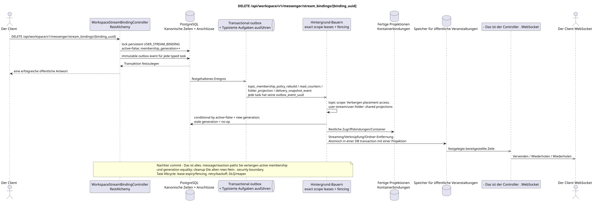

# DELETE /api/workspace/v1/messenger/stream_bindings/{binding_uuid}

[← Hauptindex der Dokumentation](../../../../index.md) · [Index der Abfolge](../../README.md) · [Abschnitt Core Messenger](../README.md)

## Status und Grenze des laufenden Vertrags

Die Methode, der Weg, die öffentliche JSON und die Autorisierung folgen dem aktuellen Vertrag von [`workspace_api.md`](../../../../workspace_api.md); bounded pagination und asynchrone visibility folgen dem separat angenommenen target compatibility ADR.



Ausgangsgestalt , die bearbeitet werden kann: [`delete_stream_binding.puml`](diagrams/delete_stream_binding.puml).

## Die Operation

**Methode und Weg:** `DELETE /api/workspace/v1/messenger/stream_bindings/{binding_uuid}`

**Zweck:** Der Zugriff eines normalen Benutzers auf den Stream zu entfernen.

## Öffentliche Anfrage

Ohne Körper JSON.

## Eine erfolgreiche öffentliche Antwort

HTTP `204`; Leerkörper.

## Öffentliche Fehler

Bewerber-Token IAM und Projektbereich erforderlich. Falsch UUID oder Anfrage-Body wird HTTP `400` gegeben; fehlende oder nicht verfügbare Ressource in diesem Bereich  `404`. Standarddokumenterter Validierungsfehler-Body:

```json
{
  "type": "ValidationErrorException",
  "code": 400,
  "message": "Validation error occurred."
}
```

Wenn man den direkten Strom oder den Strom mit sich selbst verbindet, wird `400`.

## Zielgrenze RestAlchemy

```python
from restalchemy.api import controllers
from restalchemy.api import resources
from restalchemy.dm import models
from restalchemy.dm import properties
from restalchemy.dm import types
from restalchemy.storage.sql import orm


class WorkspaceStreamBindingView(
    models.ModelWithUUID,
    models.ModelWithProject,
    orm.SQLStorableMixin,
):
    __tablename__ = "messenger_api_stream_bindings_v1"

    stream_uuid = properties.property(types.UUID(), read_only=True)
    user_uuid = properties.property(types.UUID(), read_only=True)
    who_uuid = properties.property(types.UUID(), read_only=True)


class WorkspaceStreamBindingController(controllers.BaseResourceControllerPaginated):
    __resource__ = resources.ResourceByRAModel(
        WorkspaceStreamBindingView, convert_underscore=False, process_filters=True,
    )
```

Die öffentlichen Entitätsverweise sind mit den skalaren Eigenschaften `types.UUID()` und nicht mit den Beziehungen RestAlchemy, die in URI serialisiert werden. Die physischen Spalten `*_uuid` bleiben als indexierte Außenschlüssel mit eindeutig ausgewählten Verweisintegritätsaktionen. USER_STREAM_BINDING ist einzigartig in `(project_id, stream_uuid, user_uuid)` und kann physisch die vorbereiteten Zähler speichern, aber ihre aktuelle öffentliche JSON Bindung ändert sich nicht.

## Synchrone Transaktion

1. Wiederherstellen und autorisieren von persistent `USER_STREAM_BINDING`
   Zeile des aktuellen membership lifecycle.
2. Ohne die Zeile physisch zu löschen, setzen Sie atomar `active = false` und erhöhen
   Monoton `membership_generation`.
3. Fügen Sie immutable transactional outbox-Events mit dem alten und dem neuen Publikum hinzu
   generation; Jeder Ereignis entspricht eine einzelne typed task.

Betroffene Status: Zugriff auf den Stream, das Thema und die Nachricht sowie die transactional outbox; die kanonischen Wesen werden gespeichert.

## Typisierte Aufgaben und Hintergrund-Ausfüllung

Aufgaben: Einzelne immutable `topic_membership_policy_rebuild`,
`read_counters`, `folder_projection` und `delivery_snapshot_event`, jeder mit
eigene source `outbox_event_uuid` und exact scope key.

Nach dem commit überprüft jede Message GET/list/action/reaction sofort
`USER_STREAM_BINDING.active` und generation, so stale message bindings/state
Topic-scoped worker kann asynchron verbergen/umbauen
placement bindings; user-stream/user-folder scope workers Sie werden aktualisiert shared
Cleanup der alten Generationen ist nicht optional und nicht
ist die Sicherheitsgrenze. Jede Aufgabe verwendet lease/fencing,
retry/backoff, DLQ/reaper Und wir haben einen potenziellen Effektguard `outbox_event_uuid`.

## Öffentliche Veranstaltungen und WebSocket

Streaming für den ausgeschlossenen Benutzer löschen, das Verknüpfen für den verbleibenden Benutzer löschen und Ordner aktualisieren.

## Idempotenz, Rennen und zeitliche Merkmale, die dem Kunden sichtbar sind

Der kanonische Inhalt bleibt erhalten. `204` bedeutet, dass die Mitgliedschaft bereits
Aktivität nicht aktiviert und nach dem Commit nicht zugänglich; Projektionen und Ereignisse sind asynchron. Stale
fan-out/history task mit der vorherigen generation macht no-op und kann nicht wieder auferstehen
Re-add nutzt die neue Generation und fresh placement-scoped state.

[← Hauptindex der Dokumentation](../../../../index.md) · [Index der Abfolge](../../README.md) · [Abschnitt Core Messenger](../README.md)
