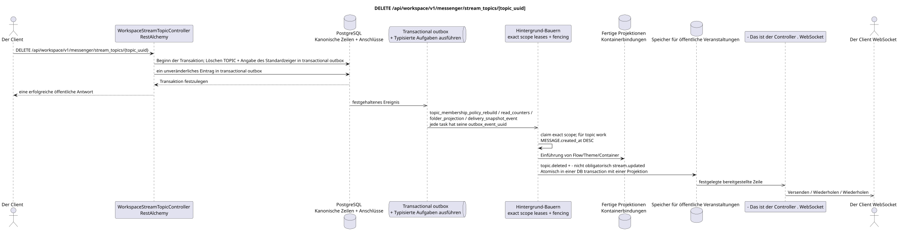

# DELETE /api/workspace/v1/messenger/stream_topics/{topic_uuid}


Allgemeine Ziel-Invariante der Zuverlässigkeit: Jedes immutable outbox-Ereignis führt genau eine immutable typed task mit einem einzigartigen `outbox_event_uuid`; coalescing fehlt. Task speichert den tatsächlichen exact scope key, verwendet lease/fencing, retry/backoff, max attempts/DLQ, reaper und idepotent effect guard. Topic scope wird nur für placement/message-binding work angewendet; shared rows erhalten keinen impliziten Fallback auf topic.

[← Hauptindex der Dokumentation](../../../../index.md) · [Index der Abfolge](../../README.md) · [Abschnitt Core Messenger](../README.md)

## Status und Grenze des laufenden Vertrags

Die Methode, der Weg, die öffentliche JSON und die Autorisierung folgen dem aktuellen Vertrag von [`workspace_api.md`](../../../../workspace_api.md); bounded pagination und asynchrone visibility folgen dem separat angenommenen target compatibility ADR.



Ausgangsgestalt , die bearbeitet werden kann: [`delete_stream_topic.puml`](diagrams/delete_stream_topic.puml).

## Die Operation

**Methode und Weg:** `DELETE /api/workspace/v1/messenger/stream_topics/{topic_uuid}`

**Zweck:** Kanonische Themen zu entfernen.

## Öffentliche Anfrage

Ohne Körper JSON.

## Eine erfolgreiche öffentliche Antwort

HTTP `204`; Leerkörper.

## Öffentliche Fehler

Bewerber-Token IAM und Projektbereich erforderlich. Falsch UUID oder Anfrage-Body wird HTTP `400` gegeben; fehlende oder nicht verfügbare Ressource in diesem Bereich  `404`. Standarddokumenterter Validierungsfehler-Body:

```json
{
  "type": "ValidationErrorException",
  "code": 400,
  "message": "Validation error occurred."
}
```

## Zielgrenze RestAlchemy

```python
from restalchemy.api import controllers
from restalchemy.api import resources
from restalchemy.dm import models
from restalchemy.dm import properties
from restalchemy.dm import types
from restalchemy.storage.sql import orm


class WorkspaceUserTopic(
    models.ModelWithUUID,
    models.ModelWithProject,
    orm.SQLStorableMixin,
):
    __tablename__ = "messenger_api_user_topics_v1"

    stream_uuid = properties.property(types.UUID(), read_only=True)
    user_uuid = properties.property(types.UUID(), read_only=True)
    last_message_uuid = properties.property(types.UUID(), read_only=True)
    summary_last_message_uuid = properties.property(types.UUID(), read_only=True)


class WorkspaceStreamTopicController(controllers.BaseResourceControllerPaginated):
    __resource__ = resources.ResourceByRAModel(
        WorkspaceUserTopic, convert_underscore=False, process_filters=True,
    )
```

Die öffentlichen Verweise auf Wesen sind skalare Eigenschaften .`types.UUID()`- nicht Beziehungen .RestAlchemy, die inURI- physische Spalten`*_uuid`bleiben als indexierte externe Schlüssel mit eindeutig ausgewählten Verweisungsabläufen.TOPICist ein kanonisches Wesen; einzigartigUSER_TOPIC_BINDINGSie sorgt für Sichtbarkeit, persönlichen Status und Themen-Zähler.

## Synchrone Transaktion

1. Berechtigungen zulassen und überprüfen.
2. TOPIC mit Außenschlüssel-Auswählung entfernen; Standard-Flow-Theme löschen.
3. Fügen Sie für jede Transaktion einzelne immutable outbox-Events hinzu
   Auszug `topic_membership_policy_rebuild`, `read_counters`,
   `folder_projection` und `delivery_snapshot_event` task.

Betroffener Status: TOPIC, Themabindungen/Locations, Standard-Flow-Theme-Anzeiger und transactional outbox; Nachrichten mit anderen Loks werden gespeichert.

## Typisierte Aufgaben und Hintergrund-Ausfüllung

Aufgaben: Einzelne `topic_membership_policy_rebuild`, `read_counters`,
`folder_projection` und `delivery_snapshot_event`, jede für ihre eigene source
outbox event.

Topic-scoped worker Verarbeitet die Platzierungen des zu löschenden Themas; shared
`user-topic`/`user-stream`/`user-folder` rows erhalten einzelne immutable tasks
exact scopes. Gleichzeitig schreibt ein fenced owner key, coalescing fehlt.

## Öffentliche Veranstaltungen und WebSocket

`topic.deleted` und bedingte `stream.updated`.

## Idempotenz, Rennen und zeitliche Merkmale, die dem Kunden sichtbar sind

Wiederholung der Ausrüstung für externe Schlüssel und transactional outbox sicher. Thema wechselt sofort, Projektionen und Ereignisse  asynchron.

[← Hauptindex der Dokumentation](../../../../index.md) · [Index der Abfolge](../../README.md) · [Abschnitt Core Messenger](../README.md)
