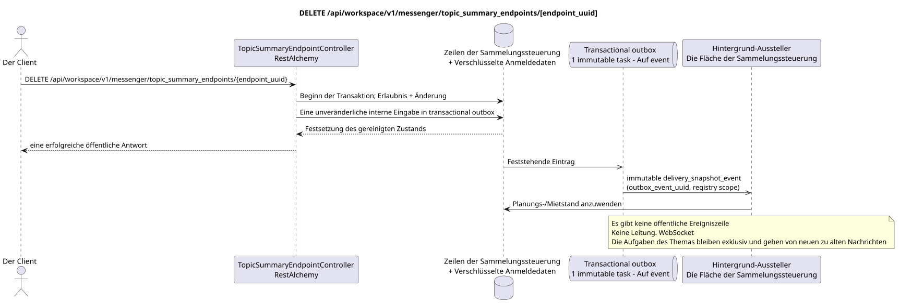

# DELETE /api/workspace/v1/messenger/topic_summary_endpoints/{endpoint_uuid}

[← Hauptindex der Dokumentation](../../../../index.md) · [Index der Abfolge](../../README.md) · [Abschnitt Core Messenger](../README.md)

## Status und Grenze des laufenden Vertrags

Die Ziel-Spezifikation in der docs-first-Ansatz. HTTP-Vertrag bleibt ein aktuelles Vertrag von [`workspace_api.md`](../../../../workspace_api.md); Zielmäßige interne Mechanismen sind nur ein Vorschlag.



Ausgangsgestalt , die bearbeitet werden kann: [`delete_topic_summary_endpoint.puml`](diagrams/delete_topic_summary_endpoint.puml).

## Die Operation

**Methode und Weg:** `DELETE /api/workspace/v1/messenger/topic_summary_endpoints/{endpoint_uuid}`

**Verwendung:** Löschen des globalen Endpunkts von Zusammenfassungen und verschlüsselten Accountdaten.

## Öffentliche Anfrage

Ohne Körper JSON.

## Eine erfolgreiche öffentliche Antwort

HTTP `204`; Leerkörper.

Die Status- und Fehlerzeitzeichenfelder können in der Antwort fehlen, wenn `null` zugelassen und diesen Wert haben. `api_key` und die aktiven Antrags-Token werden nie zurückgegeben.

## Öffentliche Fehler

Beförderer-Token IAM erforderlich. Falsche UUID oder Anfrage-Body geben HTTP `400`; keine Verwaltungserlaubnis  `403`. Standard-Body Validierungsfehler:

```json
{
  "type": "ValidationErrorException",
  "code": 400,
  "message": "Validation error occurred."
}
```

Für jede Operation mit einem Endpunktregister wird `workspace.topic_summary_endpoint.manage` benötigt; ein fehlender Endpunkt gibt `404`.

## Zielgrenze RestAlchemy

```python
from restalchemy.api import controllers
from restalchemy.api import resources
from restalchemy.dm import models
from restalchemy.dm import properties
from restalchemy.dm import types
from restalchemy.storage.sql import orm


class WorkspaceTopicSummaryEndpoint(
    models.ModelWithUUID,
    models.ModelWithTimestamp,
    orm.SQLStorableMixin,
):
    __tablename__ = "messenger_topic_summary_endpoints"

    name = properties.property(types.String(max_length=255), required=True)
    base_url = properties.property(types.String(max_length=2048), required=True)
    model = properties.property(types.String(max_length=255), required=True)
    credential_present = properties.property(types.Boolean(), read_only=True)


class TopicSummaryEndpointController(controllers.BaseResourceControllerPaginated):
    __resource__ = resources.ResourceByRAModel(
        WorkspaceTopicSummaryEndpoint,
        convert_underscore=False,
        process_filters=True,
    )
```

Diese globale Ressource hat keine öffentlichen Beziehungsfelder zu den Entitäten. Sein öffentliches Feld `uuid`  skalierbare Eigenschaft UUID. Jeder interne externe Schlüssel oder Verweis auf die Rechnungsdaten wird indiziert und hat eine eindeutig festgelegte Verweisungsintegritätsfunktion; `api_key` ist nur für die Eingabe zugänglich, wird verschlüsselt gespeichert und wird nie serialisiert.

## Synchrone Transaktion

1. Berechtigung zum Steuern und zur Wiederherstellung des Endpunkts einholen.
2. Endpunktwurzel löschen; der Ausgangsschlüssel-Kaskade löscht verschlüsselte Anmeldedaten.
3. Eine unveränderliche interne Löschprotokollin in transactional outbox.

## Typisierte Aufgabe und Hintergrund-Ausfüllung

Eine separate immutable `delivery_snapshot_event` Task mit exact scope Register
Endpunkte aktualisiert das Register/räumt die Miete für source outbox event; unique
`outbox_event_uuid`, Ohne coalescing.

Der Hintergrund-Flugzeug-Funktionär schließt den Endpunkt aus der zukünftigen Auswahl aus; aktive eingeschränkte Anträge werden gemäß der gewählten Mietrichtlinie abgeschlossen.MESSAGEnicht erfüllt.

## Öffentliche Ereignisse, Wiederholungen und zeitliche Charakteristiken

Das Ausrüstungsschlüssel-Spuren ist atomar; Wiederholung sieht fehlende Ressource.Workspaceund die Aktion des Dispe-.

Für diese administrative Operation gibt es kein öffentliches Ereignis Workspace, so dass der Manager WebSocket nicht daran teilnimmt.

[← Hauptindex der Dokumentation](../../../../index.md) · [Index der Abfolge](../../README.md) · [Abschnitt Core Messenger](../README.md)
