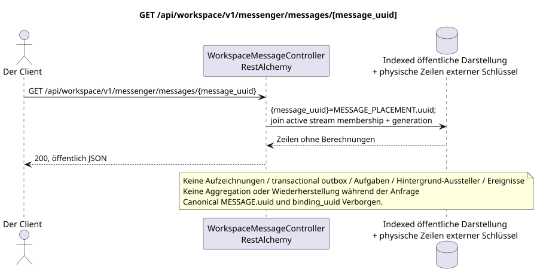

# GET /api/workspace/v1/messenger/messages/{message_uuid}

[← Hauptindex der Dokumentation](../../../../index.md) · [Index der Abfolge](../../README.md) · [Abschnitt Core Messenger](../README.md)

## Status und Grenze des laufenden Vertrags

Die Methode, der Weg, die öffentliche JSON und die Autorisierung folgen dem aktuellen Vertrag von [`workspace_api.md`](../../../../workspace_api.md); bounded pagination und asynchrone visibility folgen dem separat angenommenen target compatibility ADR.



Ausgangsgestalt , die bearbeitet werden kann: [`get_message.puml`](diagrams/get_message.puml).

## Die Operation

**Methode und Weg:** `GET /api/workspace/v1/messenger/messages/{message_uuid}`

**Zweck:** Erhalten Sie eine sichtbare Messaging-Platzierung über eine stabile public placement UUID.

## Öffentliche Anfrage

Weg: `message_uuid = a93dca35-3061-4748-bda4-7f6f8c660ea5`; ohne Körper.

## Eine erfolgreiche öffentliche Antwort

HTTP `200`:

```json
{
  "uuid": "a93dca35-3061-4748-bda4-7f6f8c660ea5",
  "project_id": "22222222-2222-2222-2222-222222222222",
  "stream_uuid": "75309057-419c-4b12-a7c1-3932429ec4a6",
  "topic_uuid": "4ec0b996-b778-45f8-8ef4-ef863be0c047",
  "author_uuid": "11111111-1111-1111-1111-111111111111",
  "payload": {
    "kind": "markdown",
    "content": "Привет, Workspace"
  },
  "user_uuid": "11111111-1111-1111-1111-111111111111",
  "read": true,
  "pinned": false,
  "starred": false,
  "is_own": true,
  "mentioned": false,
  "reactions": {},
  "reaction_users": {},
  "source_name": "native",
  "source": {
    "kind": "native"
  },
  "provider": null,
  "delivery": null,
  "created_at": "2026-06-22T10:10:00Z",
  "updated_at": "2026-06-22T10:10:00Z"
}
```

## Öffentliche Fehler

Bewerber-Token IAM und Projektbereich erforderlich; unsichtbare oder fehlende Ressource oder Marker gibt `404`..

## Zielgrenze RestAlchemy

```python
from restalchemy.api import controllers
from restalchemy.api import resources
from restalchemy.dm import models
from restalchemy.dm import properties
from restalchemy.dm import types
from restalchemy.storage.sql import orm


class WorkspaceUserMessage(models.ModelWithProject, orm.SQLStorableMixin):
    __tablename__ = "messenger_api_user_messages_v1"

    binding_uuid = properties.property(types.UUID(), id_property=True)
    uuid = properties.property(types.UUID(), read_only=True)
    stream_uuid = properties.property(types.UUID(), read_only=True)
    topic_uuid = properties.property(types.UUID(), read_only=True)
    author_uuid = properties.property(types.UUID(), read_only=True)
    user_uuid = properties.property(types.UUID(), read_only=True)


class WorkspaceMessageController(controllers.BaseResourceControllerPaginated):
    __resource__ = resources.ResourceByRAModel(
        WorkspaceUserMessage, convert_underscore=False, process_filters=True,
    )
```

Öffentlich .`uuid`und Routen-ID sind gleich`MESSAGE_PLACEMENT.uuid = UUIDv5(namespace=TOPIC.uuid, name=MESSAGE.uuid)`; name — lowercase hyphenated canonical UUID- Kanonisch .`MESSAGE.uuid`- die interne;`binding_uuid`- Das bleibt technisch geheim .ORMDer Controller erlaubt die Platzierung und überprüft synchron die Active.`USER_STREAM_BINDING`Plus eine Übereinstimmung. `membership_generation`.

## Synchronisierter Leseweg

1. Erlauben Sie die Placement UUID, fordern Sie die active membership und die Generation über die indexierte Kette USER_STREAM_BINDING -> USER_MESSAGE_BINDING -> MESSAGE_PLACEMENT an, fügen Sie eine MESSAGE an und placement-scoped USER_MESSAGE_STATE.
2. Ergebnis direkt aus der indizierten Darstellung ohne Berechnungen zurückgeben.
3. Nicht hinzufügen von transactional outbox, Aufgaben, Projektionen, öffentlichen Ereignissen oder WebSocket.

## Idempotenz und für den Kunden sichtbare Übereinstimmung

Dieser GET hat keine Nebenwirkungen. Er kann eine zulässige Verzögerung von einem früheren Eintrag beobachten, aber er führt keine Wiederherstellung, Fan-out-Verteilung, `COUNT`, `GROUP BY`, Fenster- oder Lateraloperationen, korrelierte Unteranfragen oder das Suchen nach fehlenden Bindungen durch.

[← Hauptindex der Dokumentation](../../../../index.md) · [Index der Abfolge](../../README.md) · [Abschnitt Core Messenger](../README.md)
