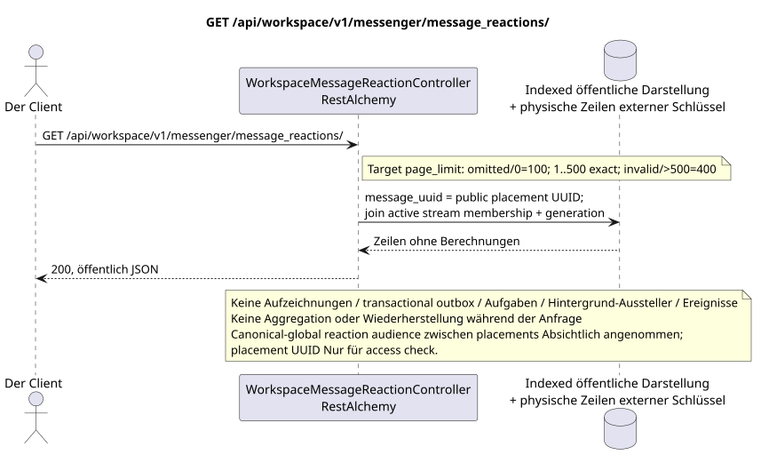

# GET /api/workspace/v1/messenger/message_reactions/

[← Hauptindex der Dokumentation](../../../../index.md) · [Index der Abfolge](../../README.md) · [Abschnitt Core Messenger](../README.md)

## Status und Grenze des laufenden Vertrags

Die Methode, der Weg, die öffentliche JSON und die Autorisierung folgen dem aktuellen Vertrag von [`workspace_api.md`](../../../../workspace_api.md); target pagination `100/500` ist ein observable behavior change.



Ausgangsgestalt , die bearbeitet werden kann: [`get_message_reactions_list.puml`](diagrams/get_message_reactions_list.puml).

## Die Operation

**Methode und Weg:** `GET /api/workspace/v1/messenger/message_reactions/`

**Zweck:** Erhalt einer Reaktionsliste zu sichtbaren Nachrichten.

## Öffentliche Anfrage

Ein Beispiel.:

```http
GET /api/workspace/v1/messenger/message_reactions/?message_uuid=a93dca35-3061-4748-bda4-7f6f8c660ea5&page_limit=100
Authorization: Bearer <access_token>
```

Aktuelle Semantik RestAlchemy: fehlende oder gleich `0` `page_limit` gibt unbegrenzte Auswahl; negativer oder nicht vollständiger Wert gibt HTTP `400`; positiver Wert hat kein Maximum. Dies ist current gap. Target: fehlende oder `0` => `100`; `1..500` wird genau angenommen; negative, nicht vollständige oder `>500` => HTTP `400` ohne Clamp; unbounded mode fehlt. marker.

## Eine erfolgreiche öffentliche Antwort

HTTP `200`:

```json
[
  {
    "uuid": "bd4b7632-8788-435a-93cc-6873657335c6",
    "project_id": "22222222-2222-2222-2222-222222222222",
    "message_uuid": "a93dca35-3061-4748-bda4-7f6f8c660ea5",
    "user_uuid": "11111111-1111-1111-1111-111111111111",
    "emoji_name": "thumbs_up",
    "provider": null,
    "delivery": null,
    "created_at": "2026-06-22T10:12:00Z",
    "updated_at": "2026-06-22T10:12:00Z"
  }
]
```

## Öffentliche Fehler

Bewerber-Token IAM und Projektbereich erforderlich; unsichtbare oder fehlende Ressource oder Marker gibt `404`..

## Zielgrenze RestAlchemy

```python
from restalchemy.api import controllers
from restalchemy.api import resources
from restalchemy.dm import models
from restalchemy.dm import properties
from restalchemy.dm import types
from restalchemy.storage.sql import orm


class WorkspaceMessageReactionView(
    models.ModelWithUUID,
    models.ModelWithProject,
    orm.SQLStorableMixin,
):
    __tablename__ = "messenger_api_message_reactions_v1"

    message_uuid = properties.property(types.UUID(), read_only=True)
    canonical_message_uuid = properties.property(types.UUID(), read_only=True)
    user_uuid = properties.property(types.UUID(), read_only=True)


class WorkspaceMessageReactionController(controllers.BaseResourceControllerPaginated):
    __resource__ = resources.ResourceByRAModel(
        WorkspaceMessageReactionView, convert_underscore=False, process_filters=True,
    )
```

Öffentliche `message_uuid`  skalare UUID Placement; innere
`canonical_message_uuid` Feldberechtigungen sind versteckt.UUIDder ursprünglichen Tatsache
Die physischen Verweise bleiben FK-indexiert, und
Die ursprünglichen Metadaten des Providers/Lieferanten sind geschlossen.

## Synchronisierter Leseweg

1. Interpretieren Sie den öffentlichen Filter `message_uuid` als
   `MESSAGE_PLACEMENT.uuid`, Wiederherstellen des Placement und überprüfen Sie den Streaming
   active `USER_STREAM_BINDING` und Gleichheit der Membership Generation.
   Die Daten können nur für die
   - Was ist los ?`provider`/`delivery`. Nie beim Lesen zusammenfassen.
2. Ergebnis direkt aus der indizierten Darstellung ohne Berechnungen zurückgeben.
3. Nicht hinzufügen von transactional outbox, Aufgaben, Projektionen, öffentlichen Ereignissen oder WebSocket.

## Idempotenz und für den Kunden sichtbare Übereinstimmung

Dieser GET hat keine Nebenwirkungen. Er kann eine zulässige Verzögerung von einem früheren Eintrag beobachten, aber er führt keine Wiederherstellung, Fan-out-Verteilung, `COUNT`, `GROUP BY`, Fenster- oder Lateraloperationen, korrelierte Unteranfragen oder das Suchen nach fehlenden Bindungen durch.

Die öffentliche `message_uuid` in jeder Zeile bleibt placement UUID und gibt access
check. Raw facts/snapshots kannonical-message-global und für alle sichtbar
placements Diese Datenschutz-Trade-off wurde angenommen.
Wie ist das? Critic risk #8.

[← Hauptindex der Dokumentation](../../../../index.md) · [Index der Abfolge](../../README.md) · [Abschnitt Core Messenger](../README.md)
