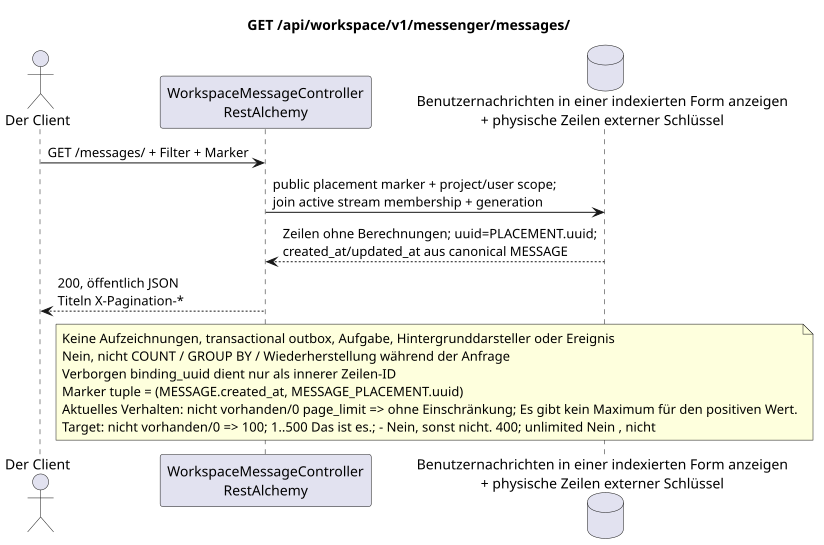

# GET /api/workspace/v1/messenger/messages/

[← Hauptindex der Dokumentation](../../../../index.md) · [Index der Abfolge](../../README.md) · [Abschnitt Core Messenger](../README.md)

## Status und Grenze des laufenden Vertrags

Ziel-Spezifikation der Umsetzung im Docs-First-AnsatzJSON, Autorierung und Filter folgen [`workspace_api.md`](../../../../workspace_api.md); bounded pagination und asynchronous visibility sind eine separat angenommenen target compatibility change. Diese Datei ändert keinen Ausführungscode.



Ausgangsgestalt , die bearbeitet werden kann: [`get_messages_list.puml`](diagrams/get_messages_list.puml).

## Die Operation

**Methode und Weg:** `GET /api/workspace/v1/messenger/messages/`

**Zweck:** Erhalten Sie eine Liste von Nachrichten, die für den aktuellen Benutzer IAM sichtbar sind, mit einer stabilen Komponentenpagination nach Schlüssel.

## Öffentliche Anfrage

Ein Beispiel für eine Anfrage.:

```http
GET /api/workspace/v1/messenger/messages/?stream_uuid=75309057-419c-4b12-a7c1-3932429ec4a6&topic_uuid=4ec0b996-b778-45f8-8ef4-ef863be0c047&sort_key=created_at&sort_dir=desc&page_limit=50&page_marker=a93dca35-3061-4748-bda4-7f6f8c660ea5
Authorization: Bearer <access_token>
```

Die Zeilen werden nach `(MESSAGE.created_at, MESSAGE_PLACEMENT.uuid)` sortiert. `page_marker`  letzte öffentliche Platzierung UUID. Marker außerhalb des gleichen Bereichs des Benutzers, des Projekts und des Filters werden abgelehnt. Pagination-Titel: `X-Pagination-Limit` und, nur wenn die folgende Seite vorhanden ist, `X-Pagination-Marker`.

Aktuelle Semantik RestAlchemy: fehlende oder gleich `0` `page_limit` gibt unbegrenzte Auswahl; negativer oder nicht vollständiger Wert gibt HTTP `400`; positiver Wert hat kein Maximum. Dies ist current gap. Target: fehlende oder `0` => `100`; `1..500` wird genau angenommen; negative, nicht vollständige oder `>500` => HTTP `400` ohne Clamp; unbounded mode fehlt. marker.

## Eine erfolgreiche öffentliche Antwort

HTTP `200`:

```json
[
  {
    "uuid": "a93dca35-3061-4748-bda4-7f6f8c660ea5",
    "project_id": "22222222-2222-2222-2222-222222222222",
    "stream_uuid": "75309057-419c-4b12-a7c1-3932429ec4a6",
    "topic_uuid": "4ec0b996-b778-45f8-8ef4-ef863be0c047",
    "author_uuid": "11111111-1111-1111-1111-111111111111",
    "payload": {
      "kind": "markdown",
      "content": "Привет, Workspace"
    },
    "user_uuid": "11111111-1111-1111-1111-111111111111",
    "read": true,
    "pinned": false,
    "starred": false,
    "is_own": true,
    "mentioned": false,
    "reactions": {},
    "reaction_users": {},
    "source_name": "native",
    "source": {
      "kind": "native"
    },
    "provider": null,
    "delivery": null,
    "created_at": "2026-06-22T10:10:00Z",
    "updated_at": "2026-06-22T10:10:00Z"
  }
]
```

## Öffentliche Fehler

Bewerber-Token benötigt .IAMEin Marker außerhalb des Bereichs des authentifizierten Benutzers, des Projekts, der Ansicht und des Filters gibt`404`. Fehler auf der Seite der Aufzeichnung nicht auftreten.

## Zielgrenze RestAlchemy

```python
from restalchemy.api import controllers
from restalchemy.api import resources
from restalchemy.dm import models
from restalchemy.dm import properties
from restalchemy.dm import types
from restalchemy.storage.sql import orm


class WorkspaceUserMessage(models.ModelWithProject, orm.SQLStorableMixin):
    __tablename__ = "messenger_api_user_messages_v1"

    binding_uuid = properties.property(types.UUID(), id_property=True)
    uuid = properties.property(types.UUID(), read_only=True)
    stream_uuid = properties.property(types.UUID(), read_only=True)
    topic_uuid = properties.property(types.UUID(), read_only=True)
    author_uuid = properties.property(types.UUID(), read_only=True)
    user_uuid = properties.property(types.UUID(), read_only=True)


class WorkspaceMessageController(
    controllers.BaseResourceControllerPaginated,
):
    __resource__ = resources.ResourceByRAModel(
        WorkspaceUserMessage,
        convert_underscore=False,
        process_filters=True,
    )
```

Die öffentlichen Verweise auf Wesen sind skalare Eigenschaften .UUID- nicht Beziehungen .RestAlchemy, die inURI- physische Spalten`*_uuid`sind indexierte externe Schlüssel mit eindeutig angegebenen Verweisintegritätsaktionen.

Der öffentliche `uuid` ist gleich `MESSAGE_PLACEMENT.uuid = UUIDv5(namespace=TOPIC.uuid, name=MESSAGE.uuid)`; name  lowercase hyphenated canonical UUID. `MESSAGE.uuid` innerer, `binding_uuid`  versteckter ORM identity. Der Controller erstellt den Marker nach der öffentlichen Platzierung UUID und verwendet die Tuple `(MESSAGE.created_at,MESSAGE_PLACEMENT.uuid)`, ohne hidden binding key.

## Synchronisierter Leseweg

1. Verwenden Sie die IAM und den aktuellen Benutzer sowie die dokumentierten Filter und Themen.
2. Scannen Sie eine indizierte Darstellung mit dem führenden `USER_MESSAGE_BINDING` und dem obligatorischen join zu dem aktiven `USER_STREAM_BINDING` des gleichen generation.
3. Fügen Sie eine `MESSAGE_PLACEMENT`, eine kanonische `MESSAGE` und eine Placement-scoped Zeile `USER_MESSAGE_STATE`.
4. Kanonische Inhalte/Zeitzeichen und den Stand lesen; serialisieren `uuid = MESSAGE_PLACEMENT.uuid`.
5. Zurückgeben öffentliche JSON ohne Berechnung der Reaktionsaggregate oder ungelesen.

## Transactional outbox, Hintergrund-Ausübende, Ereignisse und Vereinbarkeit

Dieser GET fügt keine Eintragung in die Transaktions-Outbox hinzu, erstellt keine typische Aufgabe, nimmt keinen Thema ein, schreibt keine Projektion oder Ereignis auf und ruft nicht den WebSocket-Verwalter an. Er führt keine `COUNT`, `GROUP BY`, Fenster- oder Lateraloperationen, korrelierte Unteranfragen, Fan-Out-Verteilung, Wiederherstellung oder Suche nach fehlenden Bindungen durch.

Die Antwort spiegelt bereits festgelegte Projektionszeilen wider und kann eine zulässige geringe Rückstandskonstanz (eventual consistency) von früheren Aufzeichnungen zeigen..

[← Hauptindex der Dokumentation](../../../../index.md) · [Index der Abfolge](../../README.md) · [Abschnitt Core Messenger](../README.md)
