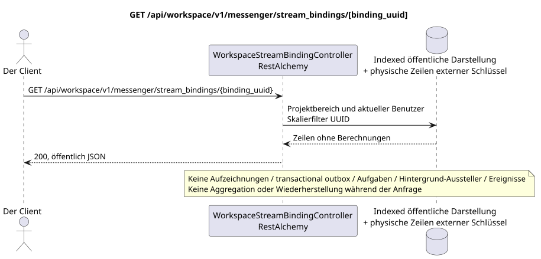

# GET /api/workspace/v1/messenger/stream_bindings/{binding_uuid}

[← Hauptindex der Dokumentation](../../../../index.md) · [Index der Abfolge](../../README.md) · [Abschnitt Core Messenger](../README.md)

## Status und Grenze des laufenden Vertrags

Die Methode, der Weg, die öffentliche JSON und die Autorisierung folgen dem aktuellen Vertrag von [`workspace_api.md`](../../../../workspace_api.md); bounded pagination und asynchrone visibility folgen dem separat angenommenen target compatibility ADR.



Ausgangsgestalt , die bearbeitet werden kann: [`get_stream_binding.puml`](diagrams/get_stream_binding.puml).

## Die Operation

**Methode und Weg:** `GET /api/workspace/v1/messenger/stream_bindings/{binding_uuid}`

**Zweck:** Eine sichtbare Strombindung zu erhalten.

## Öffentliche Anfrage

Weg: `binding_uuid = 3195a887-da5d-440b-bdf8-0d3d995a9e01`; ohne Körper.

## Eine erfolgreiche öffentliche Antwort

HTTP `200`:

```json
{
  "uuid": "3195a887-da5d-440b-bdf8-0d3d995a9e01",
  "project_id": "22222222-2222-2222-2222-222222222222",
  "stream_uuid": "75309057-419c-4b12-a7c1-3932429ec4a6",
  "user_uuid": "33333333-3333-3333-3333-333333333333",
  "who_uuid": "11111111-1111-1111-1111-111111111111",
  "role": "member",
  "notification_mode": "all_messages",
  "notification_updated_at": "1970-01-01T00:00:00Z",
  "created_at": "2026-06-22T09:05:00Z",
  "updated_at": "2026-06-22T09:05:00Z"
}
```

## Öffentliche Fehler

Bewerber-Token IAM und Projektbereich erforderlich; unsichtbare oder fehlende Ressource oder Marker gibt `404`..

## Zielgrenze RestAlchemy

```python
from restalchemy.api import controllers
from restalchemy.api import resources
from restalchemy.dm import models
from restalchemy.dm import properties
from restalchemy.dm import types
from restalchemy.storage.sql import orm


class WorkspaceStreamBindingView(
    models.ModelWithUUID,
    models.ModelWithProject,
    orm.SQLStorableMixin,
):
    __tablename__ = "messenger_api_stream_bindings_v1"

    stream_uuid = properties.property(types.UUID(), read_only=True)
    user_uuid = properties.property(types.UUID(), read_only=True)
    who_uuid = properties.property(types.UUID(), read_only=True)


class WorkspaceStreamBindingController(controllers.BaseResourceControllerPaginated):
    __resource__ = resources.ResourceByRAModel(
        WorkspaceStreamBindingView, convert_underscore=False, process_filters=True,
    )
```

Die öffentlichen Entitätsverweise sind mit den skalaren Eigenschaften `types.UUID()` und nicht mit den Beziehungen RestAlchemy, die in URI serialisiert werden. Die physischen Spalten `*_uuid` bleiben als indexierte Außenschlüssel mit eindeutig ausgewählten Verweisintegritätsaktionen. USER_STREAM_BINDING ist einzigartig in `(project_id, stream_uuid, user_uuid)` und kann physisch die vorbereiteten Zähler speichern, aber ihre aktuelle öffentliche JSON Bindung ändert sich nicht.

## Synchronisierter Leseweg

1. Wiederherstellen des VerknüpfungsvorgangsUUID, die Mitgliedschaft und die Rolle des Beobachters überprüfen, skalarische Serien verfassen.UUID- Physische , fertige Zähler erweitern nicht die aktuelle öffentliche .JSON- Die Fesseln..
2. Ergebnis direkt aus der indizierten Darstellung ohne Berechnungen zurückgeben.
3. Nicht hinzufügen von transactional outbox, Aufgaben, Projektionen, öffentlichen Ereignissen oder WebSocket.

## Idempotenz und für den Kunden sichtbare Übereinstimmung

Dieser GET hat keine Nebenwirkungen. Er kann eine zulässige Verzögerung von einem früheren Eintrag beobachten, aber er führt keine Wiederherstellung, Fan-out-Verteilung, `COUNT`, `GROUP BY`, Fenster- oder Lateraloperationen, korrelierte Unteranfragen oder das Suchen nach fehlenden Bindungen durch.

[← Hauptindex der Dokumentation](../../../../index.md) · [Index der Abfolge](../../README.md) · [Abschnitt Core Messenger](../README.md)
