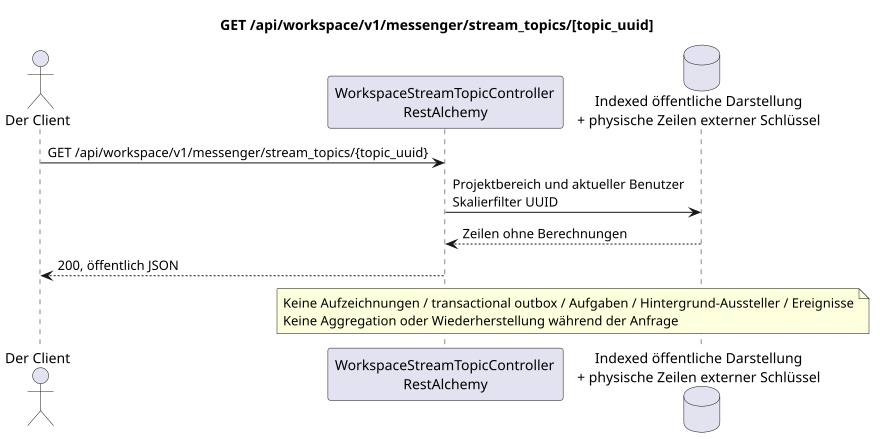

# GET /api/workspace/v1/messenger/stream_topics/{topic_uuid}

[← Hauptindex der Dokumentation](../../../../index.md) · [Index der Abfolge](../../README.md) · [Abschnitt Core Messenger](../README.md)

## Status und Grenze des laufenden Vertrags

Die Methode, der Weg, die öffentliche JSON und die Autorisierung folgen dem aktuellen Vertrag von [`workspace_api.md`](../../../../workspace_api.md); bounded pagination und asynchrone visibility folgen dem separat angenommenen target compatibility ADR.



Ausgangsgestalt , die bearbeitet werden kann: [`get_stream_topic.puml`](diagrams/get_stream_topic.puml).

## Die Operation

**Methode und Weg:** `GET /api/workspace/v1/messenger/stream_topics/{topic_uuid}`

**Zweck:** Eine sichtbare Darstellung des Themas zu erhalten.

## Öffentliche Anfrage

Weg: `topic_uuid = 4ec0b996-b778-45f8-8ef4-ef863be0c047`; ohne Körper.

## Eine erfolgreiche öffentliche Antwort

HTTP `200`:

```json
{
  "uuid": "4ec0b996-b778-45f8-8ef4-ef863be0c047",
  "project_id": "22222222-2222-2222-2222-222222222222",
  "name": "Релизы",
  "stream_uuid": "75309057-419c-4b12-a7c1-3932429ec4a6",
  "user_uuid": "11111111-1111-1111-1111-111111111111",
  "color": 4491468,
  "last_message_uuid": "a93dca35-3061-4748-bda4-7f6f8c660ea5",
  "unread_count": 2,
  "active_unread_count": 2,
  "passive_unread_count": 0,
  "is_default": false,
  "is_done": false,
  "notification_mode": "default",
  "summary": null,
  "summary_last_message_uuid": null,
  "summary_has_new_messages": null,
  "summary_enabled": true,
  "summary_system_prompt": null,
  "summary_reasoning_effort": null,
  "source_name": "native",
  "source": {
    "kind": "native"
  },
  "provider": null,
  "delivery": null,
  "created_at": "2026-06-22T09:10:00Z",
  "updated_at": "2026-06-22T10:10:00Z"
}
```

## Öffentliche Fehler

Bewerber-Token IAM und Projektbereich erforderlich; unsichtbare oder fehlende Ressource oder Marker gibt `404`..

## Zielgrenze RestAlchemy

```python
from restalchemy.api import controllers
from restalchemy.api import resources
from restalchemy.dm import models
from restalchemy.dm import properties
from restalchemy.dm import types
from restalchemy.storage.sql import orm


class WorkspaceUserTopic(
    models.ModelWithUUID,
    models.ModelWithProject,
    orm.SQLStorableMixin,
):
    __tablename__ = "messenger_api_user_topics_v1"

    stream_uuid = properties.property(types.UUID(), read_only=True)
    user_uuid = properties.property(types.UUID(), read_only=True)
    last_message_uuid = properties.property(types.UUID(), read_only=True)
    summary_last_message_uuid = properties.property(types.UUID(), read_only=True)


class WorkspaceStreamTopicController(controllers.BaseResourceControllerPaginated):
    __resource__ = resources.ResourceByRAModel(
        WorkspaceUserTopic, convert_underscore=False, process_filters=True,
    )
```

Die öffentlichen Verweise auf Wesen sind skalare Eigenschaften .`types.UUID()`- nicht Beziehungen .RestAlchemy, die inURI- physische Spalten`*_uuid`bleiben als indexierte externe Schlüssel mit eindeutig ausgewählten Verweisungsabläufen.TOPICist ein kanonisches Wesen; einzigartigUSER_TOPIC_BINDINGSie sorgt für Sichtbarkeit, persönlichen Status und Themen-Zähler.

## Synchronisierter Leseweg

1. Erlauben Sie eine indexierte Bindung des Themas des aktuellen Benutzers, verbinden Sie die kanonischen TOPIC und den Standort nur mit einen zu einem und viele zu einem Verbindungen».
2. Ergebnis direkt aus der indizierten Darstellung ohne Berechnungen zurückgeben.
3. Nicht hinzufügen von transactional outbox, Aufgaben, Projektionen, öffentlichen Ereignissen oder WebSocket.

## Idempotenz und für den Kunden sichtbare Übereinstimmung

Dieser GET hat keine Nebenwirkungen. Er kann eine zulässige Verzögerung von einem früheren Eintrag beobachten, aber er führt keine Wiederherstellung, Fan-out-Verteilung, `COUNT`, `GROUP BY`, Fenster- oder Lateraloperationen, korrelierte Unteranfragen oder das Suchen nach fehlenden Bindungen durch.

[← Hauptindex der Dokumentation](../../../../index.md) · [Index der Abfolge](../../README.md) · [Abschnitt Core Messenger](../README.md)
