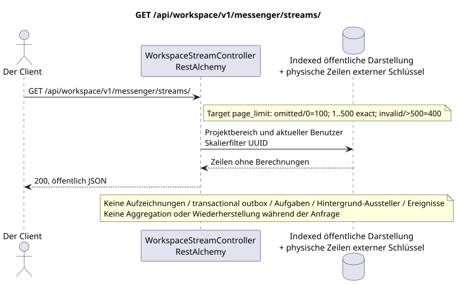

# GET /api/workspace/v1/messenger/streams/

[← Hauptindex der Dokumentation](../../../../index.md) · [Index der Abfolge](../../README.md) · [Abschnitt Core Messenger](../README.md)

## Status und Grenze des laufenden Vertrags

Die Methode, der Weg, die öffentliche JSON und die Autorisierung folgen dem aktuellen Vertrag von [`workspace_api.md`](../../../../workspace_api.md); target pagination `100/500` ist ein observable behavior change.



Ausgangsgestalt , die bearbeitet werden kann: [`get_streams_list.puml`](diagrams/get_streams_list.puml).

## Die Operation

**Methode und Weg:** `GET /api/workspace/v1/messenger/streams/`

**Zweck:** Erhält eine Liste der Flüsse, die durch die Anbindungen des aktuellen Benutzers sichtbar sind.

## Öffentliche Anfrage

Ein Beispiel.:

```http
GET /api/workspace/v1/messenger/streams/?private=false&page_limit=50&page_marker=75309057-419c-4b12-a7c1-3932429ec4a6
Authorization: Bearer <access_token>
```

Aktuelle Semantik RestAlchemy: fehlende oder gleich `0` `page_limit` gibt unbegrenzte Auswahl; negativer oder nicht vollständiger Wert gibt HTTP `400`; positiver Wert hat kein Maximum. Dies ist current gap. Target: fehlende oder `0` => `100`; `1..500` wird genau angenommen; negative, nicht vollständige oder `>500` => HTTP `400` ohne Clamp; unbounded mode fehlt. marker.

## Eine erfolgreiche öffentliche Antwort

HTTP `200`:

```json
[
  {
    "uuid": "75309057-419c-4b12-a7c1-3932429ec4a6",
    "name": "Инженерия",
    "description": "Инженерное пространство",
    "project_id": "22222222-2222-2222-2222-222222222222",
    "owner": "11111111-1111-1111-1111-111111111111",
    "user_uuid": "11111111-1111-1111-1111-111111111111",
    "role": "owner",
    "notification_mode": "all_messages",
    "unread_count": 2,
    "active_unread_count": 2,
    "passive_unread_count": 0,
    "source_name": "native",
    "source": {
      "kind": "native"
    },
    "invite_only": false,
    "announce": false,
    "private": false,
    "is_archived": false,
    "color": 3368601,
    "last_message_uuid": "a93dca35-3061-4748-bda4-7f6f8c660ea5",
    "default_topic_uuid": "4ec0b996-b778-45f8-8ef4-ef863be0c047",
    "created_at": "2026-06-22T09:00:00Z",
    "updated_at": "2026-06-22T10:10:00Z"
  }
]
```

## Öffentliche Fehler

Bewerber-Token IAM und Projektbereich erforderlich; unsichtbare oder fehlende Ressource oder Marker gibt `404`..

## Zielgrenze RestAlchemy

```python
from restalchemy.api import controllers
from restalchemy.api import resources
from restalchemy.dm import models
from restalchemy.dm import properties
from restalchemy.dm import types
from restalchemy.storage.sql import orm


class WorkspaceUserStream(
    models.ModelWithUUID,
    models.ModelWithProject,
    orm.SQLStorableMixin,
):
    __tablename__ = "messenger_api_user_streams_v1"

    owner = properties.property(types.UUID(), read_only=True)
    user_uuid = properties.property(types.UUID(), read_only=True)
    direct_user_uuid = properties.property(
        types.AllowNone(types.UUID()), default=None, read_only=True,
    )
    last_message_uuid = properties.property(types.UUID(), read_only=True)
    default_topic_uuid = properties.property(types.UUID(), read_only=True)


class WorkspaceStreamController(controllers.BaseResourceControllerPaginated):
    __resource__ = resources.ResourceByRAModel(
        WorkspaceUserStream, convert_underscore=False, process_filters=True,
    )
```

Die öffentlichen Entitätsverweise sind mit den skalaren Eigenschaften `types.UUID()` und nicht mit den Beziehungen RestAlchemy, die in URI serialisiert werden. Die physischen Spalten `*_uuid` bleiben indexierte Außenschlüssel mit eindeutig ausgewählten Verweisungsaktionen. Das öffentliche Feld `owner` ist die Eigenschaft UUID; das physische Feld `owner_uuid`  der indexierte Außenschlüssel des Benutzers. USER_STREAM_BINDING speichert die vorbereiteten Flussstufemessern..

## Synchronisierter Leseweg

1. Die eindeutigen Zeilen USER_STREAM_BINDING und eine kanonische STREAM sowie die nicht-optionale Standardtheme und die letzte Nachricht scannen..
2. Ergebnis direkt aus der indizierten Darstellung ohne Berechnungen zurückgeben.
3. Nicht hinzufügen von transactional outbox, Aufgaben, Projektionen, öffentlichen Ereignissen oder WebSocket.

## Idempotenz und für den Kunden sichtbare Übereinstimmung

Dieser GET hat keine Nebenwirkungen. Er kann eine zulässige Verzögerung von einem früheren Eintrag beobachten, aber er führt keine Wiederherstellung, Fan-out-Verteilung, `COUNT`, `GROUP BY`, Fenster- oder Lateraloperationen, korrelierte Unteranfragen oder das Suchen nach fehlenden Bindungen durch.

[← Hauptindex der Dokumentation](../../../../index.md) · [Index der Abfolge](../../README.md) · [Abschnitt Core Messenger](../README.md)
