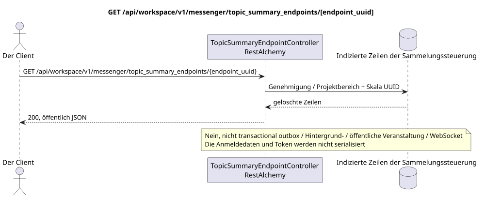

# GET /api/workspace/v1/messenger/topic_summary_endpoints/{endpoint_uuid}

[← Hauptindex der Dokumentation](../../../../index.md) · [Index der Abfolge](../../README.md) · [Abschnitt Core Messenger](../README.md)

## Status und Grenze des laufenden Vertrags

Die Ziel-Spezifikation in der docs-first-Ansatz. HTTP-Vertrag bleibt ein aktuelles Vertrag von [`workspace_api.md`](../../../../workspace_api.md); Zielmäßige interne Mechanismen sind nur ein Vorschlag.



Ausgangsgestalt , die bearbeitet werden kann: [`get_topic_summary_endpoint.puml`](diagrams/get_topic_summary_endpoint.puml).

## Die Operation

**Methode und Weg:** `GET /api/workspace/v1/messenger/topic_summary_endpoints/{endpoint_uuid}`

**Verwendung:** Lesen eines gereinigten globalen Endpunkts von Zusammenfassungen.

## Öffentliche Anfrage

Weg: `endpoint_uuid = e4ad6d80-6bc7-4a91-864c-8e97319a82bd`; ohne Körper.

## Eine erfolgreiche öffentliche Antwort

HTTP `200`:

```json
{
  "uuid": "e4ad6d80-6bc7-4a91-864c-8e97319a82bd",
  "name": "primary-summary-model",
  "base_url": "https://llm.example.com/v1",
  "model": "summary-model",
  "enabled": true,
  "priority": 10,
  "supports_vision": true,
  "supports_reasoning": true,
  "temperature": 0.2,
  "max_output_tokens": 512,
  "top_p": 1,
  "presence_penalty": 0,
  "frequency_penalty": 0,
  "credential_present": true,
  "failure_count": 0,
  "created_at": "2026-06-22T08:00:00Z",
  "updated_at": "2026-06-22T08:00:00Z"
}
```

Die Status- und Fehlerzeitzeichenfelder können in der Antwort fehlen, wenn `null` zugelassen und diesen Wert haben. `api_key` und die aktiven Antrags-Token werden nie zurückgegeben.

## Öffentliche Fehler

Beförderer-Token IAM erforderlich. Falsche UUID oder Anfrage-Body geben HTTP `400`; keine Verwaltungserlaubnis  `403`. Standard-Body Validierungsfehler:

```json
{
  "type": "ValidationErrorException",
  "code": 400,
  "message": "Validation error occurred."
}
```

Für jede Operation mit einem Endpunktregister wird `workspace.topic_summary_endpoint.manage` benötigt; ein fehlender Endpunkt gibt `404`.

## Zielgrenze RestAlchemy

```python
from restalchemy.api import controllers
from restalchemy.api import resources
from restalchemy.dm import models
from restalchemy.dm import properties
from restalchemy.dm import types
from restalchemy.storage.sql import orm


class WorkspaceTopicSummaryEndpoint(
    models.ModelWithUUID,
    models.ModelWithTimestamp,
    orm.SQLStorableMixin,
):
    __tablename__ = "messenger_topic_summary_endpoints"

    name = properties.property(types.String(max_length=255), required=True)
    base_url = properties.property(types.String(max_length=2048), required=True)
    model = properties.property(types.String(max_length=255), required=True)
    credential_present = properties.property(types.Boolean(), read_only=True)


class TopicSummaryEndpointController(controllers.BaseResourceControllerPaginated):
    __resource__ = resources.ResourceByRAModel(
        WorkspaceTopicSummaryEndpoint,
        convert_underscore=False,
        process_filters=True,
    )
```

Diese globale Ressource hat keine öffentlichen Beziehungsfelder zu den Entitäten. Sein öffentliches Feld `uuid`  skalierbare Eigenschaft UUID. Jeder interne externe Schlüssel oder Verweis auf die Rechnungsdaten wird indiziert und hat eine eindeutig festgelegte Verweisungsintegritätsfunktion; `api_key` ist nur für die Eingabe zugänglich, wird verschlüsselt gespeichert und wird nie serialisiert.

## Synchronisierter Leseweg

1. Dokumentarisierte Genehmigung und Projektbereich verlangen.
2. Lese indizierte physische Zeilen über Standardobjekte RestAlchemy.
3. Löschen Sie die Anmeldungs- und Accountfelder, und dann die aktuelle öffentliche Form in Serie.
4. Erstellen Sie keine transactional outbox, Aufgaben, Hintergrund-Ausstelleranfragen, öffentliche Ereignisse oder Arbeiten WebSocket.

Dieses Lesen hat keine Nebenwirkungen und führt keine Aggregation oder Wiederherstellung während der Abfrage aus.

[← Hauptindex der Dokumentation](../../../../index.md) · [Index der Abfolge](../../README.md) · [Abschnitt Core Messenger](../README.md)
