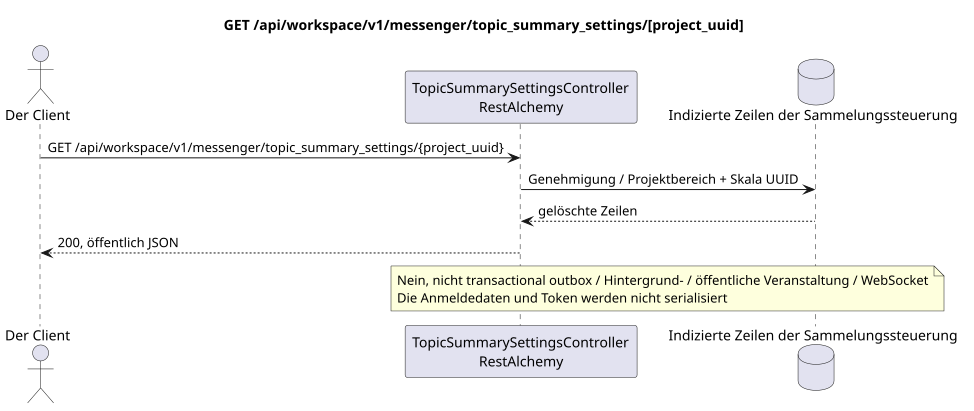

# GET /api/workspace/v1/messenger/topic_summary_settings/{project_uuid}

[← Hauptindex der Dokumentation](../../../../index.md) · [Index der Abfolge](../../README.md) · [Abschnitt Core Messenger](../README.md)

## Status und Grenze des laufenden Vertrags

Die Ziel-Spezifikation in der docs-first-Ansatz. HTTP-Vertrag bleibt ein aktuelles Vertrag von [`workspace_api.md`](../../../../workspace_api.md); Zielmäßige interne Mechanismen sind nur ein Vorschlag.



Ausgangsgestalt , die bearbeitet werden kann: [`get_topic_summary_settings.puml`](diagrams/get_topic_summary_settings.puml).

## Die Operation

**Methode und Weg:** `GET /api/workspace/v1/messenger/topic_summary_settings/{project_uuid}`

**Zweck:** Die globalen und an das laufende Projekt bezogenen Bedingungen für die Einbeziehung von Zusammenfassungen lesen.

## Öffentliche Anfrage

Weg: `project_uuid = 12345678-1234-4234-8234-123456789abc`; der Wert muss mit dem Projekt IAM übereinstimmen; ohne Körper.

## Eine erfolgreiche öffentliche Antwort

HTTP `200`:

```json
{
  "project_id": "12345678-1234-4234-8234-123456789abc",
  "global_enabled": false,
  "project_enabled": false
}
```

Die Status- und Fehlerzeitzeichenfelder können in der Antwort fehlen, wenn `null` zugelassen und diesen Wert haben. `api_key` und die aktiven Antrags-Token werden nie zurückgegeben.

## Öffentliche Fehler

Beförderer-Token IAM erforderlich. Falsche UUID oder Anfrage-Body geben HTTP `400`; keine Verwaltungserlaubnis  `403`. Standard-Body Validierungsfehler:

```json
{
  "type": "ValidationErrorException",
  "code": 400,
  "message": "Validation error occurred."
}
```

Wenn UUID auf dem Weg nicht mit dem Projekt IAM übereinstimmt, kehrt `403` zurück; GET erfordert die Mitgliedschaft im Projekt, und PUT  die Berechtigung zur Verwaltung.

## Zielgrenze RestAlchemy

```python
from restalchemy.api import controllers
from restalchemy.api import resources
from restalchemy.dm import models
from restalchemy.dm import properties
from restalchemy.dm import types
from restalchemy.storage.sql import orm


class WorkspaceTopicSummarySettings(
    models.ModelWithProject,
    orm.SQLStorableMixin,
):
    __tablename__ = "messenger_topic_summary_settings"

    project_id = properties.property(types.UUID(), id_property=True, read_only=True)
    global_enabled = properties.property(types.Boolean(), default=False)
    project_enabled = properties.property(types.Boolean(), default=False)


class TopicSummarySettingsController(controllers.BaseResourceController):
    __resource__ = resources.ResourceByRAModel(
        WorkspaceTopicSummarySettings,
        convert_underscore=False,
        process_filters=True,
    )
```

Ein öffentliches Feld `project_id`  skalierende Eigenschaft UUID, nicht ein Verhältnis in Form URI. Ein physisch indexierter Außenschlüssel für ein Projekt Workspace hat eine eindeutig festgelegte Verweisungsintegritätsfunktion. UUID aus dem Weg muss mit dem Kontext des Projekts übereinstimmen IAM.

## Synchronisierter Leseweg

1. Dokumentarisierte Genehmigung und Projektbereich verlangen.
2. Lese indizierte physische Zeilen über Standardobjekte RestAlchemy.
3. Löschen Sie die Anmeldungs- und Accountfelder, und dann die aktuelle öffentliche Form in Serie.
4. Erstellen Sie keine transactional outbox, Aufgaben, Hintergrund-Ausstelleranfragen, öffentliche Ereignisse oder Arbeiten WebSocket.

Dieses Lesen hat keine Nebenwirkungen und führt keine Aggregation oder Wiederherstellung während der Abfrage aus.

[← Hauptindex der Dokumentation](../../../../index.md) · [Index der Abfolge](../../README.md) · [Abschnitt Core Messenger](../README.md)
