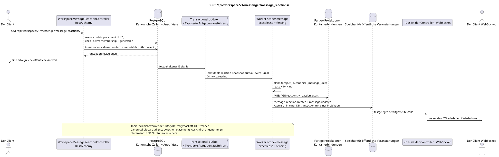

# POST /api/workspace/v1/messenger/message_reactions/

[← Hauptindex der Dokumentation](../../../../index.md) · [Index der Abfolge](../../README.md) · [Abschnitt Core Messenger](../README.md)

## Status und Grenze des laufenden Vertrags

Die Methode, der Weg, die öffentliche JSON und die Autorisierung folgen dem aktuellen Vertrag von [`workspace_api.md`](../../../../workspace_api.md); bounded pagination und asynchrone visibility folgen dem separat angenommenen target compatibility ADR.



Ausgangsgestalt , die bearbeitet werden kann: [`post_message_reactions_create.puml`](diagrams/post_message_reactions_create.puml).

## Die Operation

**Methode und Weg:** `POST /api/workspace/v1/messenger/message_reactions/`

**Zweck:** Eine Reaktionsquelle für eine kanonische Nachricht erstellen.

## Öffentliche Anfrage

```json
{
  "message_uuid": "a93dca35-3061-4748-bda4-7f6f8c660ea5",
  "emoji_name": "thumbs_up"
}
```

## Eine erfolgreiche öffentliche Antwort

HTTP `201`:

```json
{
  "uuid": "bd4b7632-8788-435a-93cc-6873657335c6",
  "project_id": "22222222-2222-2222-2222-222222222222",
  "message_uuid": "a93dca35-3061-4748-bda4-7f6f8c660ea5",
  "user_uuid": "11111111-1111-1111-1111-111111111111",
  "emoji_name": "thumbs_up",
  "provider": null,
  "delivery": null,
  "created_at": "2026-06-22T10:12:00Z",
  "updated_at": "2026-06-22T10:12:00Z"
}
```

## Öffentliche Fehler

Bewerber-Token IAM und Projektbereich erforderlich. Falsch UUID oder Anfrage-Body wird HTTP `400` gegeben; fehlende oder nicht verfügbare Ressource in diesem Bereich  `404`. Standarddokumenterter Validierungsfehler-Body:

```json
{
  "type": "ValidationErrorException",
  "code": 400,
  "message": "Validation error occurred."
}
```

Wiederholung derselben Kombination von Benutzer, Nachricht und Emoji wird abgelehnt; der aktuelle Vertrag legt keinen separaten Anwendungscode dafür fest.

## Zielgrenze RestAlchemy

```python
from restalchemy.api import controllers
from restalchemy.api import resources
from restalchemy.dm import models
from restalchemy.dm import properties
from restalchemy.dm import types
from restalchemy.storage.sql import orm


class WorkspaceMessageReactionView(
    models.ModelWithUUID,
    models.ModelWithProject,
    orm.SQLStorableMixin,
):
    __tablename__ = "messenger_api_message_reactions_v1"

    message_uuid = properties.property(types.UUID(), read_only=True)
    canonical_message_uuid = properties.property(types.UUID(), read_only=True)
    user_uuid = properties.property(types.UUID(), read_only=True)


class WorkspaceMessageReactionController(controllers.BaseResourceControllerPaginated):
    __resource__ = resources.ResourceByRAModel(
        WorkspaceMessageReactionView, convert_underscore=False, process_filters=True,
    )
```

Öffentliche `message_uuid`  skalare UUID Placement; innere
`canonical_message_uuid` Feldberechtigungen sind versteckt.UUIDder ursprünglichen Tatsache
Die physischen Verweise bleiben FK-indexiert, und
Die ursprünglichen Metadaten des Providers/Lieferanten sind geschlossen.

## Synchrone Transaktion

1. Interpretieren Sie öffentliche `message_uuid` als Placement UUID, wiederherstellen
   Sie können die canonical Message und die active stream membership sofort überprüfen und
   matching generation.
2. Fügen Sie eine raw fact für den aktuellen Benutzer, canonical message und emoji;
   placement wird für die Autorisierung verwendet, nicht als hidden public ID.
3. Fügen Sie ein separates immutable Event hinzu transactional outbox; derived task
   Unique auf `outbox_event_uuid`, keine synchronen Änderungen.

Betroffene Zustand: Reaktion, Zugriff und transactional outbox.

## Typisierte Aufgaben und Hintergrund-Ausfüllung

Aufgaben: Einzelne immutable `reaction_snapshot` und bei Bedarf einzelne
`delivery_snapshot_event`; coalescing nicht vorhanden.

Einer fenced owner scope `message`
`(project_id, canonical_message_uuid)` Liest aktuelle Fakten und Atom
ersetzt `MESSAGE.reactions`/`reaction_users`; topic lock wird nicht verwendet.
Task lifecycle beinhaltet lease expiry, retry/backoff, DLQ und reaper.

## Öffentliche Veranstaltungen und WebSocket

Für den Initiator  `message_reaction.created`, dann für den Beobachter  `message.updated` über den Dispepter.

## Idempotenz, Rennen und zeitliche Merkmale, die dem Kunden sichtbar sind

Die Einzigartigkeit `(project,canonical_message,user,emoji)` verhindert Duplikate und
Abbruch der Mitgliedschaft verbietet die Anfrage sofort nach dem commit,
Die Tatsache ist sofort sichtbar für den Initiator, die Bilder und
Canonical-global Snapshots sind absichtlich zwischen
Das ist eine Entscheidung , die wir getroffen haben . Critic risk #8.

[← Hauptindex der Dokumentation](../../../../index.md) · [Index der Abfolge](../../README.md) · [Abschnitt Core Messenger](../README.md)
