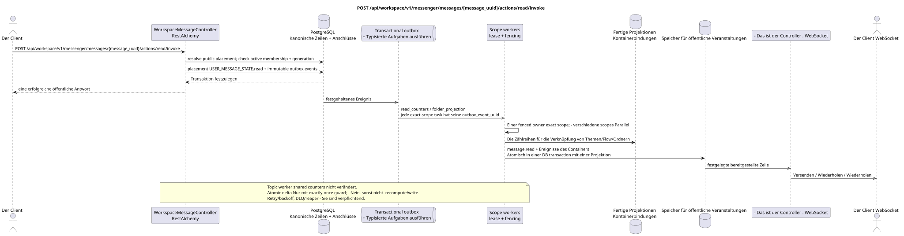

# POST /api/workspace/v1/messenger/messages/{message_uuid}/actions/read/invoke

[← Hauptindex der Dokumentation](../../../../index.md) · [Index der Abfolge](../../README.md) · [Abschnitt Core Messenger](../README.md)

## Status und Grenze des laufenden Vertrags

Die Methode, der Weg, die öffentliche JSON und die Autorisierung folgen dem aktuellen Vertrag von [`workspace_api.md`](../../../../workspace_api.md); bounded pagination und asynchrone visibility folgen dem separat angenommenen target compatibility ADR.



Ausgangsgestalt , die bearbeitet werden kann: [`post_message_read_action.puml`](diagrams/post_message_read_action.puml).

## Die Operation

**Methode und Weg:** `POST /api/workspace/v1/messenger/messages/{message_uuid}/actions/read/invoke`

**Zweck:** Eine Nachricht für den aktuellen Benutzer als gelesen zu markieren.

## Öffentliche Anfrage

Ohne Körper JSON.

## Eine erfolgreiche öffentliche Antwort

HTTP `200`:

```json
{
  "uuid": "a93dca35-3061-4748-bda4-7f6f8c660ea5",
  "project_id": "22222222-2222-2222-2222-222222222222",
  "stream_uuid": "75309057-419c-4b12-a7c1-3932429ec4a6",
  "topic_uuid": "4ec0b996-b778-45f8-8ef4-ef863be0c047",
  "author_uuid": "11111111-1111-1111-1111-111111111111",
  "payload": {
    "kind": "markdown",
    "content": "Привет, Workspace"
  },
  "user_uuid": "33333333-3333-3333-3333-333333333333",
  "read": true,
  "pinned": false,
  "starred": false,
  "is_own": false,
  "mentioned": false,
  "reactions": {},
  "reaction_users": {},
  "source_name": "native",
  "source": {
    "kind": "native"
  },
  "provider": null,
  "delivery": null,
  "created_at": "2026-06-22T10:10:00Z",
  "updated_at": "2026-06-22T10:10:00Z"
}
```

## Öffentliche Fehler

Bewerber-Token IAM und Projektbereich erforderlich. Falsch UUID oder Anfrage-Body wird HTTP `400` gegeben; fehlende oder nicht verfügbare Ressource in diesem Bereich  `404`. Standarddokumenterter Validierungsfehler-Body:

```json
{
  "type": "ValidationErrorException",
  "code": 400,
  "message": "Validation error occurred."
}
```

## Zielgrenze RestAlchemy

```python
from restalchemy.api import controllers
from restalchemy.api import resources
from restalchemy.dm import models
from restalchemy.dm import properties
from restalchemy.dm import types
from restalchemy.storage.sql import orm


class WorkspaceUserMessage(models.ModelWithProject, orm.SQLStorableMixin):
    __tablename__ = "messenger_api_user_messages_v1"

    binding_uuid = properties.property(types.UUID(), id_property=True)
    uuid = properties.property(types.UUID(), read_only=True)
    stream_uuid = properties.property(types.UUID(), read_only=True)
    topic_uuid = properties.property(types.UUID(), read_only=True)
    author_uuid = properties.property(types.UUID(), read_only=True)
    user_uuid = properties.property(types.UUID(), read_only=True)


class WorkspaceMessageController(controllers.BaseResourceControllerPaginated):
    __resource__ = resources.ResourceByRAModel(
        WorkspaceUserMessage, convert_underscore=False, process_filters=True,
    )
```

Public `uuid` und route ID sind gleich `MESSAGE_PLACEMENT.uuid`; canonical `MESSAGE.uuid` und `binding_uuid` sind versteckt. Placement wählt eindeutig `USER_MESSAGE_STATE (project,user,placement)`, und action überprüft synchron die active membership und generation.

## Synchrone Transaktion

1. Erlauben Sie öffentliche Platzierung UUID und Zugriff des aktuellen Benutzers.
2. Einzigartiger Wert festlegen USER_MESSAGE_STATE.read.
3. Nur wenn Sie etwas ändern , fügen Sie für jedes einzelne immutable outbox-Event ein
   Ausführbare Task des tatsächlichen Bereichs.

Betroffener Zustand: USER_MESSAGE_STATE, Zugangsbereich und transactional outbox; Containerzähler werden nie in der Nachrichtengebundene gespeichert.

## Typisierte Aufgaben und Hintergrund-Ausfüllung

Aufgaben: Einzigartige unwandelbare `read_counters` für exakt `user-stream` und
`user-topic`, und auch `folder_projection` für genau `user-folder`; jede task
entspricht einem eigenen Source-Outbox-Event, coalescing fehlt.

Fenced owners scopes `user-stream`, `user-topic` und `user-folder` ist idempotentiell.
/snapshot. Topic worker schreibt diese shared rows nicht. Atomic delta
zulässig nur mit exactly-once guard auf `outbox_event_uuid`; andernfalls scope worker
Die Task-Lebenszeit umfasst retry/backoff, DLQ/reaper.

## Öffentliche Veranstaltungen und WebSocket

`message.read`, Aktualisieren von Themen, Streams und Ordnern

## Idempotenz, Rennen und zeitliche Merkmale, die dem Kunden sichtbar sind

Die Zustandsanordnung ist idympotent; der aktuelle Zustand ändert sich sofort, und Aggregate und Ereignisse können kurz zurückbleiben.

[← Hauptindex der Dokumentation](../../../../index.md) · [Index der Abfolge](../../README.md) · [Abschnitt Core Messenger](../README.md)
