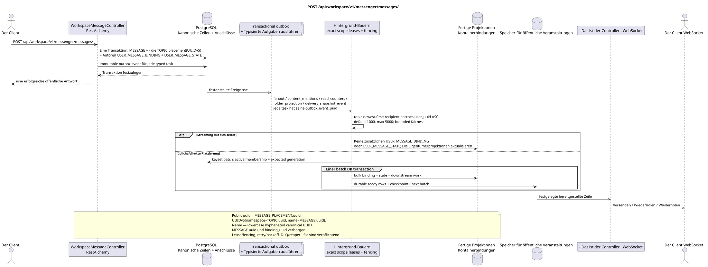

# POST /api/workspace/v1/messenger/messages/

[← Hauptindex der Dokumentation](../../../../index.md) · [Index der Abfolge](../../README.md) · [Abschnitt Core Messenger](../README.md)

## Status und Grenze des laufenden Vertrags

Die Methode, der Weg, die öffentliche JSON und die Autorisierung folgen dem aktuellen Vertrag von [`workspace_api.md`](../../../../workspace_api.md); bounded pagination und asynchrone visibility folgen dem separat angenommenen target compatibility ADR.



Ausgangsgestalt , die bearbeitet werden kann: [`post_messages_create.puml`](diagrams/post_messages_create.puml).

## Die Operation

**Methode und Weg:** `POST /api/workspace/v1/messenger/messages/`

**Zweck:** Erstellen einer kanonischen Markdown-Nachricht und deren Anfangsverteilung.

## Öffentliche Anfrage

```json
{
  "stream_uuid": "75309057-419c-4b12-a7c1-3932429ec4a6",
  "topic_uuid": "4ec0b996-b778-45f8-8ef4-ef863be0c047",
  "payload": {
    "kind": "markdown",
    "content": "Привет, Workspace"
  }
}
```

## Eine erfolgreiche öffentliche Antwort

HTTP `201`:

```json
{
  "uuid": "a93dca35-3061-4748-bda4-7f6f8c660ea5",
  "project_id": "22222222-2222-2222-2222-222222222222",
  "stream_uuid": "75309057-419c-4b12-a7c1-3932429ec4a6",
  "topic_uuid": "4ec0b996-b778-45f8-8ef4-ef863be0c047",
  "author_uuid": "11111111-1111-1111-1111-111111111111",
  "payload": {
    "kind": "markdown",
    "content": "Привет, Workspace"
  },
  "user_uuid": "11111111-1111-1111-1111-111111111111",
  "read": true,
  "pinned": false,
  "starred": false,
  "is_own": true,
  "mentioned": false,
  "reactions": {},
  "reaction_users": {},
  "source_name": "native",
  "source": {
    "kind": "native"
  },
  "provider": null,
  "delivery": null,
  "created_at": "2026-06-22T10:10:00Z",
  "updated_at": "2026-06-22T10:10:00Z"
}
```

## Öffentliche Fehler

Bewerber-Token IAM und Projektbereich erforderlich. Falsch UUID oder Anfrage-Body wird HTTP `400` gegeben; fehlende oder nicht verfügbare Ressource in diesem Bereich  `404`. Standarddokumenterter Validierungsfehler-Body:

```json
{
  "type": "ValidationErrorException",
  "code": 400,
  "message": "Validation error occurred."
}
```

Fehlende oder fehlende Themen geben standardmäßig `400001007` (`StreamDefaultTopicNotConfiguredError`); markdown muss nach Entfernung der Randleere 1 bis 40 000 Zeichen enthalten.

## Zielgrenze RestAlchemy

```python
from restalchemy.api import controllers
from restalchemy.api import resources
from restalchemy.dm import models
from restalchemy.dm import properties
from restalchemy.dm import types
from restalchemy.storage.sql import orm


class WorkspaceUserMessage(models.ModelWithProject, orm.SQLStorableMixin):
    __tablename__ = "messenger_api_user_messages_v1"

    binding_uuid = properties.property(types.UUID(), id_property=True)
    uuid = properties.property(types.UUID(), read_only=True)
    stream_uuid = properties.property(types.UUID(), read_only=True)
    topic_uuid = properties.property(types.UUID(), read_only=True)
    author_uuid = properties.property(types.UUID(), read_only=True)
    user_uuid = properties.property(types.UUID(), read_only=True)


class WorkspaceMessageController(controllers.BaseResourceControllerPaginated):
    __resource__ = resources.ResourceByRAModel(
        WorkspaceUserMessage, convert_underscore=False, process_filters=True,
    )
```

Public `uuid` und route ID sind gleich `MESSAGE_PLACEMENT.uuid`, berechnet als `UUIDv5(namespace=TOPIC.uuid, name=MESSAGE.uuid)`; name  lowercase hyphenated canonical UUID. `MESSAGE.uuid` intern, `binding_uuid` versteckt. `topic_uuid` physisch bindend; public null/omission wird zuerst in canonical default topic.

## Synchrone Transaktion

1. Überprüfen Sie den aktuellen Zugriff auf den Stream und das Thema.
2. Einen einfügen `MESSAGE`.
3. Berechnen Sie eine bestimmte Placement UUID und setzen Sie eine `MESSAGE_PLACEMENT`; retry das gleiche Paar topic/message gibt das gleiche zurück UUID.
4. Verfasserin einfügen`USER_MESSAGE_BINDING`und
   `USER_MESSAGE_STATE (read=true)`.
5. Fügen Sie für jede Transaktion ein eigenständiges unveränderliches Outbox-Event hinzu
   Auszug initial typed task.

Die Synchronisierung ist auf die Sammlung beschränkt `MESSAGE` +
`MESSAGE_PLACEMENT` + Autoren `USER_MESSAGE_BINDING` + Autoren
`USER_MESSAGE_STATE` + transactional outbox.

## Typisierte Aufgaben und Hintergrund-Ausfüllung

Die Aufgaben sind `fanout`, `content_mentions`, `read_counters`, `folder_projection` und,
wenn zutreffend, Provider `delivery_snapshot_event`; jede hat
eigene source outbox event.

Der Slot nimmt ausschließlich `(project_id, topic_uuid)` ein, verarbeitet Nachrichten über
`MESSAGE.created_at DESC`, und die Empfänger  immutable keyset batches per
`user_uuid ASC`: default `1000`, hard maximum `5000`, ohne `OFFSET` und unbounded
transaction. Jeder Batch wird überprüft active membership/generation,
Atomisch schreibt binding/state, downstream work und ready events, dann checkpoint;
retry Stale task macht keine Option; self-chat fügt keine hinzu
zweites Set.

## Öffentliche Veranstaltungen und WebSocket

Worker Sie wird atomar festgehalten und ready `message.created`/
`topic.updated`/`stream.updated` rows. Dispatcher - Er kommt schon. durable events.

## Idempotenz, Rennen und zeitliche Merkmale, die dem Kunden sichtbar sind

Der kanonische Inhalt wird in einem Exemplar gespeichert; business key und UUIDv5
Sie werden von der Seite der Autorin angezeigt. (`201` =
primary commit), Empfänger/Projektionen können zurückbleiben; etwa eine Sekunde — SLO intent,
Grenzgerechte Fairness verhindert, dass ein großes Publikum alte Arbeiten verdrängt..

[← Hauptindex der Dokumentation](../../../../index.md) · [Index der Abfolge](../../README.md) · [Abschnitt Core Messenger](../README.md)
