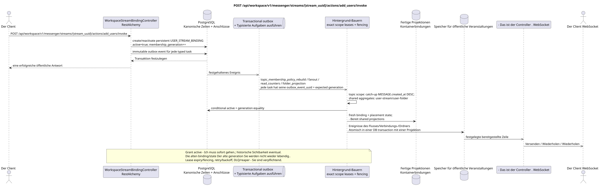

# POST /api/workspace/v1/messenger/streams/{stream_uuid}/actions/add_users/invoke

[← Hauptindex der Dokumentation](../../../../index.md) · [Index der Abfolge](../../README.md) · [Abschnitt Core Messenger](../README.md)

## Status und Grenze des laufenden Vertrags

Die Methode, der Weg, die öffentliche JSON und die Autorisierung folgen dem aktuellen Vertrag von [`workspace_api.md`](../../../../workspace_api.md); bounded pagination und asynchrone visibility folgen dem separat angenommenen target compatibility ADR.



Ausgangsgestalt , die bearbeitet werden kann: [`post_stream_add_users_action.puml`](diagrams/post_stream_add_users_action.puml).

## Die Operation

**Methode und Weg:** `POST /api/workspace/v1/messenger/streams/{stream_uuid}/actions/add_users/invoke`

**Zweck:** Benutzer in den normalen Stream hinzufügen, indem sie nach Rollen gruppiert werden.

## Öffentliche Anfrage

```json
{
  "member": [
    "33333333-3333-3333-3333-333333333333",
    "44444444-4444-4444-4444-444444444444"
  ],
  "owner": [
    "55555555-5555-5555-5555-555555555555"
  ]
}
```

## Eine erfolgreiche öffentliche Antwort

HTTP `200`:

```json
[
  {
    "uuid": "3195a887-da5d-440b-bdf8-0d3d995a9e01",
    "project_id": "22222222-2222-2222-2222-222222222222",
    "stream_uuid": "75309057-419c-4b12-a7c1-3932429ec4a6",
    "user_uuid": "33333333-3333-3333-3333-333333333333",
    "who_uuid": "11111111-1111-1111-1111-111111111111",
    "role": "member",
    "notification_mode": "all_messages",
    "notification_updated_at": "1970-01-01T00:00:00Z",
    "created_at": "2026-06-22T09:05:00Z",
    "updated_at": "2026-06-22T09:05:00Z"
  },
  {
    "uuid": "4295a887-da5d-440b-bdf8-0d3d995a9e02",
    "project_id": "22222222-2222-2222-2222-222222222222",
    "stream_uuid": "75309057-419c-4b12-a7c1-3932429ec4a6",
    "user_uuid": "44444444-4444-4444-4444-444444444444",
    "who_uuid": "11111111-1111-1111-1111-111111111111",
    "role": "member",
    "notification_mode": "all_messages",
    "notification_updated_at": "1970-01-01T00:00:00Z",
    "created_at": "2026-06-22T09:05:00Z",
    "updated_at": "2026-06-22T09:05:00Z"
  }
]
```

## Öffentliche Fehler

Bewerber-Token IAM und Projektbereich erforderlich. Falsch UUID oder Anfrage-Body wird HTTP `400` gegeben; fehlende oder nicht verfügbare Ressource in diesem Bereich  `404`. Standarddokumenterter Validierungsfehler-Body:

```json
{
  "type": "ValidationErrorException",
  "code": 400,
  "message": "Validation error occurred."
}
```

Nicht unterstützte Rolle gibt `400001004`; Benutzer nicht in Listeform  `400001005`; Änderung der Mitgliedschaft des direkten Flusses oder des Flusses mit sich selbst — `400`.

## Zielgrenze RestAlchemy

```python
from restalchemy.api import controllers
from restalchemy.api import resources
from restalchemy.dm import models
from restalchemy.dm import properties
from restalchemy.dm import types
from restalchemy.storage.sql import orm


class WorkspaceStreamBindingView(
    models.ModelWithUUID,
    models.ModelWithProject,
    orm.SQLStorableMixin,
):
    __tablename__ = "messenger_api_stream_bindings_v1"

    stream_uuid = properties.property(types.UUID(), read_only=True)
    user_uuid = properties.property(types.UUID(), read_only=True)
    who_uuid = properties.property(types.UUID(), read_only=True)


class WorkspaceStreamBindingController(controllers.BaseResourceControllerPaginated):
    __resource__ = resources.ResourceByRAModel(
        WorkspaceStreamBindingView, convert_underscore=False, process_filters=True,
    )
```

Die öffentlichen Entitätsverweise sind mit den skalaren Eigenschaften `types.UUID()` und nicht mit den Beziehungen RestAlchemy, die in URI serialisiert werden. Die physischen Spalten `*_uuid` bleiben als indexierte Externe Schlüssel mit eindeutig ausgewählten Verweisintegritätsaktionen. USER_STREAM_BINDING ist einzigartig in `(project_id, stream_uuid, user_uuid)` und kann physisch bereitgestellte Zähler speichern, aber ihre aktuelle öffentliche JSON Bindung ändert sich nicht.

## Synchrone Transaktion

1. Überprüfen Sie den Rollenzugriff auf den normalen Fluss.
2. Für jeden Benutzer erstellen persistent `USER_STREAM_BINDING` mit
   `active = true` und Anfang `membership_generation` oder reaktivieren
   tombstone, Vorher erhöht generation; `who_uuid` ist gleich dem aktuellen
   Die alte Generation wird nicht mehr verwendet..
3. Fügen Sie für jede Ausgabe ein immutable transactional outbox Event hinzu typed
   task; Ein Ereignis ist nicht mit einem anderen zusammenfallen.

Betroffener Zustand: Paket USER_STREAM_BINDING und transactional outbox.

## Typisierte Aufgaben und Hintergrund-Ausfüllung

Aufgaben: Einzelne immutable `topic_membership_policy_rebuild`, `fanout`,
`read_counters` und `folder_projection`; jede Aufgabe hat ihre eigene source
`outbox_event_uuid`, exact scope key und erwartet `membership_generation` dort,
wo das Ergebnis von membership.

Die Antwort bedeutet, dass die Mitgliedschaft aktiv ist sofort, aber historische Sichtbarkeit
Der Topic-scoped Worker erstellt fresh
`USER_MESSAGE_BINDING` + placement-scoped `USER_MESSAGE_STATE` Nur wenn
membership bleibt aktiv und generation stimmt zusammen; stale task macht no-op.
Shared aggregates Einzelne Eigentümer aktualisieren `user-stream`/`user-folder`.
Alle Aufgaben verwenden lease/fencing, retry/backoff, DLQ/reaper und idepotent
effect guard. Alte Bindungen/state der vorherigen Generation werden automatisch nicht mehr verwendet
Sie werden sichtbar..

## Öffentliche Veranstaltungen und WebSocket

Für den neuen Benutzer  `stream.created`, für den bestehenden  `stream_bindings.created` sowie für die Aktualisierung von Ordnern.

## Idempotenz, Rennen und zeitliche Merkmale, die dem Kunden sichtbar sind

Einzigartiger Schlüssel des Flusses und des Benutzers und monotone Generation steuern
Die Antwort auf die aktive Mitgliedschaft kommt sofort zurück, die historische
Die Sichtbarkeit der Nachrichten/Themen wird nach der Projektion commit und nur asynchron erreicht
Dann wird er geboren. ready WebSocket events.

[← Hauptindex der Dokumentation](../../../../index.md) · [Index der Abfolge](../../README.md) · [Abschnitt Core Messenger](../README.md)
