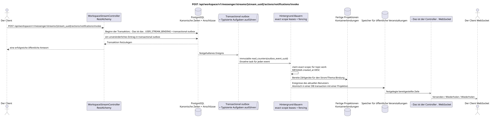

# POST /api/workspace/v1/messenger/streams/{stream_uuid}/actions/notifications/invoke


Allgemeine Ziel-Invariante der Zuverlässigkeit: Jedes immutable outbox-Ereignis führt genau eine immutable typed task mit einem einzigartigen `outbox_event_uuid`; coalescing fehlt. Task speichert den tatsächlichen exact scope key, verwendet lease/fencing, retry/backoff, max attempts/DLQ, reaper und idepotent effect guard. Topic scope wird nur für placement/message-binding work angewendet; shared rows erhalten keinen impliziten Fallback auf topic.

[← Hauptindex der Dokumentation](../../../../index.md) · [Index der Abfolge](../../README.md) · [Abschnitt Core Messenger](../README.md)

## Status und Grenze des laufenden Vertrags

Die Methode, der Weg, die öffentliche JSON und die Autorisierung folgen dem aktuellen Vertrag von [`workspace_api.md`](../../../../workspace_api.md); bounded pagination und asynchrone visibility folgen dem separat angenommenen target compatibility ADR.



Ausgangsgestalt , die bearbeitet werden kann: [`post_stream_notifications_action.puml`](diagrams/post_stream_notifications_action.puml).

## Die Operation

**Methode und Weg:** `POST /api/workspace/v1/messenger/streams/{stream_uuid}/actions/notifications/invoke`

**Zweck:** Einrichten von Flussbenachrichtigungen für den aktuellen Benutzer.

## Öffentliche Anfrage

```json
{
  "notification_mode": "mentions_only"
}
```

## Eine erfolgreiche öffentliche Antwort

HTTP `200`:

```json
{
  "uuid": "75309057-419c-4b12-a7c1-3932429ec4a6",
  "name": "Инженерия",
  "description": "Инженерное пространство",
  "project_id": "22222222-2222-2222-2222-222222222222",
  "owner": "11111111-1111-1111-1111-111111111111",
  "user_uuid": "11111111-1111-1111-1111-111111111111",
  "role": "owner",
  "notification_mode": "mentions_only",
  "unread_count": 2,
  "active_unread_count": 1,
  "passive_unread_count": 1,
  "source_name": "native",
  "source": {
    "kind": "native"
  },
  "invite_only": false,
  "announce": false,
  "private": false,
  "is_archived": false,
  "color": 3368601,
  "last_message_uuid": "a93dca35-3061-4748-bda4-7f6f8c660ea5",
  "default_topic_uuid": "4ec0b996-b778-45f8-8ef4-ef863be0c047",
  "created_at": "2026-06-22T09:00:00Z",
  "updated_at": "2026-06-22T10:16:00Z"
}
```

## Öffentliche Fehler

Bewerber-Token IAM und Projektbereich erforderlich. Falsch UUID oder Anfrage-Body wird HTTP `400` gegeben; fehlende oder nicht verfügbare Ressource in diesem Bereich  `404`. Standarddokumenterter Validierungsfehler-Body:

```json
{
  "type": "ValidationErrorException",
  "code": 400,
  "message": "Validation error occurred."
}
```

## Zielgrenze RestAlchemy

```python
from restalchemy.api import controllers
from restalchemy.api import resources
from restalchemy.dm import models
from restalchemy.dm import properties
from restalchemy.dm import types
from restalchemy.storage.sql import orm


class WorkspaceUserStream(
    models.ModelWithUUID,
    models.ModelWithProject,
    orm.SQLStorableMixin,
):
    __tablename__ = "messenger_api_user_streams_v1"

    owner = properties.property(types.UUID(), read_only=True)
    user_uuid = properties.property(types.UUID(), read_only=True)
    direct_user_uuid = properties.property(
        types.AllowNone(types.UUID()), default=None, read_only=True,
    )
    last_message_uuid = properties.property(types.UUID(), read_only=True)
    default_topic_uuid = properties.property(types.UUID(), read_only=True)


class WorkspaceStreamController(controllers.BaseResourceControllerPaginated):
    __resource__ = resources.ResourceByRAModel(
        WorkspaceUserStream, convert_underscore=False, process_filters=True,
    )
```

Die öffentlichen Entitätsverweise sind mit den skalaren Eigenschaften `types.UUID()` und nicht mit den Beziehungen RestAlchemy, die in URI serialisiert werden. Die physischen Spalten `*_uuid` bleiben indexierte Außenschlüssel mit eindeutig ausgewählten Verweisungsaktionen. Das öffentliche Feld `owner` ist die Eigenschaft UUID; das physische Feld `owner_uuid`  der indexierte Außenschlüssel des Benutzers. USER_STREAM_BINDING speichert die vorbereiteten Flussstufemessern..

## Synchrone Transaktion

1. Erlauben USER_STREAM_BINDING.
2. Einstellen des Modus und des Server-Zeitzeichens.
3. Fügen Sie einzelne immutable Outbox-Events für `read_counters` und, wenn
   Sie benötigen ein öffentliches Ereignis, `delivery_snapshot_event`; jedes Ereignis
   Er erhält genau eins. task.

Betroffene Status: USER_STREAM_BINDING und transactional outbox; die fertigen Zähler werden hier gespeichert.

## Typisierte Aufgaben und Hintergrund-Ausfüllung

Aufgaben: `read_counters` und optional `delivery_snapshot_event`.

Einzelne fenced owners `user-stream`/`user-topic`/`user-folder` scopes
Wir klassifizieren die vorbereiteten Zähler und bereiten die Ereignisse vor.. Topic
worker shared rows nicht schreibt; jedes Outbox-Event führt eine separate task.

## Öffentliche Veranstaltungen und WebSocket

Aktualisieren des Flusses und des aktuellen Benutzerthemas.

## Idempotenz, Rennen und zeitliche Merkmale, die dem Kunden sichtbar sind

Eine Zeile besitzt den Bereich; `COUNT` wird während der Anfrage nicht ausgeführt..

[← Hauptindex der Dokumentation](../../../../index.md) · [Index der Abfolge](../../README.md) · [Abschnitt Core Messenger](../README.md)
