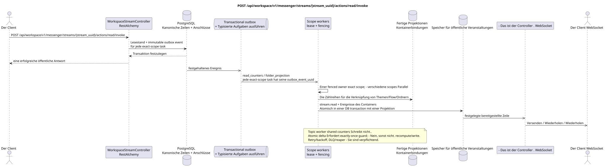

# POST /api/workspace/v1/messenger/streams/{stream_uuid}/actions/read/invoke

[← Hauptindex der Dokumentation](../../../../index.md) · [Index der Abfolge](../../README.md) · [Abschnitt Core Messenger](../README.md)

## Status und Grenze des laufenden Vertrags

Die Methode, der Weg, die öffentliche JSON und die Autorisierung folgen dem aktuellen Vertrag von [`workspace_api.md`](../../../../workspace_api.md); bounded pagination und asynchrone visibility folgen dem separat angenommenen target compatibility ADR.



Ausgangsgestalt , die bearbeitet werden kann: [`post_stream_read_action.puml`](diagrams/post_stream_read_action.puml).

## Die Operation

**Methode und Weg:** `POST /api/workspace/v1/messenger/streams/{stream_uuid}/actions/read/invoke`

**Zweck:** Die Flussnachrichten für den aktuellen Benutzer als gelesen zu markieren.

## Öffentliche Anfrage

Ohne Körper JSON.

## Eine erfolgreiche öffentliche Antwort

HTTP `200`:

```json
{
  "uuid": "75309057-419c-4b12-a7c1-3932429ec4a6",
  "name": "Инженерия",
  "description": "Инженерное пространство",
  "project_id": "22222222-2222-2222-2222-222222222222",
  "owner": "11111111-1111-1111-1111-111111111111",
  "user_uuid": "11111111-1111-1111-1111-111111111111",
  "role": "owner",
  "notification_mode": "all_messages",
  "unread_count": 0,
  "active_unread_count": 0,
  "passive_unread_count": 0,
  "source_name": "native",
  "source": {
    "kind": "native"
  },
  "invite_only": false,
  "announce": false,
  "private": false,
  "is_archived": false,
  "color": 3368601,
  "last_message_uuid": "a93dca35-3061-4748-bda4-7f6f8c660ea5",
  "default_topic_uuid": "4ec0b996-b778-45f8-8ef4-ef863be0c047",
  "created_at": "2026-06-22T09:00:00Z",
  "updated_at": "2026-06-22T10:16:00Z"
}
```

## Öffentliche Fehler

Bewerber-Token IAM und Projektbereich erforderlich. Falsch UUID oder Anfrage-Body wird HTTP `400` gegeben; fehlende oder nicht verfügbare Ressource in diesem Bereich  `404`. Standarddokumenterter Validierungsfehler-Body:

```json
{
  "type": "ValidationErrorException",
  "code": 400,
  "message": "Validation error occurred."
}
```

## Zielgrenze RestAlchemy

```python
from restalchemy.api import controllers
from restalchemy.api import resources
from restalchemy.dm import models
from restalchemy.dm import properties
from restalchemy.dm import types
from restalchemy.storage.sql import orm


class WorkspaceUserStream(
    models.ModelWithUUID,
    models.ModelWithProject,
    orm.SQLStorableMixin,
):
    __tablename__ = "messenger_api_user_streams_v1"

    owner = properties.property(types.UUID(), read_only=True)
    user_uuid = properties.property(types.UUID(), read_only=True)
    direct_user_uuid = properties.property(
        types.AllowNone(types.UUID()), default=None, read_only=True,
    )
    last_message_uuid = properties.property(types.UUID(), read_only=True)
    default_topic_uuid = properties.property(types.UUID(), read_only=True)


class WorkspaceStreamController(controllers.BaseResourceControllerPaginated):
    __resource__ = resources.ResourceByRAModel(
        WorkspaceUserStream, convert_underscore=False, process_filters=True,
    )
```

Die öffentlichen Entitätsverweise sind mit den skalaren Eigenschaften `types.UUID()` und nicht mit den Beziehungen RestAlchemy, die in URI serialisiert werden. Die physischen Spalten `*_uuid` bleiben indexierte Außenschlüssel mit eindeutig ausgewählten Verweisungsaktionen. Das öffentliche Feld `owner` ist die Eigenschaft UUID; das physische Feld `owner_uuid`  der indexierte Außenschlüssel des Benutzers. USER_STREAM_BINDING speichert die vorbereiteten Flussstufemessern..

## Synchrone Transaktion

1. Bereiche erlauben.
2. Anwendbare Lesemerkersätze festlegen USER_MESSAGE_STATE.
3. Fügen Sie für jede Ausgabe ein separates immutable outbox-Event hinzu task
   `user-stream`/`user-topic`/`user-folder`.

Betroffener Zustand: USER_MESSAGE_STATE und transactional outbox; Aggregat wird nie in der Nachrichtengebundenheit gespeichert.

## Typisierte Aufgaben und Hintergrund-Ausfüllung

Aufgaben: einzelne immutable `read_counters` tasks für `user-stream` und
`user-topic`, und auch `folder_projection` für `user-folder`; jede
entspricht seinem Source Outbox Event, coalescing fehlt.

Fenced owners exact scopes `user-stream`, `user-topic` und `user-folder`
Sie aktualisieren die bereitgestellten Zähler/snapshot; topic worker shared rows schreibt nicht. Atomic delta
erfordert genau-einmal eine Wartung von `outbox_event_uuid`, sonst wird
recompute/write. Tasks Sie benutzen retry/backoff, DLQ/reaper.

## Öffentliche Veranstaltungen und WebSocket

`stream.read` und der Erneuerung von Containern.

## Idempotenz, Rennen und zeitliche Merkmale, die dem Kunden sichtbar sind

Wiederholte Lesemerkung ist idympotent; der Lesestand ändert sich sofort, Zähler und Ereignisse  asynchron.

[← Hauptindex der Dokumentation](../../../../index.md) · [Index der Abfolge](../../README.md) · [Abschnitt Core Messenger](../README.md)
