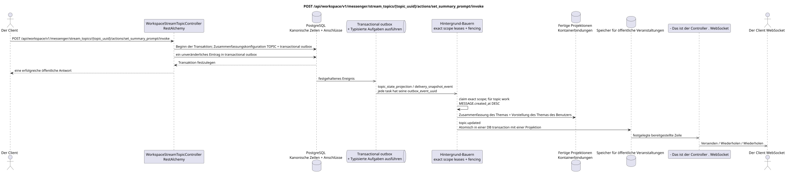

# POST /api/workspace/v1/messenger/stream_topics/{topic_uuid}/actions/set_summary_prompt/invoke

[← Hauptindex der Dokumentation](../../../../index.md) · [Index der Abfolge](../../README.md) · [Abschnitt Core Messenger](../README.md)

## Status und Grenze des laufenden Vertrags

Die Methode, der Weg, die öffentliche JSON und die Autorisierung folgen dem aktuellen Vertrag von [`workspace_api.md`](../../../../workspace_api.md); bounded pagination und asynchrone visibility folgen dem separat angenommenen target compatibility ADR.



Ausgangsgestalt , die bearbeitet werden kann: [`post_topic_set_summary_prompt_action.puml`](diagrams/post_topic_set_summary_prompt_action.puml).

## Die Operation

**Methode und Weg:** `POST /api/workspace/v1/messenger/stream_topics/{topic_uuid}/actions/set_summary_prompt/invoke`

**Zweck:** Die Konfiguration der Themensumme aktualisieren.

## Öffentliche Anfrage

```json
{
  "summary_system_prompt": "Суммируй решения, ответственных и нерешённые риски.",
  "summary_reasoning_effort": "medium",
  "summary_enabled": true
}
```

## Eine erfolgreiche öffentliche Antwort

HTTP `200`:

```json
{
  "uuid": "4ec0b996-b778-45f8-8ef4-ef863be0c047",
  "project_id": "22222222-2222-2222-2222-222222222222",
  "name": "Релизы",
  "stream_uuid": "75309057-419c-4b12-a7c1-3932429ec4a6",
  "user_uuid": "11111111-1111-1111-1111-111111111111",
  "color": 4491468,
  "last_message_uuid": "a93dca35-3061-4748-bda4-7f6f8c660ea5",
  "unread_count": 2,
  "active_unread_count": 2,
  "passive_unread_count": 0,
  "is_default": false,
  "is_done": false,
  "notification_mode": "default",
  "summary": null,
  "summary_last_message_uuid": null,
  "summary_has_new_messages": null,
  "summary_enabled": true,
  "summary_system_prompt": "Суммируй решения, ответственных и нерешённые риски.",
  "summary_reasoning_effort": "medium",
  "source_name": "native",
  "source": {
    "kind": "native"
  },
  "provider": null,
  "delivery": null,
  "created_at": "2026-06-22T09:10:00Z",
  "updated_at": "2026-06-22T10:20:00Z"
}
```

## Öffentliche Fehler

Bewerber-Token IAM und Projektbereich erforderlich. Falsch UUID oder Anfrage-Body wird HTTP `400` gegeben; fehlende oder nicht verfügbare Ressource in diesem Bereich  `404`. Standarddokumenterter Validierungsfehler-Body:

```json
{
  "type": "ValidationErrorException",
  "code": 400,
  "message": "Validation error occurred."
}
```

Mindestens ein Feld ist erforderlich; die Operation ist nur für den Eigentümer oder Administrator zugänglich, für alle anderen — `403`.

## Zielgrenze RestAlchemy

```python
from restalchemy.api import controllers
from restalchemy.api import resources
from restalchemy.dm import models
from restalchemy.dm import properties
from restalchemy.dm import types
from restalchemy.storage.sql import orm


class WorkspaceUserTopic(
    models.ModelWithUUID,
    models.ModelWithProject,
    orm.SQLStorableMixin,
):
    __tablename__ = "messenger_api_user_topics_v1"

    stream_uuid = properties.property(types.UUID(), read_only=True)
    user_uuid = properties.property(types.UUID(), read_only=True)
    last_message_uuid = properties.property(types.UUID(), read_only=True)
    summary_last_message_uuid = properties.property(types.UUID(), read_only=True)


class WorkspaceStreamTopicController(controllers.BaseResourceControllerPaginated):
    __resource__ = resources.ResourceByRAModel(
        WorkspaceUserTopic, convert_underscore=False, process_filters=True,
    )
```

Die öffentlichen Verweise auf Wesen sind skalare Eigenschaften .`types.UUID()`- nicht Beziehungen .RestAlchemy, die inURI- physische Spalten`*_uuid`bleiben als indexierte externe Schlüssel mit eindeutig ausgewählten Verweisungsabläufen.TOPICist ein kanonisches Wesen; einzigartigUSER_TOPIC_BINDINGSie sorgt für Sichtbarkeit, persönlichen Status und Themen-Zähler.

## Synchrone Transaktion

1. Überprüfen Sie die Eigentümer- oder Administratorrolle.
2. Die Zusammenfassung wird aktualisiert TOPIC.
3. Fügen Sie separate immutable Outbox-Events für `topic_state_projection` und
   `delivery_snapshot_event`; Wenn Sie abgeschaltet sind , können Sie die erwartete Aufgabe absagen.

Betroffener Zustand: Anwendbar TOPIC, USER_TOPIC_BINDING, USER_MESSAGE_STATE und transactional outbox; Zähler befinden sich nur in Containerbindungen.

## Typisierte Aufgaben und Hintergrund-Ausfüllung

Aufgaben: Einzelne unwandelbare `topic_state_projection` und, wenn erforderlich
Lieferung, `delivery_snapshot_event`; jede hat ihre eigene source outbox
event und einzigartig `outbox_event_uuid`, coalescing fehlt.

Ein Background-Berichtsteller mit exklusivem Themabesitz macht ein Bild von einer begrenzten Anzahl von Nachrichten, ruft den Provider außerhalb der Transaktion auf und zeichnet später die Zusammenfassung und die Ereignisse auf. Verschiedene Themen können innerhalb eines anpassbaren Limites parallel verarbeitet werden; innerhalb eines beschäftigten Themas erhalten kanonische Nachrichten Priorität nach `MESSAGE.created_at DESC`, wobei ältere Arbeiten mit der Zeit auch vorangetrieben werden.

## Öffentliche Veranstaltungen und WebSocket

`topic.updated` Nach der Konfiguration und Verwirklichung liefert der Dispatcher die festgelegten Linien.

## Idempotenz, Rennen und zeitliche Merkmale, die dem Kunden sichtbar sind

Aktuelle Konfiguration und Grenze schützen vor veralteten Ergebnissen..

[← Hauptindex der Dokumentation](../../../../index.md) · [Index der Abfolge](../../README.md) · [Abschnitt Core Messenger](../README.md)
