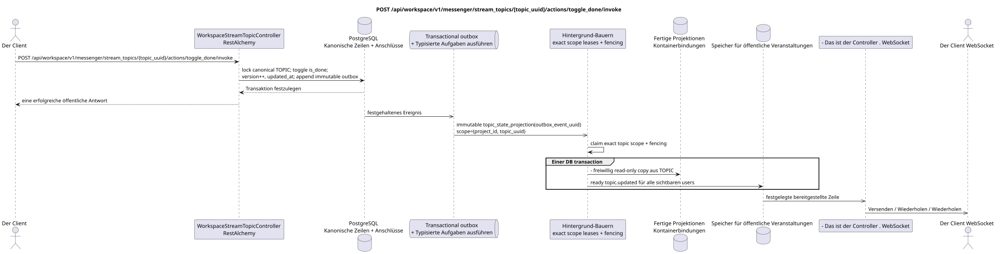

# POST /api/workspace/v1/messenger/stream_topics/{topic_uuid}/actions/toggle_done/invoke

[← Hauptindex der Dokumentation](../../../../index.md) · [Index der Abfolge](../../README.md) · [Abschnitt Core Messenger](../README.md)

## Status und Grenze des laufenden Vertrags

Die Methode, der Weg, die öffentliche JSON und die Autorisierung folgen dem aktuellen Vertrag von [`workspace_api.md`](../../../../workspace_api.md); bounded pagination und asynchrone visibility folgen dem separat angenommenen target compatibility ADR.



Ausgangsgestalt , die bearbeitet werden kann: [`post_topic_toggle_done_action.puml`](diagrams/post_topic_toggle_done_action.puml).

## Die Operation

**Methode und Weg:** `POST /api/workspace/v1/messenger/stream_topics/{topic_uuid}/actions/toggle_done/invoke`

**Zweck:** Umschalten des allgemeinen Abschlusszeichen.

## Öffentliche Anfrage

Ohne Körper JSON.

## Eine erfolgreiche öffentliche Antwort

HTTP `200`:

```json
{
  "uuid": "4ec0b996-b778-45f8-8ef4-ef863be0c047",
  "project_id": "22222222-2222-2222-2222-222222222222",
  "name": "Релизы",
  "stream_uuid": "75309057-419c-4b12-a7c1-3932429ec4a6",
  "user_uuid": "11111111-1111-1111-1111-111111111111",
  "color": 4491468,
  "last_message_uuid": "a93dca35-3061-4748-bda4-7f6f8c660ea5",
  "unread_count": 2,
  "active_unread_count": 2,
  "passive_unread_count": 0,
  "is_default": false,
  "is_done": true,
  "notification_mode": "default",
  "summary": null,
  "summary_last_message_uuid": null,
  "summary_has_new_messages": null,
  "summary_enabled": true,
  "summary_system_prompt": null,
  "summary_reasoning_effort": null,
  "source_name": "native",
  "source": {
    "kind": "native"
  },
  "provider": null,
  "delivery": null,
  "created_at": "2026-06-22T09:10:00Z",
  "updated_at": "2026-06-22T10:20:00Z"
}
```

## Öffentliche Fehler

Bewerber-Token IAM und Projektbereich erforderlich. Falsch UUID oder Anfrage-Body wird HTTP `400` gegeben; fehlende oder nicht verfügbare Ressource in diesem Bereich  `404`. Standarddokumenterter Validierungsfehler-Body:

```json
{
  "type": "ValidationErrorException",
  "code": 400,
  "message": "Validation error occurred."
}
```

## Zielgrenze RestAlchemy

```python
from restalchemy.api import controllers
from restalchemy.api import resources
from restalchemy.dm import models
from restalchemy.dm import properties
from restalchemy.dm import types
from restalchemy.storage.sql import orm


class WorkspaceUserTopic(
    models.ModelWithUUID,
    models.ModelWithProject,
    orm.SQLStorableMixin,
):
    __tablename__ = "messenger_api_user_topics_v1"

    stream_uuid = properties.property(types.UUID(), read_only=True)
    user_uuid = properties.property(types.UUID(), read_only=True)
    last_message_uuid = properties.property(types.UUID(), read_only=True)
    summary_last_message_uuid = properties.property(types.UUID(), read_only=True)


class WorkspaceStreamTopicController(controllers.BaseResourceControllerPaginated):
    __resource__ = resources.ResourceByRAModel(
        WorkspaceUserTopic, convert_underscore=False, process_filters=True,
    )
```

Die öffentlichen Verweise auf Wesen sind skalare Eigenschaften .`types.UUID()`- nicht Beziehungen .RestAlchemy, die inURI- physische Spalten`*_uuid`bleiben als indexierte externe Schlüssel mit eindeutig ausgewählten Verweisungsabläufen.TOPICist ein kanonisches Wesen; einzigartigUSER_TOPIC_BINDINGSie sorgt für Sichtbarkeit, persönlichen Status und Themen-Zähler.

## Synchrone Transaktion

1. Projekt-Scoped-Theme und active stream membership zulassen; erneut überprüfen
   authorization innerhalb der Transaktion.
2. Sperren der canonical `TOPIC` Row, atomar wechseln `TOPIC.is_done`,
   `TOPIC.version` zu vergrößern und zu aktualisieren `updated_at`.
3. Fügen Sie immutable `topic_state_projection` Outbox-Event in die gleiche
   Transaktionen und zurück view, wo `is_done` von canonical `TOPIC`.

Betroffener autoritativer Status: nur canonical `TOPIC` und transactional
outbox. `USER_TOPIC_BINDING` speichert access/notification/counts und ist nicht
writable source `is_done`; `USER_MESSAGE_STATE` Das ist kein Wechselbefehl..

## Typisierte Aufgaben und Hintergrund-Ausfüllung

Aufgabe: ein unwandelbares `topic_state_projection` für source event, scope
`topic (project_id,topic_uuid)`. Fenced owner Erstellt die vorbereiteten `topic.updated`
rows; Wenn nach den Messungen eine read-only copy `is_done` in view/binding erscheint, dann ist er
Es ist nur eine Umwandlung von canonical `TOPIC`. ready event rows
Retry/backoff, DLQ/reaper und idempotent effect
Nach `outbox_event_uuid` sind obligatorisch.

## Öffentliche Veranstaltungen und WebSocket

`topic.updated` Der Manager liefert festgelegte, fertige Zeilen.

## Idempotenz, Rennen und zeitliche Merkmale, die dem Kunden sichtbar sind

Row lock/version Sie können die Anmeldung an die Seite des Programms ändern. transaction
Wenn der Fehler nicht behoben wird, gibt der Server den Fehler zurück.
transport retry Der Client liest zuerst den canonical state und wiederholt ihn nicht toggle
Der Anrufer sieht den canonical state sofort, die Ereignisse sind bereit  asynchron.

[← Hauptindex der Dokumentation](../../../../index.md) · [Index der Abfolge](../../README.md) · [Abschnitt Core Messenger](../README.md)
