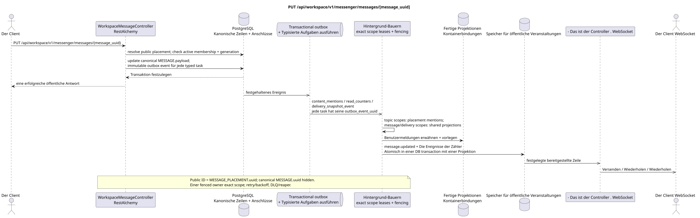

# PUT /api/workspace/v1/messenger/messages/{message_uuid}

[← Hauptindex der Dokumentation](../../../../index.md) · [Index der Abfolge](../../README.md) · [Abschnitt Core Messenger](../README.md)

## Status und Grenze des laufenden Vertrags

Die Methode, der Weg, die öffentliche JSON und die Autorisierung folgen dem aktuellen Vertrag von [`workspace_api.md`](../../../../workspace_api.md); bounded pagination und asynchrone visibility folgen dem separat angenommenen target compatibility ADR.



Ausgangsgestalt , die bearbeitet werden kann: [`put_message.puml`](diagrams/put_message.puml).

## Die Operation

**Methode und Weg:** `PUT /api/workspace/v1/messenger/messages/{message_uuid}`

**Zweck:** Ersetzen der Payload der kanonischen Nachricht nach Autorprüfung und Zugriff.

## Öffentliche Anfrage

```json
{
  "payload": {
    "kind": "markdown",
    "content": "Отредактированный текст"
  }
}
```

## Eine erfolgreiche öffentliche Antwort

HTTP `200`:

```json
{
  "uuid": "a93dca35-3061-4748-bda4-7f6f8c660ea5",
  "project_id": "22222222-2222-2222-2222-222222222222",
  "stream_uuid": "75309057-419c-4b12-a7c1-3932429ec4a6",
  "topic_uuid": "4ec0b996-b778-45f8-8ef4-ef863be0c047",
  "author_uuid": "11111111-1111-1111-1111-111111111111",
  "payload": {
    "kind": "markdown",
    "content": "Отредактированный текст"
  },
  "user_uuid": "11111111-1111-1111-1111-111111111111",
  "read": true,
  "pinned": false,
  "starred": false,
  "is_own": true,
  "mentioned": false,
  "reactions": {},
  "reaction_users": {},
  "source_name": "native",
  "source": {
    "kind": "native"
  },
  "provider": null,
  "delivery": null,
  "created_at": "2026-06-22T10:10:00Z",
  "updated_at": "2026-06-22T10:11:00Z"
}
```

## Öffentliche Fehler

Bewerber-Token IAM und Projektbereich erforderlich. Falsch UUID oder Anfrage-Body wird HTTP `400` gegeben; fehlende oder nicht verfügbare Ressource in diesem Bereich  `404`. Standarddokumenterter Validierungsfehler-Body:

```json
{
  "type": "ValidationErrorException",
  "code": 400,
  "message": "Validation error occurred."
}
```

## Zielgrenze RestAlchemy

```python
from restalchemy.api import controllers
from restalchemy.api import resources
from restalchemy.dm import models
from restalchemy.dm import properties
from restalchemy.dm import types
from restalchemy.storage.sql import orm


class WorkspaceUserMessage(models.ModelWithProject, orm.SQLStorableMixin):
    __tablename__ = "messenger_api_user_messages_v1"

    binding_uuid = properties.property(types.UUID(), id_property=True)
    uuid = properties.property(types.UUID(), read_only=True)
    stream_uuid = properties.property(types.UUID(), read_only=True)
    topic_uuid = properties.property(types.UUID(), read_only=True)
    author_uuid = properties.property(types.UUID(), read_only=True)
    user_uuid = properties.property(types.UUID(), read_only=True)


class WorkspaceMessageController(controllers.BaseResourceControllerPaginated):
    __resource__ = resources.ResourceByRAModel(
        WorkspaceUserMessage, convert_underscore=False, process_filters=True,
    )
```

Öffentlich .`uuid`und Routen-ID sind gleich`MESSAGE_PLACEMENT.uuid = UUIDv5(namespace=TOPIC.uuid, name=MESSAGE.uuid)`; name — lowercase hyphenated canonical UUID- Kanonisch .`MESSAGE.uuid`- die interne;`binding_uuid`- Das bleibt technisch geheim .ORMDer Controller erlaubt die Platzierung und überprüft synchron die active membership plus die Übereinstimmung. generation.

## Synchrone Transaktion

1. Erlauben Sie public placement UUID, active membership und generation über die entsprechende Bindung.
2. Autoren überprüfen.
3. Erneuern MESSAGE.payload.
4. Fügen Sie einzelne immutable Outbox-Events zu den Ausgabekarten hinzu
   `content_mentions`, `read_counters` und `delivery_snapshot_event` tasks.

Betroffene Status: MESSAGE und transactional outbox; Veröffentlichungen bleiben Verweise.

## Typisierte Aufgaben und Hintergrund-Ausfüllung

Aufgaben: `content_mentions`, bedingte `read_counters`, `delivery_snapshot_event`.

Topic-scoped workers Lesen Sie den aktuellen canonical content und aktualisieren Sie ihn
placement-scoped mentions nach `MESSAGE.created_at DESC`; canonical/delivery und
container shared rows Sie erhalten einzelne genaue Bereiche. outbox event
entspricht eine unwandelbare Aufgabe; ein fenced owner schreibt den exact key, und topic
worker Er tut es nicht. unsafe read-modify-write shared rows.

## Öffentliche Veranstaltungen und WebSocket

`message.updated` und veränderte Containerzeilen über den Dispatcher.

## Idempotenz, Rennen und zeitliche Merkmale, die dem Kunden sichtbar sind

Jeder Outbox-Event hat eine separate immutable task; der handler ist impotent auf `outbox_event_uuid`..

[← Hauptindex der Dokumentation](../../../../index.md) · [Index der Abfolge](../../README.md) · [Abschnitt Core Messenger](../README.md)
