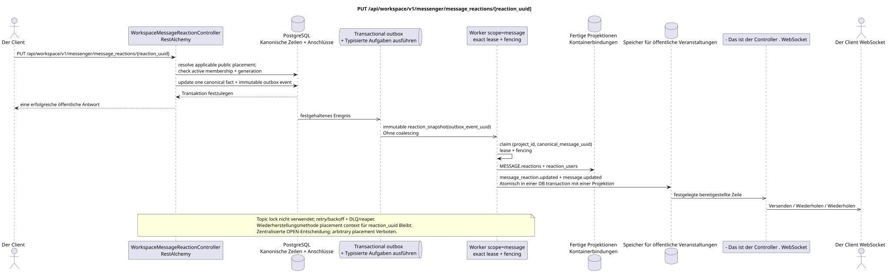

# PUT /api/workspace/v1/messenger/message_reactions/{reaction_uuid}

[← Hauptindex der Dokumentation](../../../../index.md) · [Index der Abfolge](../../README.md) · [Abschnitt Core Messenger](../README.md)

## Status und Grenze des laufenden Vertrags

Die Methode, der Weg, die öffentliche JSON und die Autorisierung folgen dem aktuellen Vertrag von [`workspace_api.md`](../../../../workspace_api.md); bounded pagination und asynchrone visibility folgen dem separat angenommenen target compatibility ADR.



Ausgangsgestalt , die bearbeitet werden kann: [`put_message_reaction.puml`](diagrams/put_message_reaction.puml).

## Die Operation

**Methode und Weg:** `PUT /api/workspace/v1/messenger/message_reactions/{reaction_uuid}`

**Zweck:** Die ursprüngliche Reaktion des aktuellen Benutzers aktualisieren.

## Öffentliche Anfrage

```json
{
  "emoji_name": "heart"
}
```

## Eine erfolgreiche öffentliche Antwort

HTTP `200`:

```json
{
  "uuid": "bd4b7632-8788-435a-93cc-6873657335c6",
  "project_id": "22222222-2222-2222-2222-222222222222",
  "message_uuid": "a93dca35-3061-4748-bda4-7f6f8c660ea5",
  "user_uuid": "11111111-1111-1111-1111-111111111111",
  "emoji_name": "heart",
  "provider": null,
  "delivery": null,
  "created_at": "2026-06-22T10:12:00Z",
  "updated_at": "2026-06-22T10:13:00Z"
}
```

## Öffentliche Fehler

Bewerber-Token IAM und Projektbereich erforderlich. Falsch UUID oder Anfrage-Body wird HTTP `400` gegeben; fehlende oder nicht verfügbare Ressource in diesem Bereich  `404`. Standarddokumenterter Validierungsfehler-Body:

```json
{
  "type": "ValidationErrorException",
  "code": 400,
  "message": "Validation error occurred."
}
```

## Zielgrenze RestAlchemy

```python
from restalchemy.api import controllers
from restalchemy.api import resources
from restalchemy.dm import models
from restalchemy.dm import properties
from restalchemy.dm import types
from restalchemy.storage.sql import orm


class WorkspaceMessageReactionView(
    models.ModelWithUUID,
    models.ModelWithProject,
    orm.SQLStorableMixin,
):
    __tablename__ = "messenger_api_message_reactions_v1"

    message_uuid = properties.property(types.UUID(), read_only=True)
    canonical_message_uuid = properties.property(types.UUID(), read_only=True)
    user_uuid = properties.property(types.UUID(), read_only=True)


class WorkspaceMessageReactionController(controllers.BaseResourceControllerPaginated):
    __resource__ = resources.ResourceByRAModel(
        WorkspaceMessageReactionView, convert_underscore=False, process_filters=True,
    )
```

Öffentliche `message_uuid`  skalare UUID Placement; innere
`canonical_message_uuid` Feldberechtigungen sind versteckt.UUIDder ursprünglichen Tatsache
Die physischen Verweise bleiben FK-indexiert, und
Die ursprünglichen Metadaten des Providers/Lieferanten sind geschlossen.

## Synchrone Transaktion

1. Wiederherstellen Sie die Benutzer-eigene Tatsache, die anwendbare öffentliche placement
   und überprüfen active stream membership + matching generation.
2. Einen Wert aktualisieren emoji.
3. Fügen Sie ein separates immutable Event hinzu transactional outbox; derived task
   Einzigartig in `outbox_event_uuid`.

Betroffener Zustand: Reaktions- und Transaktions-Outbox; keine Gesamt-Erfassung JSON der Anfrage.

## Typisierte Aufgaben und Hintergrund-Ausfüllung

Aufgaben: Ein einzelnes unwandelbares `reaction_snapshot` für source event; coalescing
nicht vorhanden.

Fenced owner scope `message` Bilder aus aktuellen Fakten neu gestalten; topic
lock Lease expiry, retry/backoff, DLQ und reaper stellen sicher, dass
Wiederherstellung nach Ausfall.

## Öffentliche Veranstaltungen und WebSocket

`message_reaction.updated` mit den früheren Feldern, dann `message.updated` für den Beobachter.

## Idempotenz, Rennen und zeitliche Merkmale, die dem Kunden sichtbar sind

Einzigartiger Faktschlüssel erlaubt Rennen; Membership recheck erzeugt sofortige
deny boundary. Der Besitzer erhält sofort die Tatsache in der Antwort, Fotos und Ereignisse —
Die Route enthält nur `reaction_uuid`, also ist die Art und Weise, wie man es speichert und
Wiederherstellen Sie die öffentliche Placement-Kontext bei mehreren sichtbaren placements
bleibt eine zentralisierte OPEN-Lösung; versteckte Bindung oder willkürliche
primary placement Sie können nicht wählen. global reaction
semantics.

[← Hauptindex der Dokumentation](../../../../index.md) · [Index der Abfolge](../../README.md) · [Abschnitt Core Messenger](../README.md)
