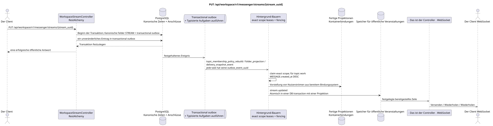

# PUT /api/workspace/v1/messenger/streams/{stream_uuid}


Allgemeine Ziel-Invariante der Zuverlässigkeit: Jedes immutable outbox-Ereignis führt genau eine immutable typed task mit einem einzigartigen `outbox_event_uuid`; coalescing fehlt. Task speichert den tatsächlichen exact scope key, verwendet lease/fencing, retry/backoff, max attempts/DLQ, reaper und idepotent effect guard. Topic scope wird nur für placement/message-binding work angewendet; shared rows erhalten keinen impliziten Fallback auf topic.

[← Hauptindex der Dokumentation](../../../../index.md) · [Index der Abfolge](../../README.md) · [Abschnitt Core Messenger](../README.md)

## Status und Grenze des laufenden Vertrags

Die Methode, der Weg, die öffentliche JSON und die Autorisierung folgen dem aktuellen Vertrag von [`workspace_api.md`](../../../../workspace_api.md); bounded pagination und asynchrone visibility folgen dem separat angenommenen target compatibility ADR.



Ausgangsgestalt , die bearbeitet werden kann: [`put_stream.puml`](diagrams/put_stream.puml).

## Die Operation

**Methode und Weg:** `PUT /api/workspace/v1/messenger/streams/{stream_uuid}`

**Zweck:** Kanonische Fluss-Felder zu aktualisieren.

## Öffentliche Anfrage

```json
{
  "name": "Разработка платформы",
  "description": "Платформа и надёжность",
  "invite_only": true,
  "announce": false,
  "color": 3368601
}
```

## Eine erfolgreiche öffentliche Antwort

HTTP `200`:

```json
{
  "uuid": "75309057-419c-4b12-a7c1-3932429ec4a6",
  "name": "Разработка платформы",
  "description": "Платформа и надёжность",
  "project_id": "22222222-2222-2222-2222-222222222222",
  "owner": "11111111-1111-1111-1111-111111111111",
  "user_uuid": "11111111-1111-1111-1111-111111111111",
  "role": "owner",
  "notification_mode": "all_messages",
  "unread_count": 2,
  "active_unread_count": 2,
  "passive_unread_count": 0,
  "source_name": "native",
  "source": {
    "kind": "native"
  },
  "invite_only": true,
  "announce": false,
  "private": false,
  "is_archived": false,
  "color": 3368601,
  "last_message_uuid": "a93dca35-3061-4748-bda4-7f6f8c660ea5",
  "default_topic_uuid": "4ec0b996-b778-45f8-8ef4-ef863be0c047",
  "created_at": "2026-06-22T09:00:00Z",
  "updated_at": "2026-06-22T10:15:00Z"
}
```

## Öffentliche Fehler

Bewerber-Token IAM und Projektbereich erforderlich. Falsch UUID oder Anfrage-Body wird HTTP `400` gegeben; fehlende oder nicht verfügbare Ressource in diesem Bereich  `404`. Standarddokumenterter Validierungsfehler-Body:

```json
{
  "type": "ValidationErrorException",
  "code": 400,
  "message": "Validation error occurred."
}
```

Quelle, Identität des Direktflusses, Privatsphäre und Mitgliedschaft sind unveränderlich; Konflikte geben `400`.

## Zielgrenze RestAlchemy

```python
from restalchemy.api import controllers
from restalchemy.api import resources
from restalchemy.dm import models
from restalchemy.dm import properties
from restalchemy.dm import types
from restalchemy.storage.sql import orm


class WorkspaceUserStream(
    models.ModelWithUUID,
    models.ModelWithProject,
    orm.SQLStorableMixin,
):
    __tablename__ = "messenger_api_user_streams_v1"

    owner = properties.property(types.UUID(), read_only=True)
    user_uuid = properties.property(types.UUID(), read_only=True)
    direct_user_uuid = properties.property(
        types.AllowNone(types.UUID()), default=None, read_only=True,
    )
    last_message_uuid = properties.property(types.UUID(), read_only=True)
    default_topic_uuid = properties.property(types.UUID(), read_only=True)


class WorkspaceStreamController(controllers.BaseResourceControllerPaginated):
    __resource__ = resources.ResourceByRAModel(
        WorkspaceUserStream, convert_underscore=False, process_filters=True,
    )
```

Die öffentlichen Entitätsverweise sind mit den skalaren Eigenschaften `types.UUID()` und nicht mit den Beziehungen RestAlchemy, die in URI serialisiert werden. Die physischen Spalten `*_uuid` bleiben indexierte Außenschlüssel mit eindeutig ausgewählten Verweisungsaktionen. Das öffentliche Feld `owner` ist die Eigenschaft UUID; das physische Feld `owner_uuid`  der indexierte Außenschlüssel des Benutzers. USER_STREAM_BINDING speichert die vorbereiteten Flussstufemessern..

## Synchrone Transaktion

1. Erlaubt den sichtbaren Stream und überprüft die Berechtigungen.
2. Kanonische Felder aktualisieren.
3. Fügen Sie einzelne immutable Outbox-Events zu den Ausgabekarten hinzu
   `topic_membership_policy_rebuild`, `folder_projection` und
   `delivery_snapshot_event` tasks.

Betroffener Zustand: STREAM und transactional outbox.

## Typisierte Aufgaben und Hintergrund-Ausfüllung

Aufgaben: Einzelne `topic_membership_policy_rebuild`, `folder_projection` und
`delivery_snapshot_event`, Jeder für sich source outbox event.

Die Projektionen der Nutzer und der Provider erhalten immutable tasks
Wirklich .`user-stream`/providerTopic-Work wird nur für
Betroffene Placements/bindings; ein fenced owner schreibt exact key.

## Öffentliche Veranstaltungen und WebSocket

`stream.updated` Über den Leiter.

## Idempotenz, Rennen und zeitliche Merkmale, die dem Kunden sichtbar sind

Einheitliche kanonische Zeile und Aufgaben mit aktueller Quelle verhindern eine veraltete Kopie. Der Anrufer sieht die Aktualisierung sofort, die restlichen Projektionen und Ereignisse  asynchron.

[← Hauptindex der Dokumentation](../../../../index.md) · [Index der Abfolge](../../README.md) · [Abschnitt Core Messenger](../README.md)
