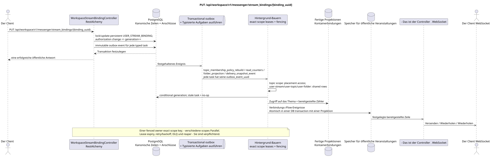

# PUT /api/workspace/v1/messenger/stream_bindings/{binding_uuid}

[← Hauptindex der Dokumentation](../../../../index.md) · [Index der Abfolge](../../README.md) · [Abschnitt Core Messenger](../README.md)

## Status und Grenze des laufenden Vertrags

Die Methode, der Weg, die öffentliche JSON und die Autorisierung folgen dem aktuellen Vertrag von [`workspace_api.md`](../../../../workspace_api.md); bounded pagination und asynchrone visibility folgen dem separat angenommenen target compatibility ADR.



Ausgangsgestalt , die bearbeitet werden kann: [`put_stream_binding.puml`](diagrams/put_stream_binding.puml).

## Die Operation

**Methode und Weg:** `PUT /api/workspace/v1/messenger/stream_bindings/{binding_uuid}`

**Zweck:** Erneuern der Rolle oder des Zustands von Benachrichtigungen der normalen Anbindung.

## Öffentliche Anfrage

```json
{
  "role": "moderator",
  "notification_mode": "mentions_only",
  "notification_updated_at": "2026-06-22T10:17:00Z"
}
```

## Eine erfolgreiche öffentliche Antwort

HTTP `200`:

```json
{
  "uuid": "3195a887-da5d-440b-bdf8-0d3d995a9e01",
  "project_id": "22222222-2222-2222-2222-222222222222",
  "stream_uuid": "75309057-419c-4b12-a7c1-3932429ec4a6",
  "user_uuid": "33333333-3333-3333-3333-333333333333",
  "who_uuid": "11111111-1111-1111-1111-111111111111",
  "role": "moderator",
  "notification_mode": "mentions_only",
  "notification_updated_at": "2026-06-22T10:17:00Z",
  "created_at": "2026-06-22T09:05:00Z",
  "updated_at": "2026-06-22T10:17:00Z"
}
```

## Öffentliche Fehler

Bewerber-Token IAM und Projektbereich erforderlich. Falsch UUID oder Anfrage-Body wird HTTP `400` gegeben; fehlende oder nicht verfügbare Ressource in diesem Bereich  `404`. Standarddokumenterter Validierungsfehler-Body:

```json
{
  "type": "ValidationErrorException",
  "code": 400,
  "message": "Validation error occurred."
}
```

Das Update des Bindens von Live- oder Stream-Stream zu sich selbst gibt `400`.

## Zielgrenze RestAlchemy

```python
from restalchemy.api import controllers
from restalchemy.api import resources
from restalchemy.dm import models
from restalchemy.dm import properties
from restalchemy.dm import types
from restalchemy.storage.sql import orm


class WorkspaceStreamBindingView(
    models.ModelWithUUID,
    models.ModelWithProject,
    orm.SQLStorableMixin,
):
    __tablename__ = "messenger_api_stream_bindings_v1"

    stream_uuid = properties.property(types.UUID(), read_only=True)
    user_uuid = properties.property(types.UUID(), read_only=True)
    who_uuid = properties.property(types.UUID(), read_only=True)


class WorkspaceStreamBindingController(controllers.BaseResourceControllerPaginated):
    __resource__ = resources.ResourceByRAModel(
        WorkspaceStreamBindingView, convert_underscore=False, process_filters=True,
    )
```

Die öffentlichen Entitätsverweise sind mit den skalaren Eigenschaften `types.UUID()` und nicht mit den Beziehungen RestAlchemy, die in URI serialisiert werden. Die physischen Spalten `*_uuid` bleiben als indexierte Externe Schlüssel mit eindeutig ausgewählten Verweisintegritätsaktionen. USER_STREAM_BINDING ist einzigartig in `(project_id, stream_uuid, user_uuid)` und kann physisch bereitgestellte Zähler speichern, aber ihre aktuelle öffentliche JSON Bindung ändert sich nicht.

## Synchrone Transaktion

1. Wiederherstellen und autorisieren.
2. Eine persistente AktualisierungUSER_STREAM_BINDING. Wenn sich die Änderung auf
   authorization/membership, `membership_generation` zu vergrößern; nur
   Wenn Sie die Benachrichtigungsanordnung ändern , wird generation nicht als surrogate
   version.
3. Fügen Sie für jede Transaktion ein separates immutable outbox-Event hinzu typed
   task der tatsächlichen.

Betroffener Zustand: USER_STREAM_BINDING und transactional outbox.

## Typisierte Aufgaben und Hintergrund-Ausfüllung

Aufgaben: Einzelne immutable `topic_membership_policy_rebuild`,
`read_counters`, `folder_projection` und `delivery_snapshot_event`, jeder mit
Eigene source `outbox_event_uuid`, exact scope key und abhängig von
membership — mit dem erwarteten generation.

Topic-scoped worker nützt nur den Zugriff auf Placements/bindings;
user-stream/user-topic/user-folder scope workers Aktualisieren von freigegebenen Aggregaten.
Gleichzeitig schreibt ein fenced owner exact key; stale generation macht no-op.
Task lifecycle beinhaltet retry/backoff, DLQ und reaper.

## Öffentliche Veranstaltungen und WebSocket

Betroffene Verbindungs- und Strömungsevenimente.

## Idempotenz, Rennen und zeitliche Merkmale, die dem Kunden sichtbar sind

Einzigartiger Membership Key, Row Lock und Generation verhindern Rennen.
sofort sichtbar, Projektionen und Ereignisse  asynchron; ready event erscheint nur
Atomisch in einer DB-Transaktion mit entsprechender Projektion.

[← Hauptindex der Dokumentation](../../../../index.md) · [Index der Abfolge](../../README.md) · [Abschnitt Core Messenger](../README.md)
